## Pengertian DevOps menurut saya
DevOps adalah metode kerja yang menggabungkan tim Developer dan Operations agar proses pembuatan,pengujian, hingga deployment aplikasi dapat dilakukan dengan lebih cepat, efisien, dan terstruktur.

## cara instalasi ubuntu server
1. Download oracle virtual box melalui https://www.virtualbox.org/
2. Download ubuntu server melalui https://ubuntu.com/download/server
3. install oracle virtual box
4. setelah virtual box berhasil diinstall, buka aplikasi dan klik new VM
5. isi VM Name, lalu pilih ISO ubuntu server yang telah di download sebelumnya.
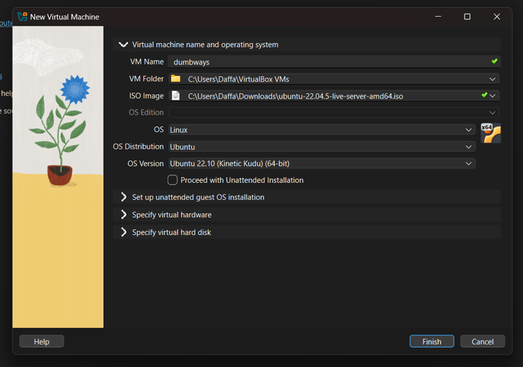
6. selanjutnya konfigurasi virtual hardware(sesuaikan dengan kemampuan perangkat masing - masing). Di konfigurasi saya, saya mengatur base memory 2048 MB, dan Numbers of CPU 3.
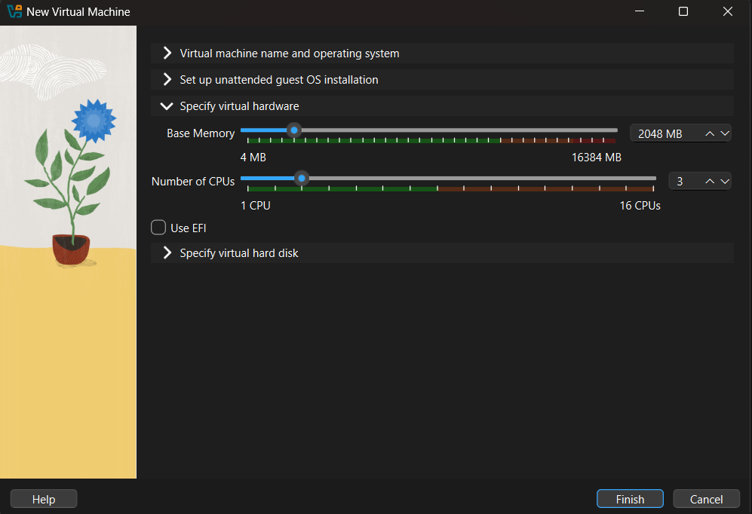
7. Selanjutnya Konfigurasi virtual hard disk(sesuaikan dengan kemampuan perangkat masing - masing). Di konfigurasi saya, saya mengatur virtual hard disk 10 GB.
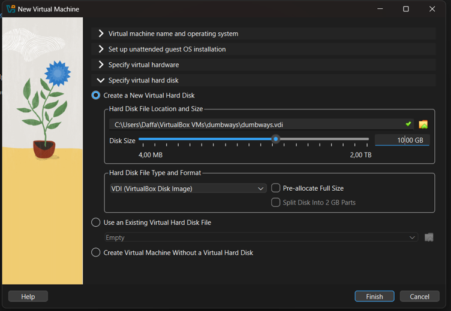
8. setelah virtual machine berhasil dibuat, jalankan dengan menekan tombol start
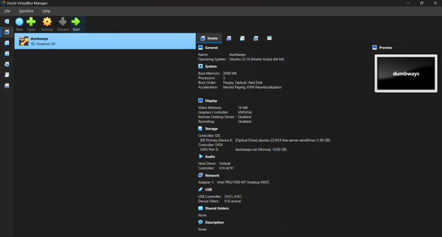
9. setelah virtual machine berhasil dijalankan, pilih opsi 'try or install Ubuntu Server'
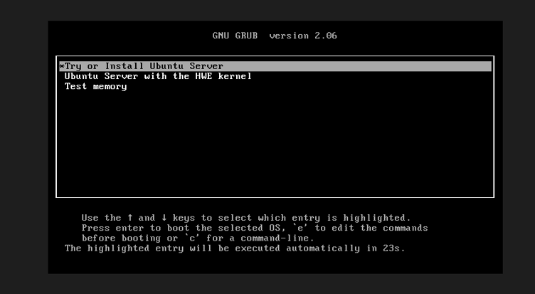
10. Selanjutnya, pilih bahasa sesuai yang diinginkan. Disarankan untuk menggunakan bahasa inggris.
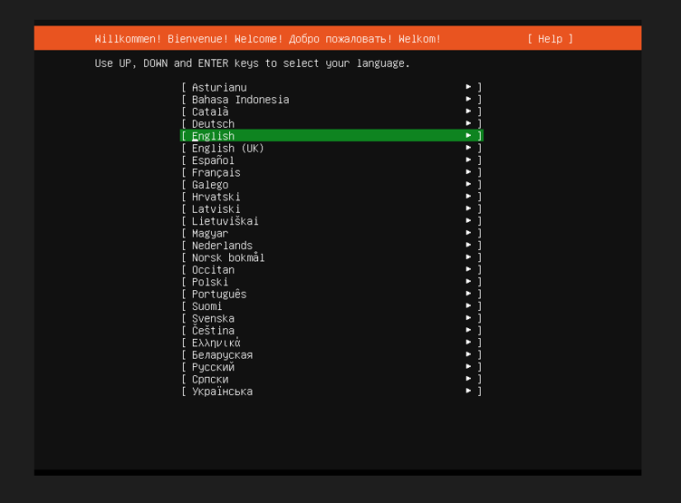
11. Selanjutnya, terdapat pilihan unuk update to new installer atau continue without updating(opsional / disesuaikan)
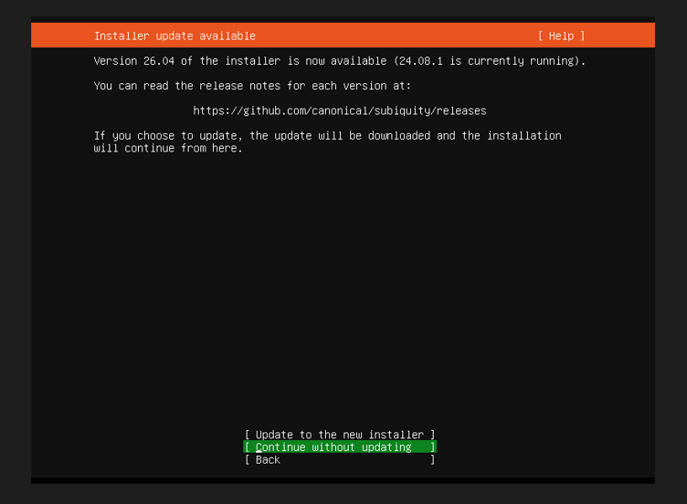
12. Selanjutnya, terdapat pilihan tipe instalasi, pilih 'ubuntu server'. Untuk additional options abaikan saja.
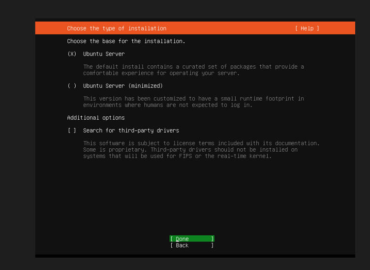
13. Selanjutnya masuk ke Network Configuration, tekan enter pada enp0s3 lalu pilih edit IPv4, lalu pilih IPv4 Method menjadi manual.
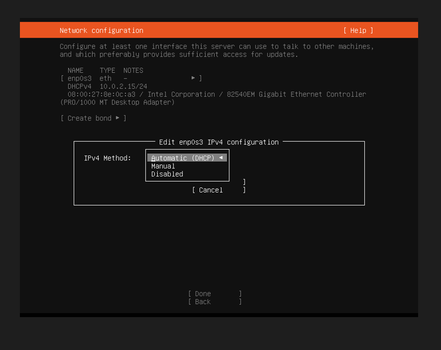
14. selanjutnya isi subnet, address dengan xxx.xxx.xxx.208,gateway, dan name servers(sesuaikan dengan jaringan perangkat masing - masing). Di konfigurasi ini,saya mengisi seperti gambar yang dicantumkan dibawah ini.
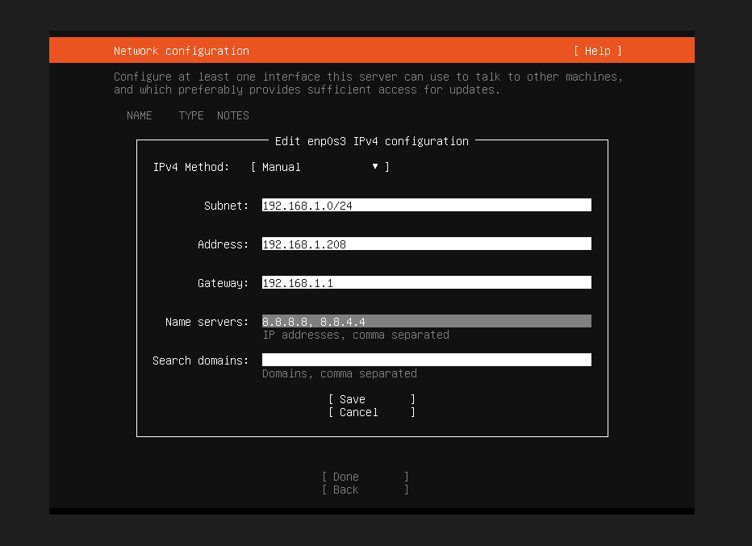
15. Setelah berhasil konfigurasi jaringan maka output seperti gambar dibawah ini yang menandakan bahwa internet berhasil terhubung.
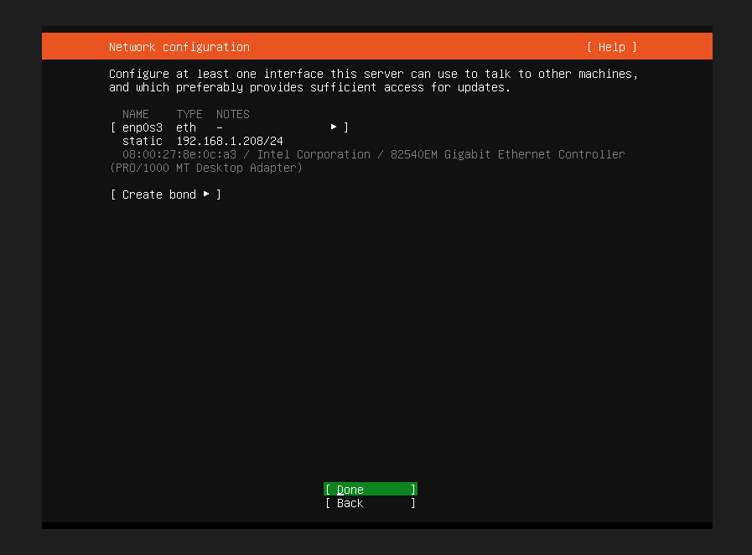
16. Selanjutnya di menu konfigurasi proxy. Di menu ini abaikan saja agar di kosongkan dan lanjut ke tahap selanjutnya.
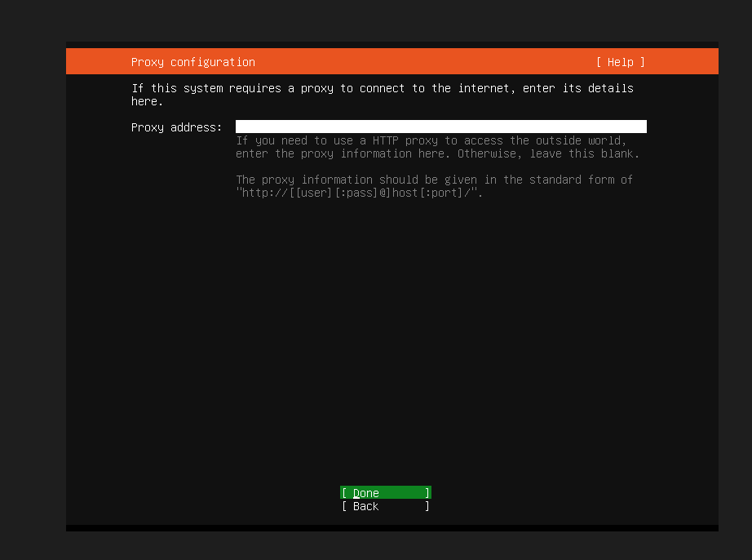
17. Selanjutnya di menu Ubuntu archive mirror configuration abaikan saja agar langsung menuju menu selanjutnya.
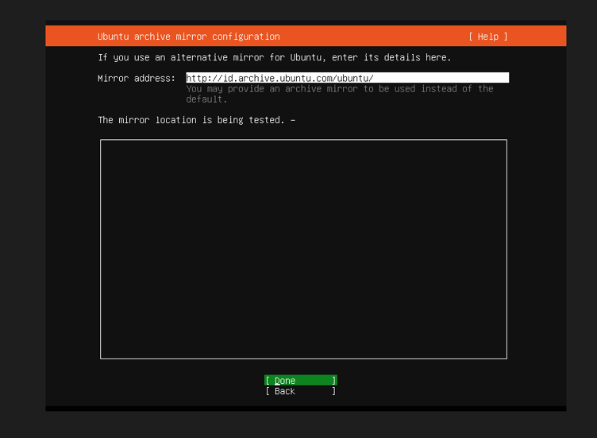
18. Selanjutnya masuk kedalam menu konfigurasi penyimpanan. Di menu ini, pilih opsi Custom storage layout.
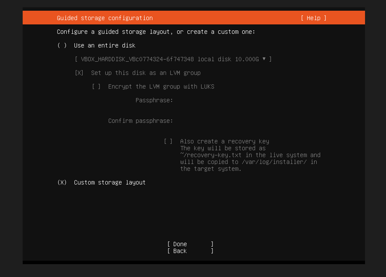
19. Di konfigurasi penyimpanan, tambahkan GPT partition pada free space seperti gambar yang dicantumkan dibawah ini. (atur sesuai kebutuhan / kemampuan)
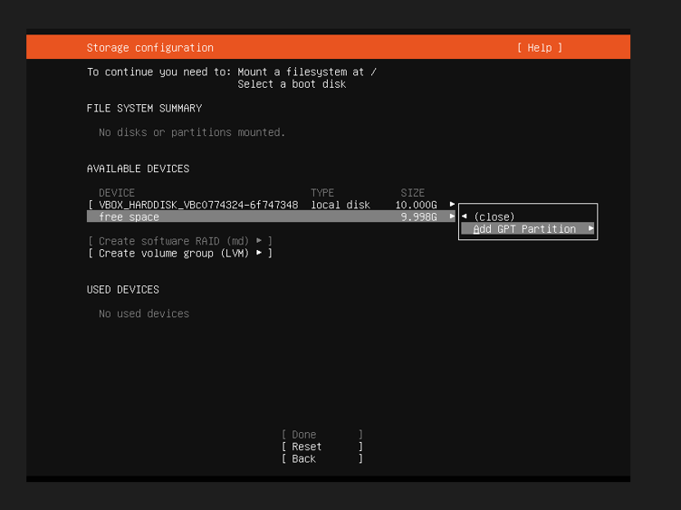
20. Di konfigurasi ini, saya menambahkan 7gb untuk partisi.
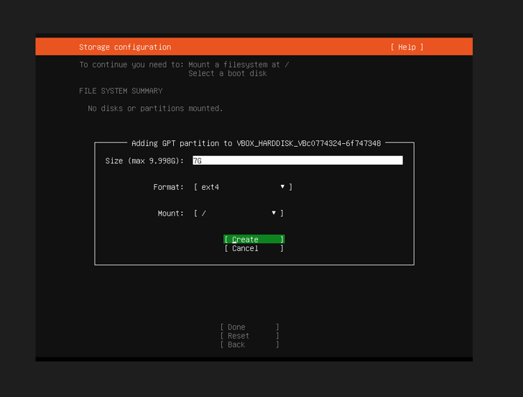
21. Di konfigurasi ini, saya juga menambahkan 2.800G untuk swap.
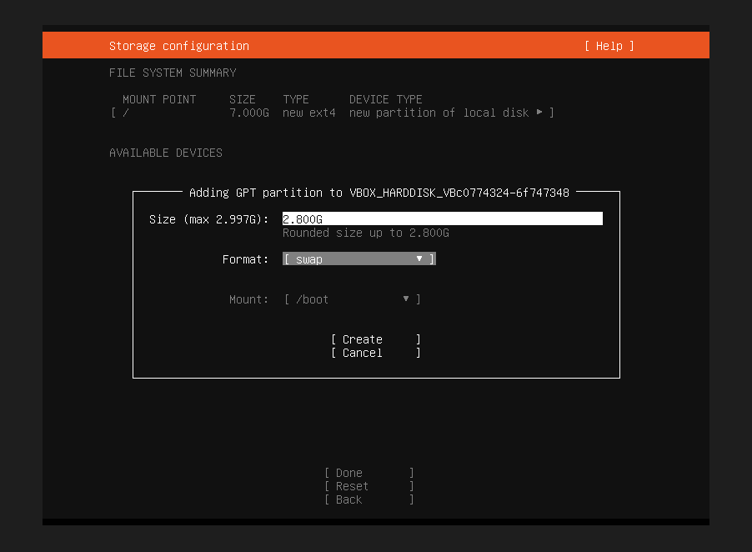
22. Setelah konfigurasi penyimpanan, masuk ke dalam menu konfigurasi profil. Disini isi sesuai dengan yang diinginkan.
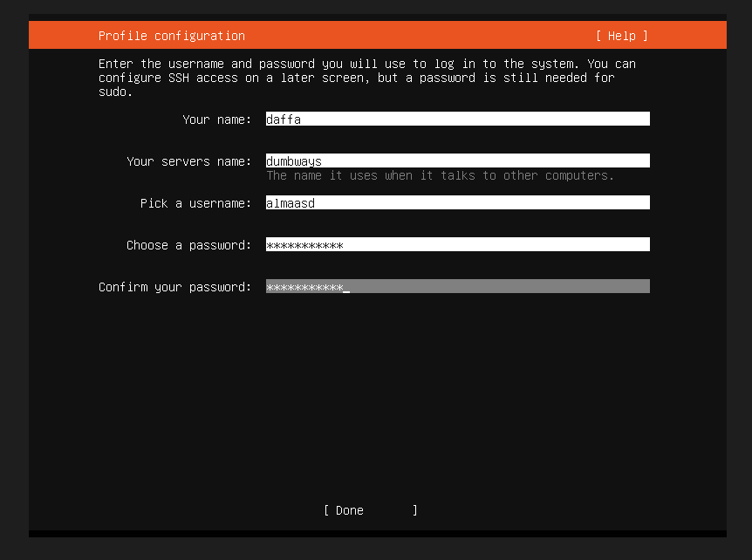
23. setelah berhasil mengisi profil, selanjutnya terdapat pilihan untuk upgrade to ubunto pro, pilih skip for now.
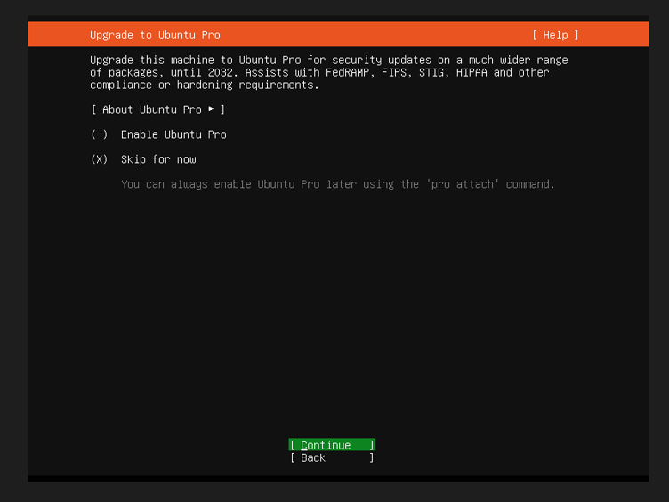
24. selanjutnya masuk ke dalam konfigurasi SSH, abaikan saja dan langsung menuju menu selanjutnya.
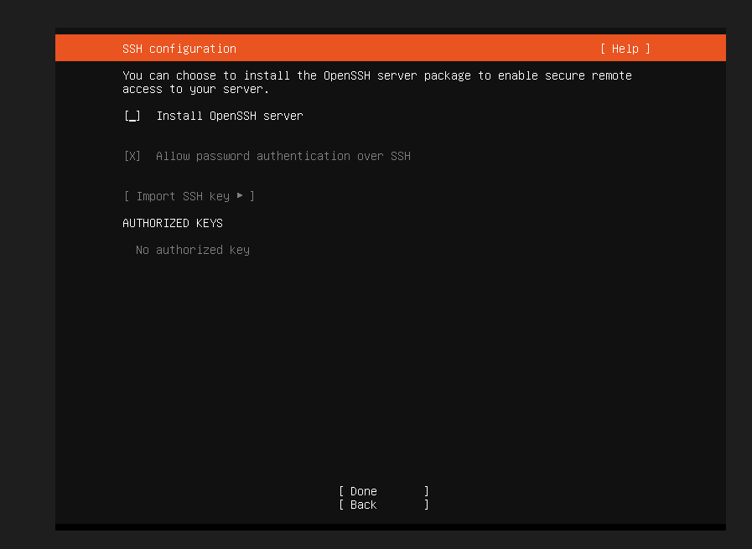
25. Selanjutnya masuk ke dalam menu Featured server snaps, abaikan saja dan langsung menuju proses selanjutnya.
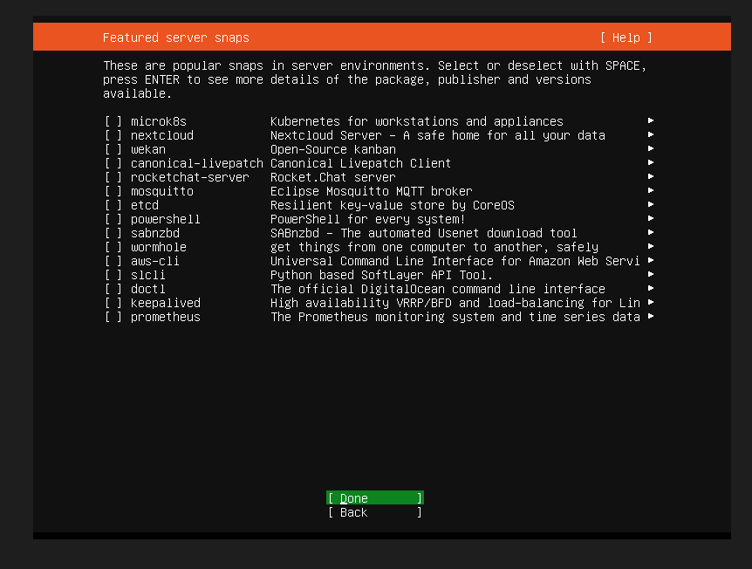
26. proses instalasi server sedang berjalan.
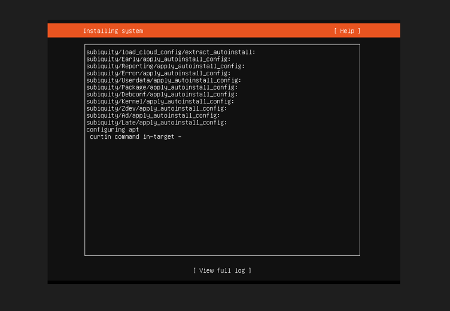
27. Setelah berhasil di install, Lakukan reboot.
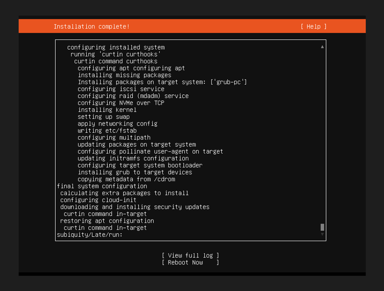
28. Setelah berhasil masuk reboot dan masuk ke dalam sistem, login menggunakan profil yang telah didaftarkan di menu konfigurasi profil.
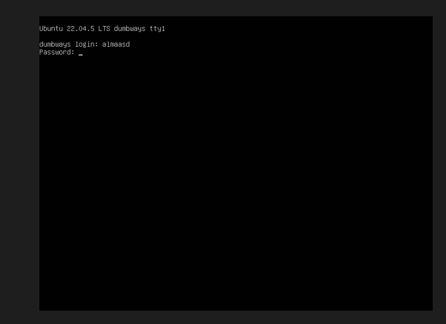
29. Setelah berhasil login, maka kita berhasil akses ke dalam server. Masukkan perintah ping 8.8.8.8 untuk test koneksi jaringan.
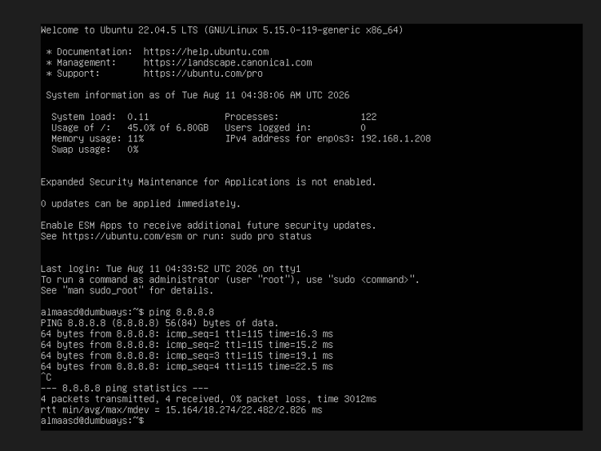