## Diagram Jaringan dengan 4 device dengan kondisi :
- IP Class C : 192.168.4.xxx
- CIDR Block : 192.168.4.0/24

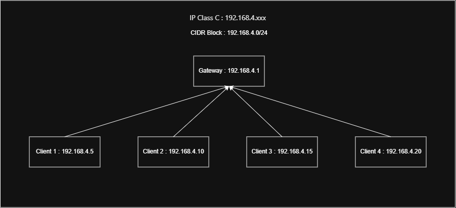

Diagram tersebut menunjukan jaringan kelas C dengan alamat jaringan 192.168.4.0/24.Jaringan terdiri dari gateway dan 4 client.
pada kelas C, angka terakhir pada alamat IP dapat dipilih bebas antara 1 - 254.
Untuk gateway, saya menggunakan 192.169.4.1.
untuk client, saya menggunakan :
client 1 : 192.168.4.5
client 2 : 192.168.4.10
client 3 : 192.168 .4.15
client 4 : 192.168.4.20

## perbedaan antara SH (Shell) dan BASH (Bourne-Again Shell)
SH (Shell) merupakan shell sederhana yang digunakan untuk menjalankan perintah dan script dasar di linux. Sedangkan Bash (Bourne-Again Shell) merupakan pengembangan dari SH yang memiliki lebih banyak fitur.

Contoh fitur Pada BASH:
1. Membuat banyak file sekaligus 
pada Bash, kita bisa membuat file banyak sekaligus dengan brace expansion:
touch file{1..5}.txt
maka akan dibuat file1.txt, file2.txt, file3.txt, file4.txt, dan file5.txt.

jika menggunakan sh dan touch file{1..5}.txt, maka hanya akan membuat file bernama touch file{1..5}.txt seperti gambar dibawah ini.
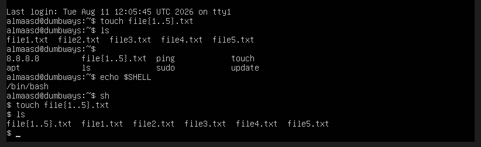

2. shortcut history command
pada Bash, kita bisa menggunakan tombol panah atas untuk melihat perintah sebelumnya.
Contoh sebelumnya kita menjalankan:
sudo apt update

kemudian kita tekan tombol panah atas, maka perintah tersebut akan muncul lagi sehingga tidak perlu di ketik ulang.

3. Menggunakan Array
pada BASH, kita bisa menggunakan array dengan contoh :
nama=("daffa" "budi" "andi")

echo "${nama[0]}"
echo "${nama[1]}"
echo "${nama[2]}"

maka output akan seperti gambar dibawah ini
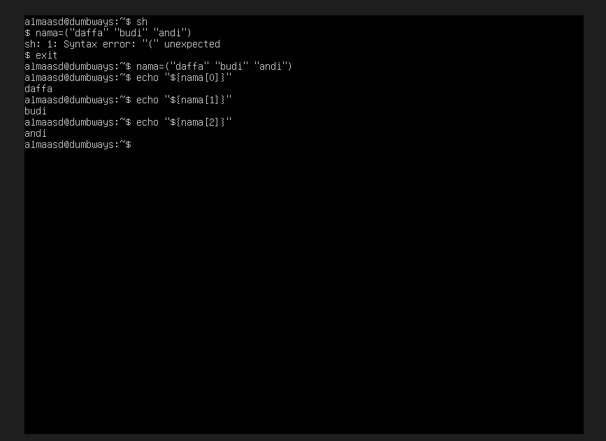

dari gambar diatas membuktikan bahwa SH tidak mendukung penggunaan array,sedangkan BASH mendukung penggunaan array.

## dokumentasi / kumpulan command linux

1. ls : menampilkan list file dan dan folder yang ada di lokasi saat ini
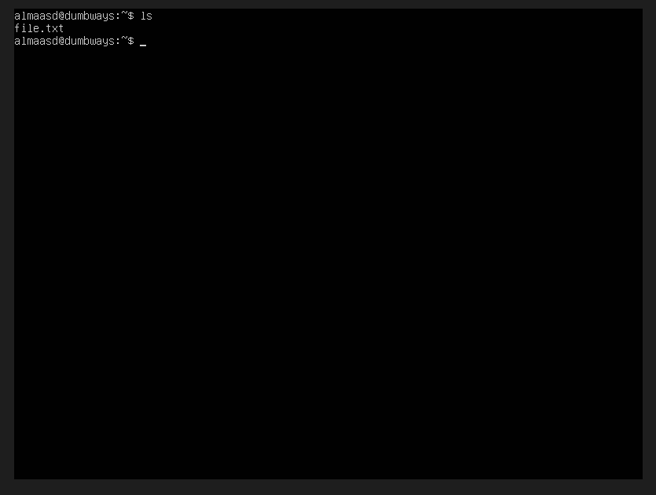

2. touch nama_file : membuat file baru di lokasi saat ini
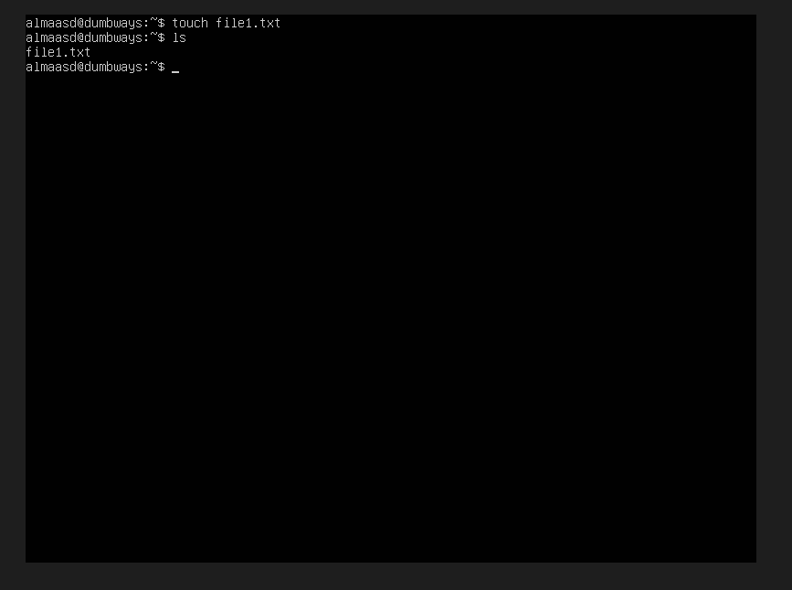

3. pwd : menampilkan lokasi tempat kita berada
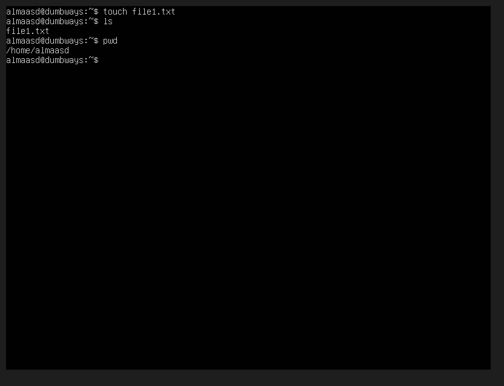

4. whoami : menampilkan username yang sedang digunakan saat ini
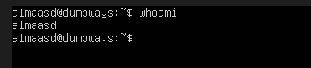

5. ip addr : melihat informasi jaringan
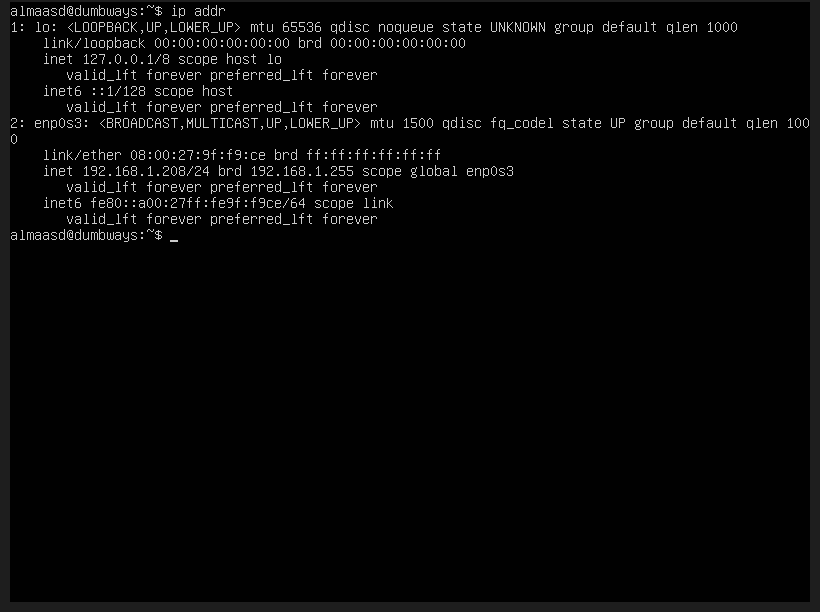

6. tail nama_file : menampilkan 10 baris terakhir isi file
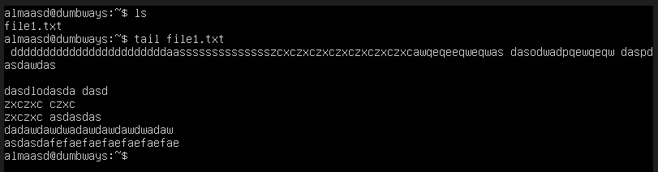

7. tail -n nama_file : menampilkan baris terakhir isi file sebanyak yang kita mau (ganti n dengan yang diinginkan)
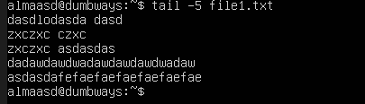

8. head nama_file : menampilkan 10 baris terdepan isi file
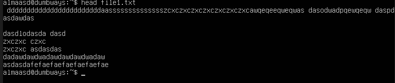

9. head -n nama_file : menampilkan baris terdepan isi file sebanyak yang kita mau (ganti n dengan yang diinginkan)
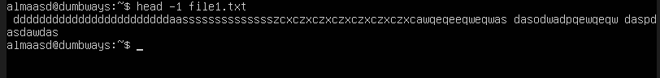

10. id : melihat identitas user
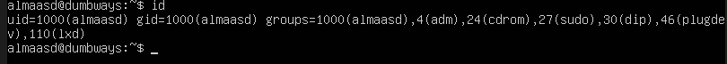

11. top : melihat process secara realtime
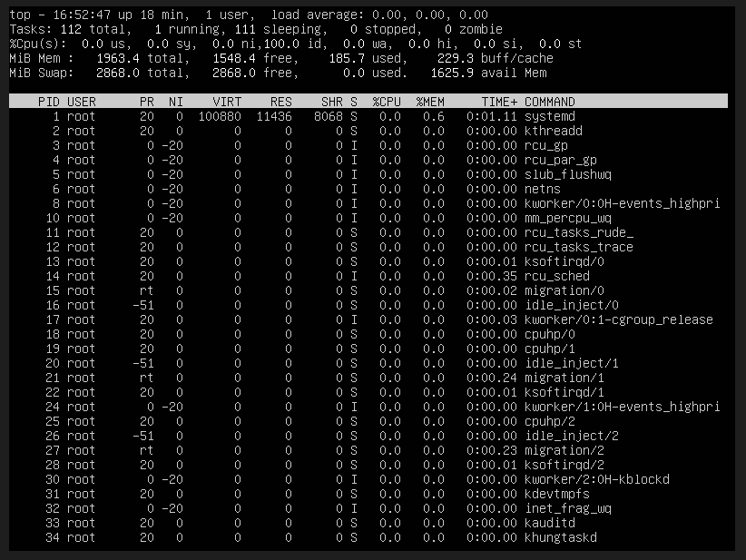

12. date : melihat tanggal dan waktu pada sistem
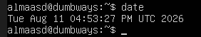

13. df : melihat penggunaan kapasitas disk
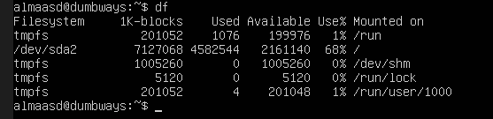

14. free : melihat penggunaan RAM
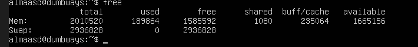

