## Akses server menggunakan Windows Terminal
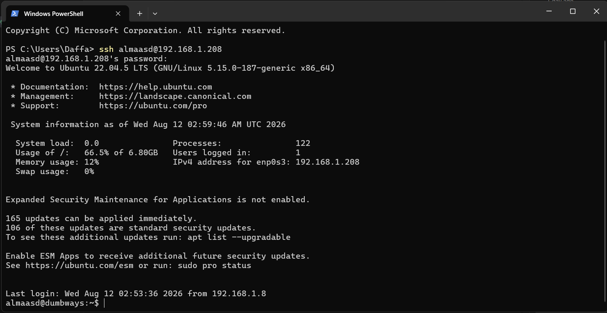

## Konfigurasi ssh agar bisa di akses hanya menggunakan publickey (password dimatikan)
1. masukkan perintah ssh-keygen di terminal untuk membuat kunci ssh yang nantinya akan digunakan untuk autentikasi. saya memberikan nama 'kunci' untuk key nya.

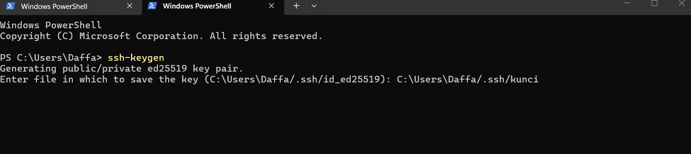
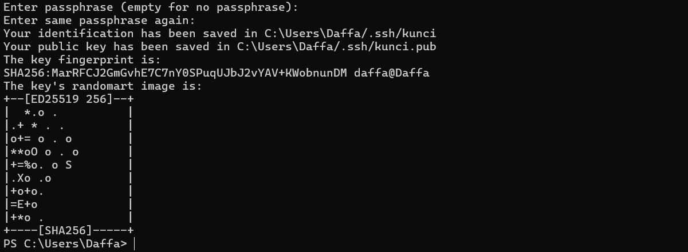

2. Setelah berhasil, buka folder c:user/nama/.ssh dan buka file kunci.pub menggunakan teks editor,kemudian copy semua isi file.

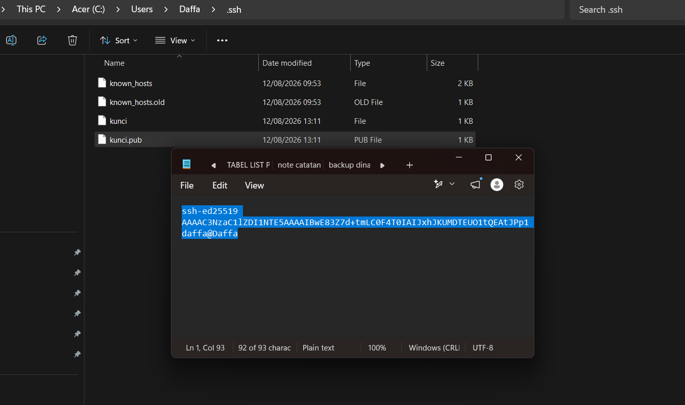

3. setelah copy,masuk ke dalam server lalu jalankan perintah seperti pada gambar untuk membuar direktori bernama .ssh

4. lakukan chmod 700 pada folder .ssh seperti perintah pada gambar di bawah ini agar hanya user yang dapat membuka,melihat, dan mengubah folder .ssh

5. buat file bernama authorized_keys dengan perintah pada gambar di bawah ini

6. lakukan sudo nano authorized_keys untuk mengedit isi file dan paste isi file kunci.pub yang telah di copy sebelumnya

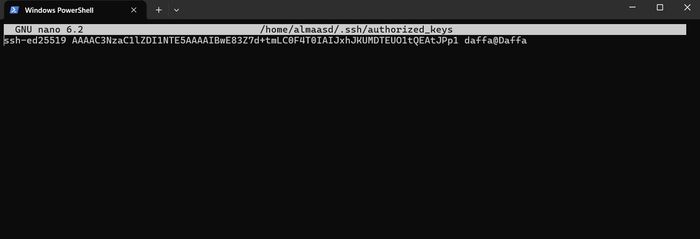

7. setelah itu, buka folder etc/ssh dengan menggunakan perintah cd /etc/ssh

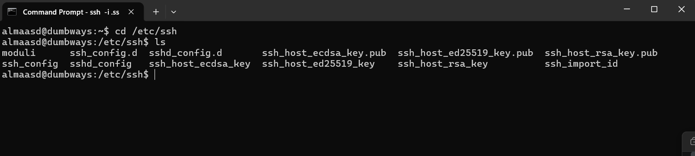

8. masukkan perintah sudo nano sshd_config untuk mengedit isi file tersebut

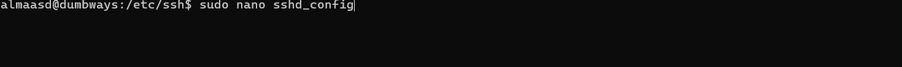

9. hapus tanda pagar pada PubkeyAuthentication, kemudian hapus tanda pagar pada PasswordAuthentication serta rubah dari yang sebelumnya yes menjadi no

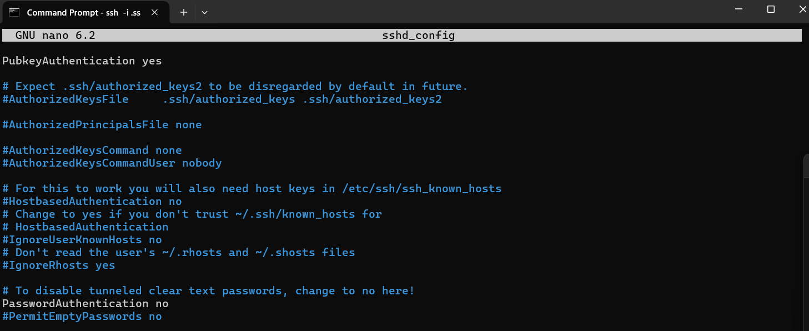

10. lakukan sudo systemctl restart ssh untuk restart ssh setelah konfigurasi dirubah

11. selanjutnya coba akses ke server dengan menggunakan perintah ssh -i .ssh\kunci almaasd@192.168.1.208,maka kita berhasil langsung masuk ke dalam server.

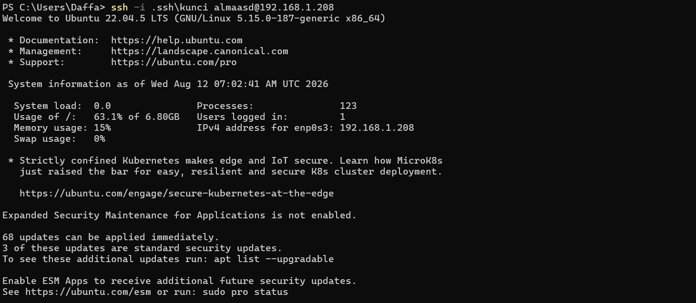

12. Jika kita coba dengan menggunakan ssh almaasd@192.168.1.208 akses langsung ditolak karna tidak diizinkan autentikasi password

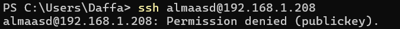

## penggunaan text manipulation (grep,sed,cat, dan echo)

1. grep
A. Menampilkan baris yang mengandung kata yang ingin dicari
    Gunakan perintah:
    grep "kata yang ingin dicari" nama_file

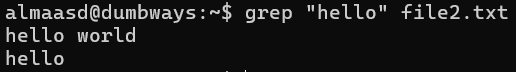

B. Menampilkan nomor baris dari kata yang dicari
    Gunakan perintah:
    grep -n "kata yang ingin dicari" nama_file

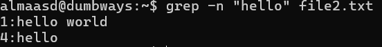

C. Menampilkan baris yang tidak mengandung kata yang dicari
    Gunakan perintah:
    grep -v "kata yang ingin dicari" nama_file

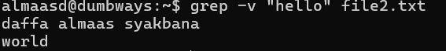

D. Menghitung jumlah baris yang mengandung kata yang dicari
    Gunakan perintah:
    grep -c "kata yang ingin dicari" nama_file

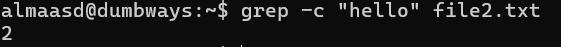

2. sed
A. Mengganti Kata tanpa menyimpan perubahan asli di file
    Gunakan perintah:
    sed 's/kata_lama/kata_baru/' nama_file

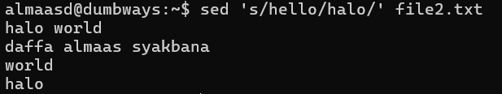

B. Mengganti kata dan menyimpan Perubahan asli di file
    Gunakan perintah :
    sed -i 's/kata_lama/kata_baru/g' nama_file

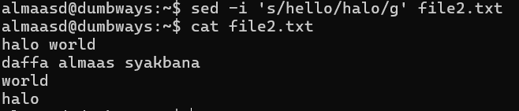

C. Menghapus baris yang mengandung kata tertentu
    Gunakan perintah:
    sed '/kata yang ingin dihapus/d' nama_file
    (tambahkan -i jika ingin langsung menyimpan perubahan file)

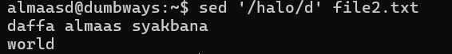

3. cat
A. Menampilkan isi file
    Gunakan perintah:
    cat nama_file

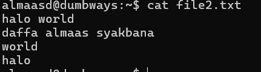

B. Menampilkan Isi Beberapa File
    Gunakan perintah:
    cat nama_file1 nama_file2

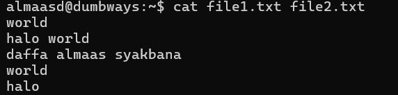

C. Menggabungkan File 
    Gunakan perintah:
    cat nama_file1 nama_file2 > nama_file_baru

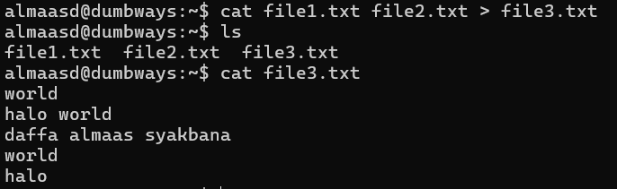

4. echo
A. Mencetak teks
    Gunakan perintah:
    echo "teks yang ingin dicetak"

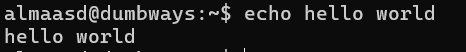

B. Menulis Teks ke file
    Gunakan perintah:
    echo "isi_teks" > nama_file
    - jika nama_file belum ada, maka file akan dibuat
    - jika sudah ada, isi file akan ditimpa

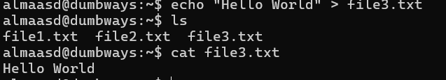

C. Menambahkan Teks ke File (tidak menimpa isi file sebelumnya)
    Gunakan perintah:
    echo "isi_teks" >> nama_file

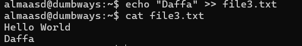

## Menyalakan ufw dengan memberikan akses untuk port 22, 80, 443, 3000, 5000 dan 6969

1. Aktifkan firewall dengan menggunakan perintah:
    sudo ufw enable

    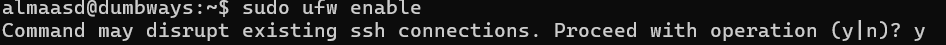

2. Berikan akses terhadap masing - masing port dengan menggunakan perintah:
    sudo ufw allow nomor_port

    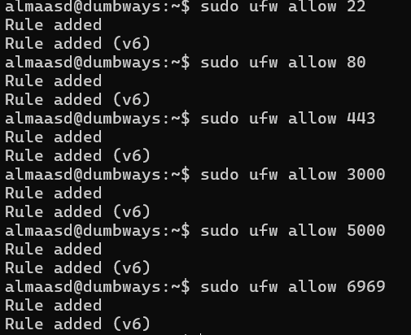

3. cek status firewall dengan perintah:
    sudo ufw status

    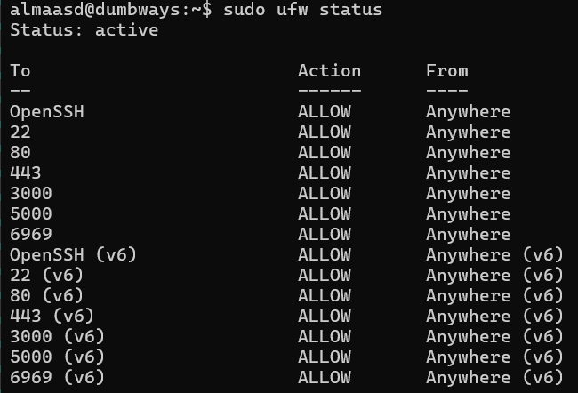

    berdasarkan gambar diatas, port 22, 80, 443, 3000, 5000 dan 6969 telah diberikan akses.

## challenge mengganti ip address

1. Masukkan perintah dibawah untuk mengedit configurasi network :
    sudo nano /etc/netplan/50-cloud-init.yaml

2. Ubah ip adress dari 192.168.1.208 menjadi 192.168.1.210

    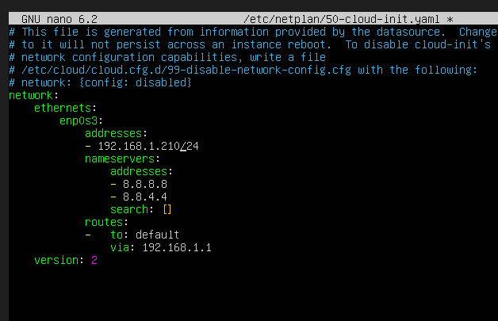

3. lakukan uji konfigurasi dan konfirmasi perubahan menggunakan perintah:
    sudo netplan try

    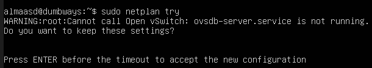

4. cek status jaringan dengan menggunakan perintah:
    sudo netplan status

    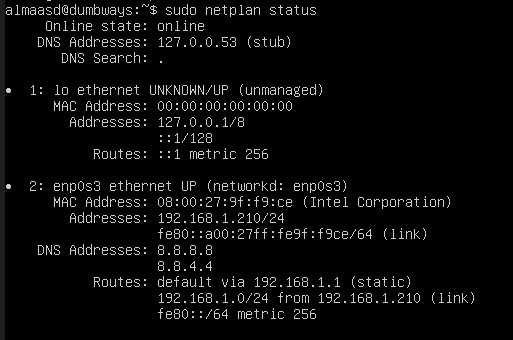
    
    berdasarkan gambar diatas, ip adress berhasil dirubah dari 192.168.1.208 menjadi 192.168.1.210.

