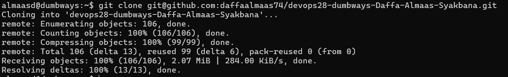
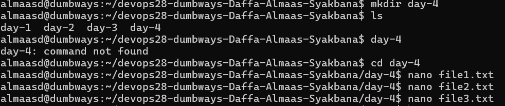
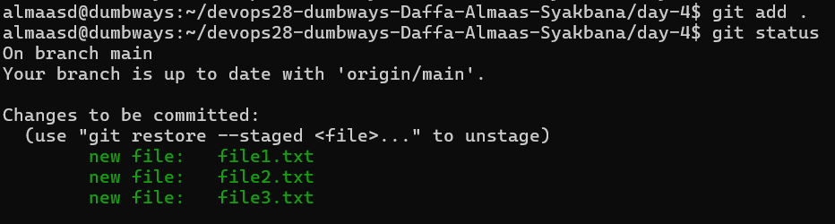
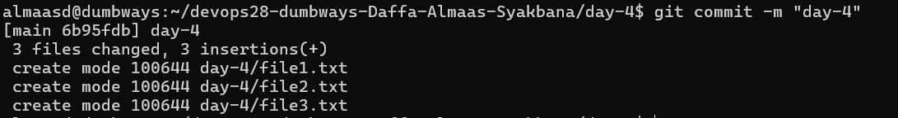
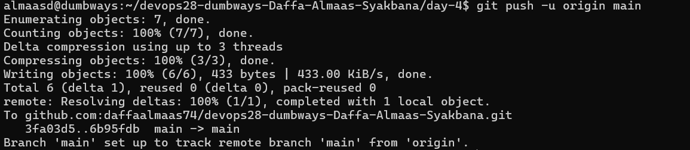
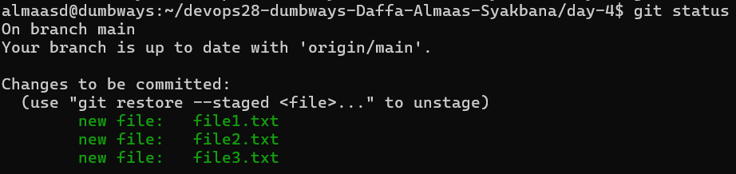
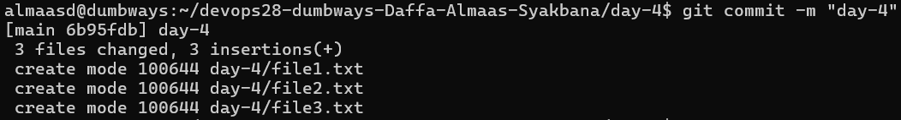

## penjelasan tentang git

git merupakan sistem version control yang digunakan untuk mencatat, mengelola, dan melacak perubahan pada file didalam suatu proyek.

## Buat sebuah repositori bernama "devops26-dumbways-<nama>", lalu tambahkan 3 file yang berisi text

1. saya menggunakan repositori yang telah saya buat sebelumnya bernama devops28-dumbways-Daffa-Almaas-Syakbana

2. lakukan clone repositori github ke dalam server menggunakan git clone

 

3. buat folder baru bernama day-4 didalam folder repositori yang telah di clone dan buat 3 file baru .txt

 

4. lakukan git add. untuk memasukkan perubahan file sebelum dilakukan commit

 

5. lakukan git commit untuk menyimpan perubahan file

 

6. lakukan git push untuk mengirim commit ke github

## manage repositori menggunakan terminal

repositori dapat dikelola dengan menggunakan perintah git,seperti :

git add : untuk memasukkan perubahan file sebelum dilakukan commit

git status : melihat kondisi repositori

git commit : menyimpan perubahan

