##### 1. [NodeJS] Deploy app wayshub-frontend yang berjalan di port 3000 dan menggunakan node 12

1. lakukan clone dari repositori https://github.com/dumbwaysdev/wayshub-frontend ke dalam server local dengan menggunakan " git clone https://github.com/dumbwaysdev/wayshub-frontend "

 

2. setelah berhasil clone, buka direktori wayshub-frontend, dan install node 12 dengan menggunakan perintah " nvm install 12 "

 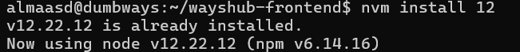

3. Setelah berhasil menginstall node 12, masukkan perintah "npm install" untuk menginstall depedency sesuai yang ada di isi package.json

 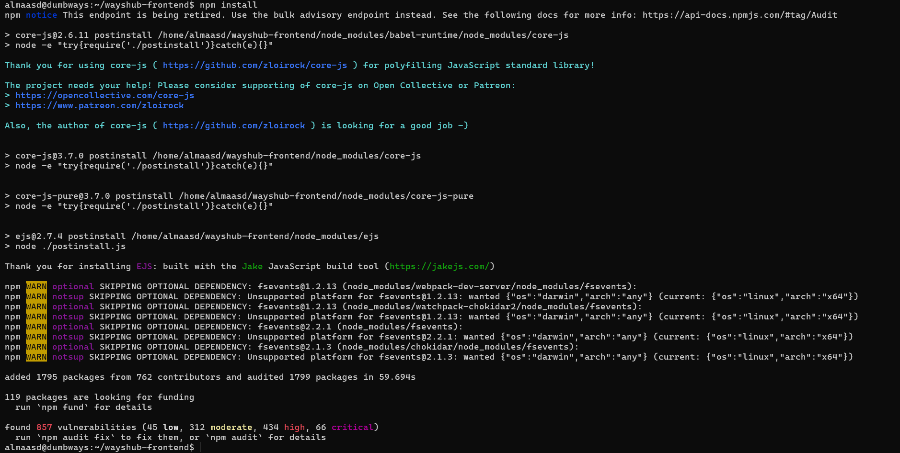

4. selanjutnya, sebelum menjalankan aplikasi, pastikan firewall sudah menyala dan port 3000 telah diberi akses(gunakan perintah "ufw sudo status" untuk cek status firewall)

 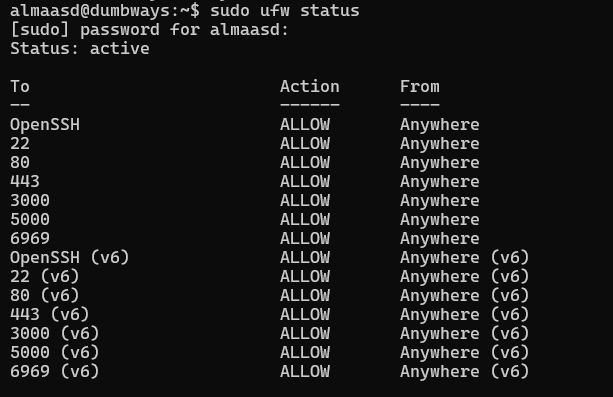

5. Jalankan aplikasi dengan menggunakan perintah " npm start "

 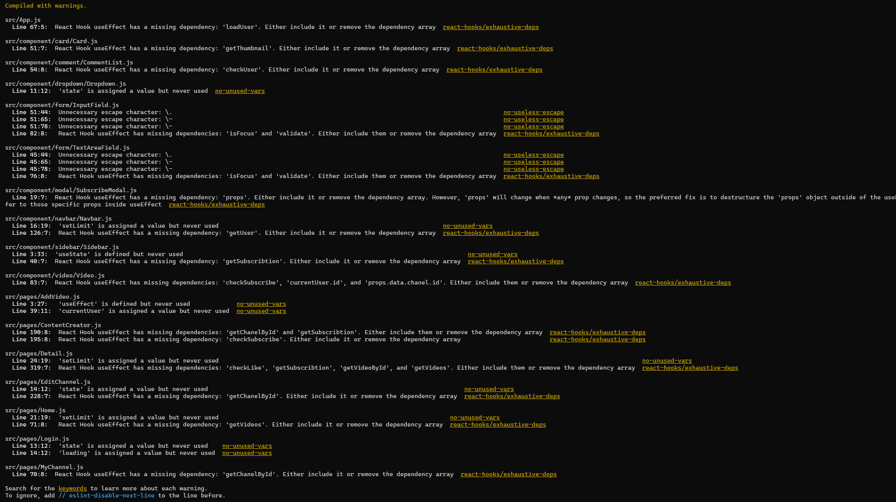

6. Aplikasi berhasil dijalankan dengan menggunakan port 3000 dengan url http://192.168.1.208:3000

 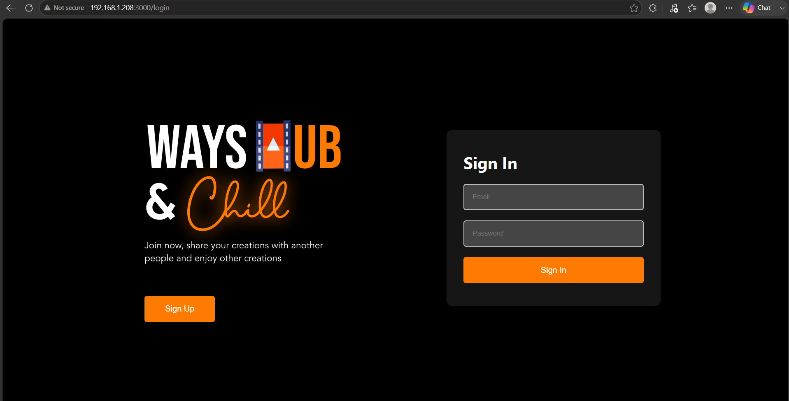

##### 2. [Python] Deploy app menampilkan text berisi nama menggunakan port 5000 & bisa dibuka melalui web

1. install package manager (pip) dengan menggunakan perintah " sudo apt install python3-pip "

 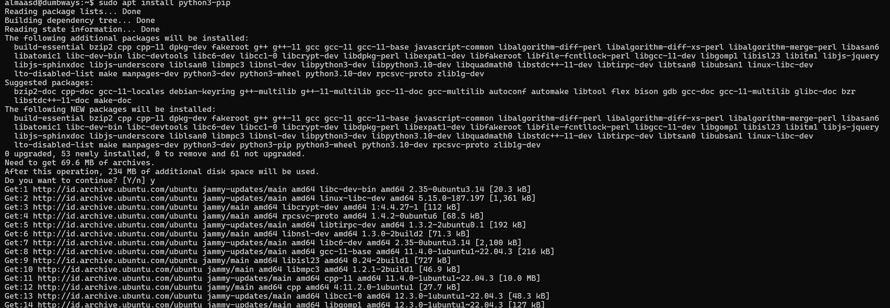

2. setelah berhasil install, buat folder bernama python dan masuk kedalam direktori tersebut.

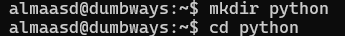

3. install library flask dengan menggunakan perintah " pip install flask "

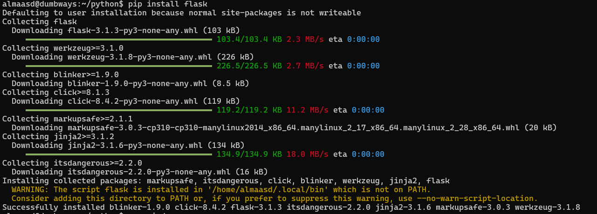

4. buat file bernama index.py dan isi file tersebut sesuai dengan gambar dibawah

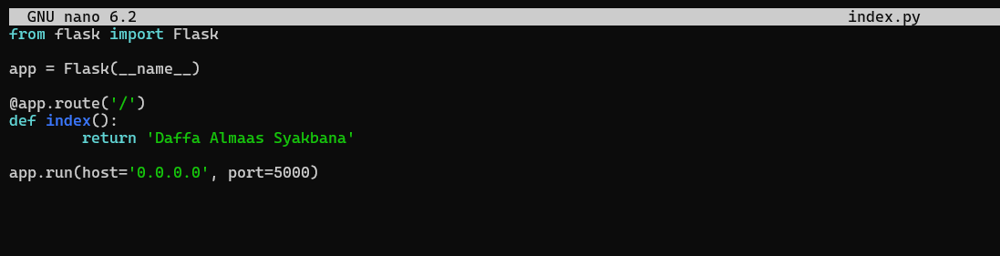

Dari gambar diatas, port menggunakan 5000.

5. sebelum menjalankan aplikasi, pastikan firewall sudah menyala dan port 5000 telah diberi akses(gunakan perintah "ufw sudo status" untuk cek status firewall)

 

6. jalankan aplikasi dengan menggunakan perintah " python3 index.py "

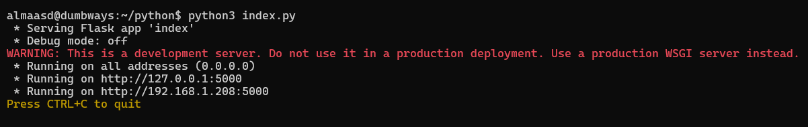

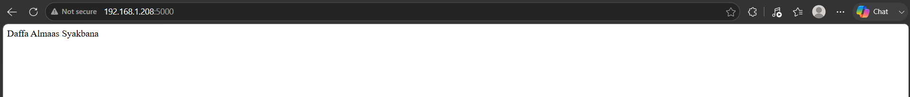

Dari gambar diatas aplikasi berhasil berjalan dan dapat dibuka melalui browser dengan menggunakan port 5000.

#### 3. Deploy app menampilkan text "Golang geming!"

1.  download installer go dengan menggunakan perintah " wget -4 https://go.dev/dl/go1.26.6.linux-amd64.tar.gz "

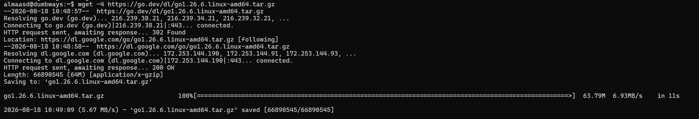

2. masukkan perintah sudo su untuk beralih ke user root dan masukkan perintah " rm -rf /usr/local/go && tar -C /usr/local -xzf go1.26.6.linux-amd64.tar.gz " untuk menghapus instalasi go lama jika sudah terinstall dan mengekstrak go yang baru

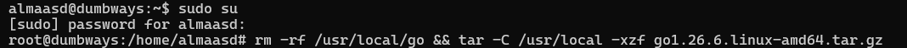

Setelah berhasil mengekstrak, exit dari user root dengan menggunakan tombol ctrl + D.

3. buat direktori bernama golang dan masuk ke dalam direktori tersebut

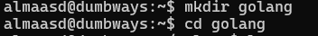

4. buat file bernama index.go dan isi file tersebut seperti gambar dibawah

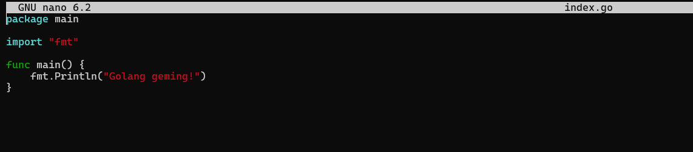

5. Jalankan aplikasi dengan menggunakan perintah " go run index.go " dan buka browser lalu masukkan url http://192.168.1.208:8080/

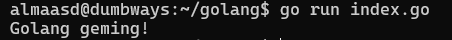