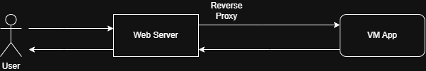
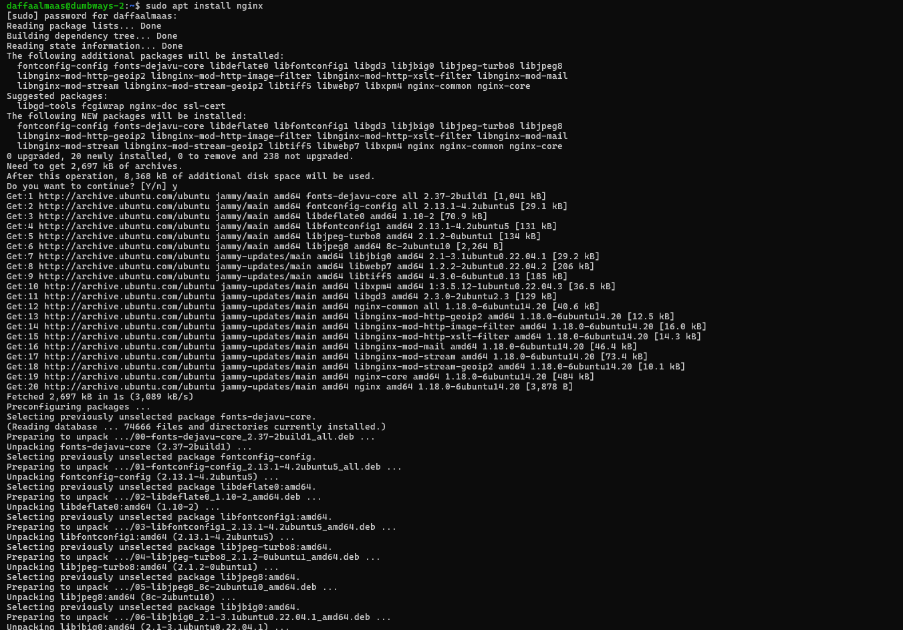
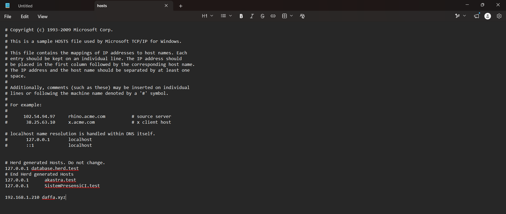
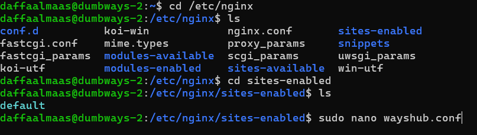
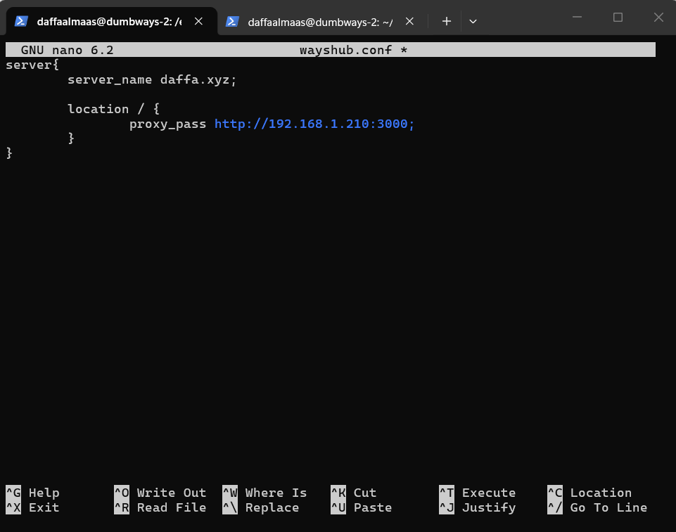
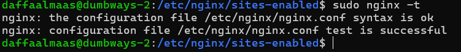
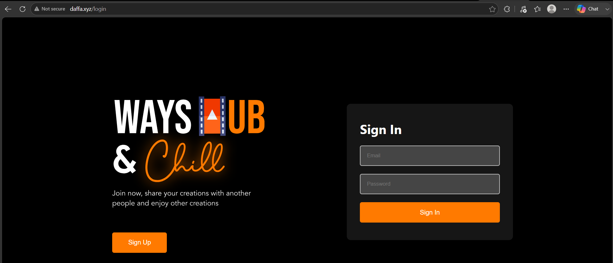
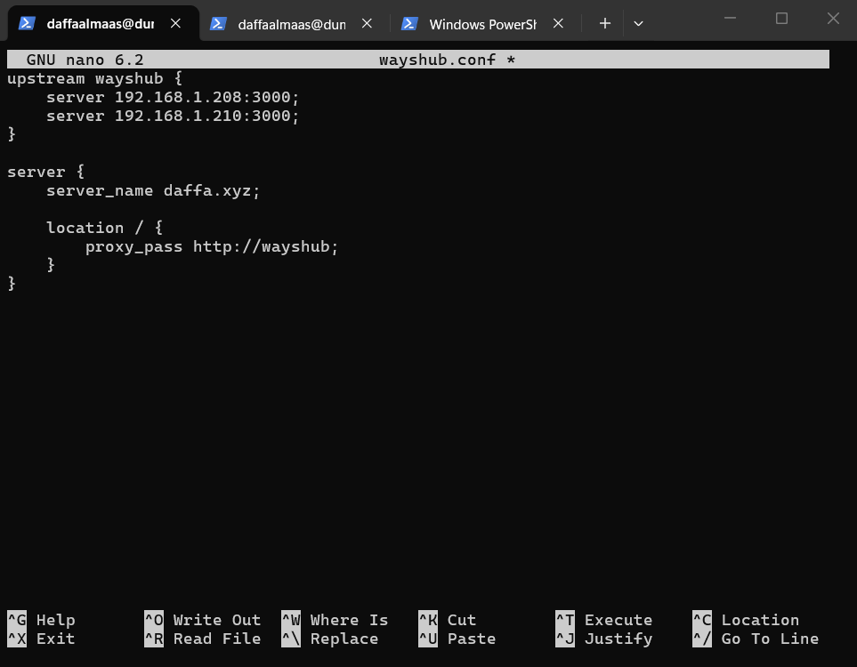
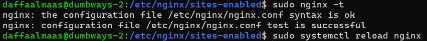
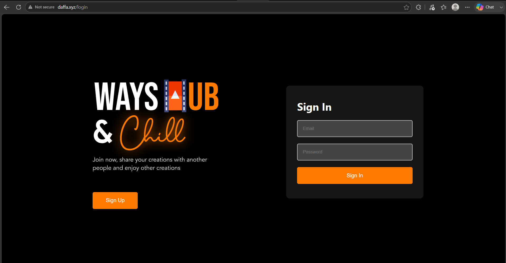

#### 1.  Gambarkan sturktur web server menggunakan reverse proxy dan jelaskan cara kerjanya!

 

 cara kerja :
 
 1. User membuka alamat website melalui browser, Request dari user masuk ke web server.

 2. Web server menerima request dari user lalu meneruskannya ke VM APP(server)

 3. VM App(server) mengirim response ke web server 

 4. Web server mengirim response ke user

 #### 2. Buatlah Reverse Proxy untuk aplilkasi yang sudah kalian deploy kemarin. (wayshub), untuk domain nya sesuaikan nama masing" ex: ade.xyz .
 
 1. Menginstall Nginx

  

2. edit file hosts di C:\Windows\System32\drivers\etc, lalu masukkan ip adress server dan nama domain

3. Buka direktori /etc/nginx/sites-enabled, dan buat file baru dengan format .conf

4. Isi file wayshub.conf yang telah dibuat dengan isi seperti gambar dibawah

5. Jalankan perintah " sudo nginx -t " untuk mengecek konfigurasi apakah sudah sesuai

6. Jalankan perintah sudo systemctl reload nginx

7. Domain daffa.xyz berhasil digunakan dan aplikasi wayshub berhasil ditampilkan

 #### 3. Challenge menggunakan load balancer

 1. Edit wayshub.conf seperti gambar dibawah

2. Lakukan "sudo nginx -t" untuk mengecek konfigurasi dan "sudo systemctl reload nginx" untuk reload nginx

3. Aplikasi berhasil dibuka dengan menggunakan domain daffa.xyz serta menggunakan load balancer

 