# Stage 2 Week 5 - Final Task

## Penjelasan Server

   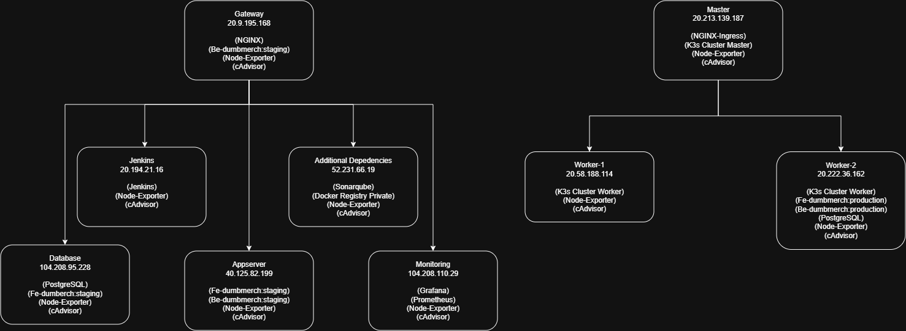

### 1. Provisioning

1. Di WSL, buat dua direktori bernama kubernetes-server dan server di dalam direktori automation/Terraform/azure.

2. Di dalam direktori kubernetes-server, buat tiga file Terraform, yaitu main.tf yang digunakan untuk mendefinisikan resource dan infrastruktur yang akan dibuat, providers.tf yang berfungsi untuk menentukan serta mengatur provider yang digunakan, yaitu Azure, dan variables.tf yang digunakan untuk mendefinisikan variabel.

3. Pada file [main.tf](src/automation/terraform/kubernetes-server/main.tf) berisikan konfigurasi infrastruktur Azure untuk membangun cluster Kubernetes yang terdiri dari satu master dan dua worker. Master dan worker-1 ditempatkan pada Australia East dalam satu Virtual Network (VNet), sedangkan worker-2 ditempatkan pada Japan East dengan VNet terpisah. Setiap server dilengkapi dengan Network Security Group (NSG), Public IP, Network Interface (NIC), serta managed data disk. Untuk memungkinkan komunikasi jaringan antara cluster di Australia East dan worker-2 di Japan East, kedua VNet dihubungkan menggunakan VNet Peering dua arah. Konfigurasi ini memungkinkan node Kubernetes tetap dapat saling berkomunikasi meskipun berada pada region Azure yang berbeda.

4. Pada file [variables.tf](src/automation/terraform/kubernetes-server/variables.tf) berisikan definisi variabel yang digunakan untuk mengatur konfigurasi infrastruktur Azure secara terpusat. Variabel tersebut mencakup nama Resource Group, lokasi deployment di Australia East, konfigurasi VNet dan subnet, Network Security Group (NSG), username server, ukuran Virtual Machine menggunakan Standard_B2als_v2, lokasi SSH public key, jenis storage Standard_LRS, ukuran data disk sebesar 10 GB, serta konfigurasi caching ReadWrite. Dengan menggunakan variabel ini, konfigurasi pada main.tf menjadi lebih fleksibel dan mudah disesuaikan tanpa perlu mengubah resource secara langsung.

5. Pada file [providers.tf](src/automation/terraform/kubernetes-server/providers.tf) berisikan  konfigurasi AzureRM digunakan untuk menghubungkan Terraform dengan Azure dan mengelola resource di dalamnya.

6. Di dalam direktori server, buat tiga file Terraform, yaitu main.tf yang digunakan untuk mendefinisikan resource dan infrastruktur yang akan dibuat, providers.tf yang berfungsi untuk menentukan serta mengatur provider yang digunakan, yaitu Azure, dan variables.tf yang digunakan untuk mendefinisikan variabel.

7. Pada file [main.tf](src/automation/terraform/server/main.tf) berisikan konfigurasi infrastruktur Azure untuk membangun beberapa server di berbagai region. Konfigurasi ini mencakup Resource Group, VNet, Subnet, NSG, Public IP, NIC, Virtual Machine, serta managed data disk. Penggunaan for_each memungkinkan resource dibuat secara otomatis berdasarkan daftar region dan server yang telah ditentukan.

8. Pada file [variables.tf](src/automation/terraform/server/variables.tf) berisikan konfigurasi region dan server yang akan digunakan dalam infrastruktur Azure. Terdapat tiga region, yaitu West US 2, East Asia, dan Korea Central, dengan konfigurasi VNet, Subnet, dan NSG masing-masing. Selain itu, file ini mendefinisikan enam server yaitu appserver, gateway, database, monitoring, jenkins, dan additional-depedencies, serta konfigurasi ukuran VM, username, SSH key, dan penyimpanan data disk.

9. Pada file [providers.tf](src/automation/terraform/server/providers.tf) berisikan konfigurasi AzureRM digunakan untuk menghubungkan Terraform dengan Azure dan mengelola resource di dalamnya.

10. Didalam direktori kubernetes-server, Jalankan perintah ' terraform validate ' untuk memeriksa konfigurasi Terraform sebelum diterapkan.

    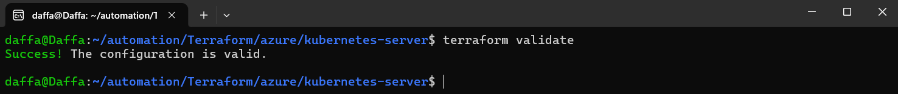

11. Jalankan perintah ' terraform plan ' untuk melihat perubahan resource yang akan dibuat.

    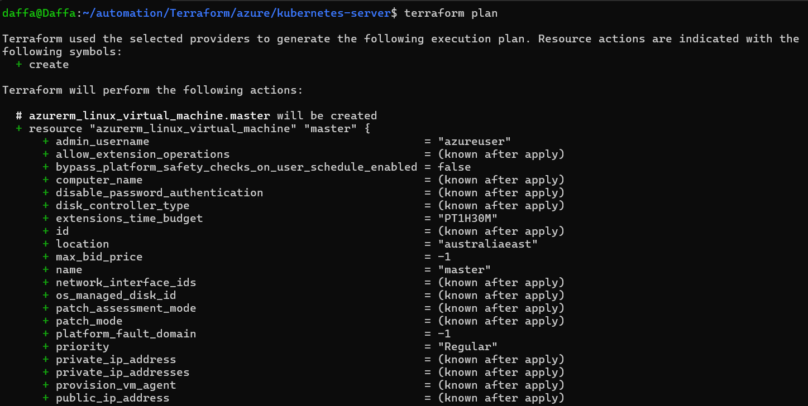

12. Jalankan perintah ' terraform apply ' untuk menerapkan konfigurasi membuat resource pada Azure.

    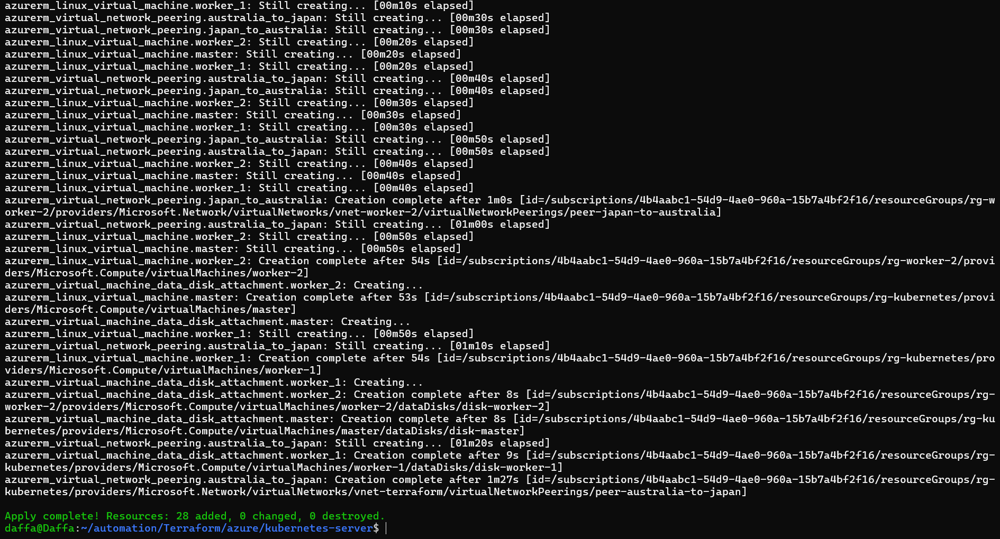

13. Didalam direktori server, Jalankan perintah ' terraform validate ' untuk memeriksa konfigurasi Terraform sebelum diterapkan.

    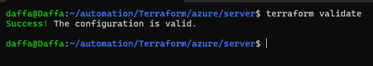

11. Jalankan perintah ' terraform plan ' untuk melihat perubahan resource yang akan dibuat.

    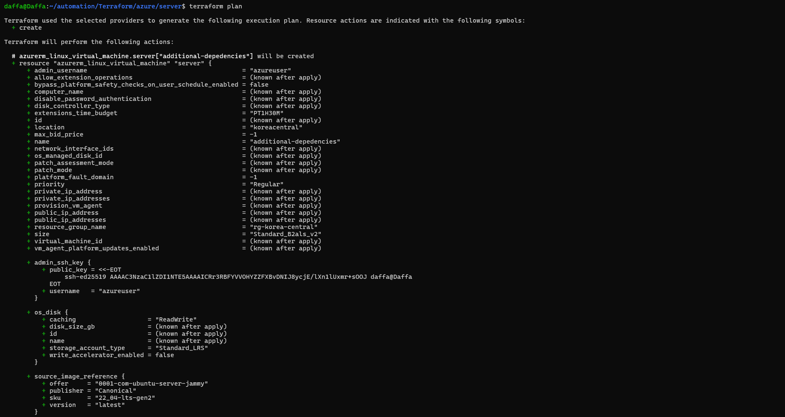

12. Jalankan perintah ' terraform apply ' untuk menerapkan konfigurasi membuat resource pada Azure.

    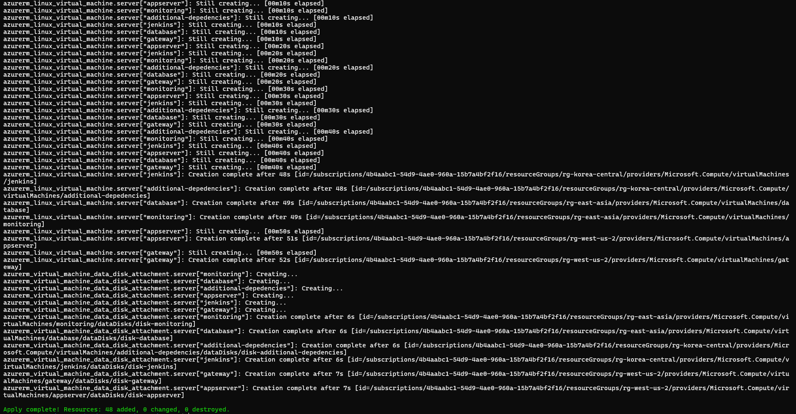

13. Resource berhasil dibuat, terdapat 9 virtual machine yang telah berjalan pada beberapa region Azure, yaitu Korea Central, West US 2, East Asia, Australia East, dan Japan East, yang terdiri dari server additional-dependencies, appserver, database, gateway, jenkins, master, monitoring, worker-1, dan worker-2. Seluruh server telah diberikan akses inbound terhadap port 22, 80, 443, dan 3333.

    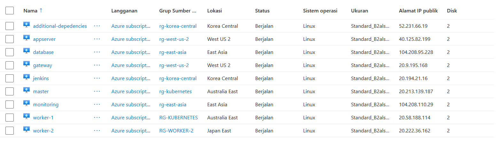

### 2. Repository

1. Di dalam Github, buat repository baru bernama fe-dumbmerch dan be-dumbmerch dengan visibilitas private.

    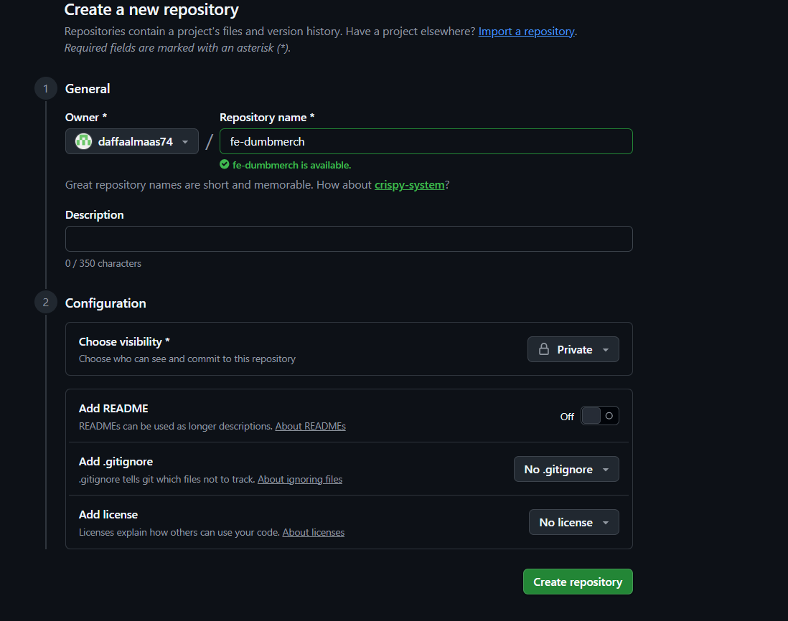

    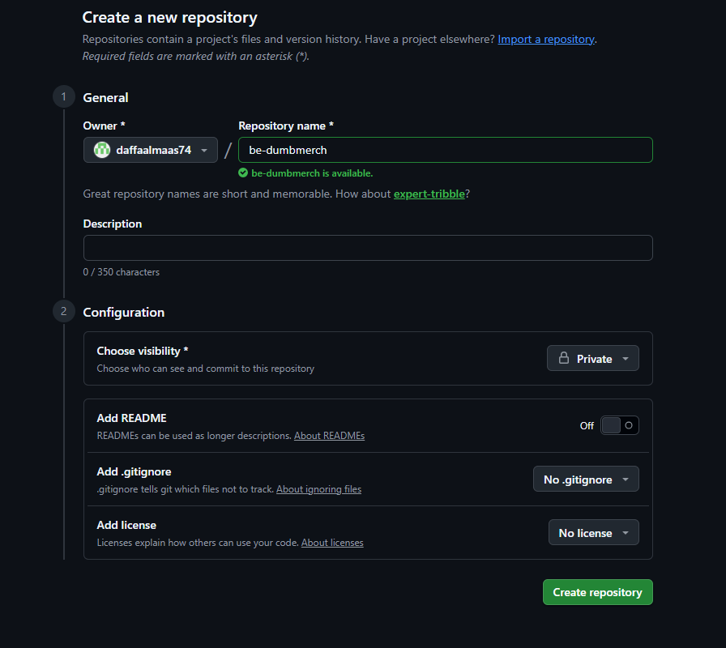

2. Di dalam WSL, buat direktori dumbmerch yang berisi direktori staging dan production. Kemudian lakukan git clone repository https://github.com/demo-dumbways/fe-dumbmerch dan https://github.com/demo-dumbways/be-dumbmerch ke dalam direktori staging dan production.

    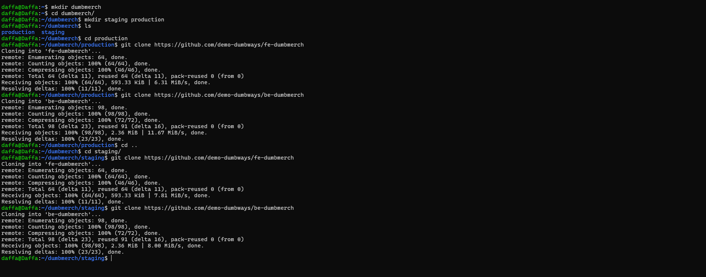

3. Tambahkan SSH Key ke dalam github.

    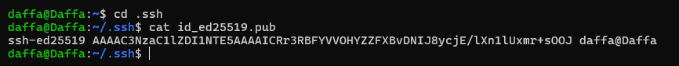
    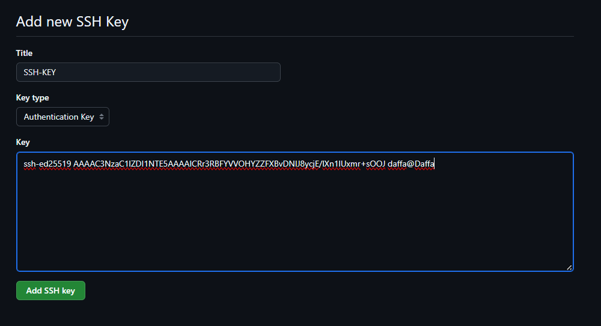
    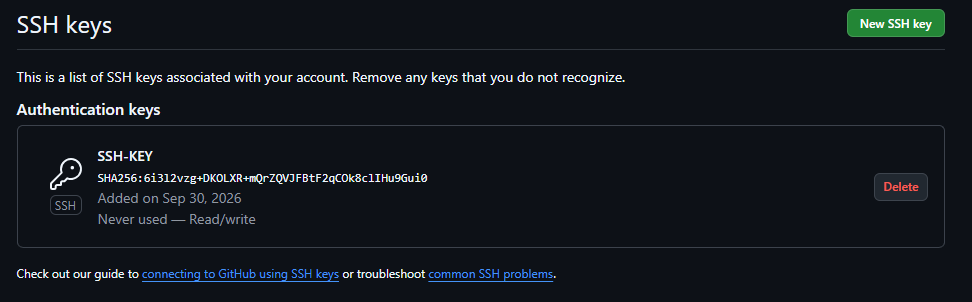

4. Hubungkan repository fe-dumbmerch dan be-dumbmerch pada direktori staging dan production ke repository GitHub menggunakan perintah git remote set-url origin, dengan remote SSH git@github.com:daffaalmaas74/fe-dumbmerch.git dan git@github.com:daffaalmaas74/be-dumbmerch.git.

    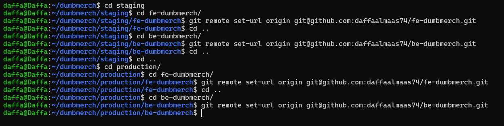

5. Buat branch staging dan production pada repository fe-dumbmerch dan be-dumbmerch menggunakan perintah ' git checkout -b staging ' dan ' git checkout -b production ', kemudian push masing-masing branch ke repository GitHub menggunakan perintah ' git push -u origin staging ' dan ' git push -u origin production '.

    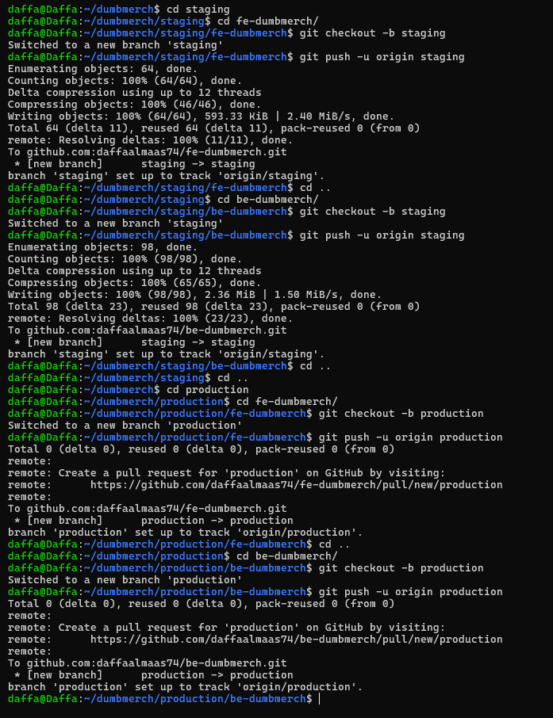

6. Branch staging dan production berhasil dibuat dan di-push ke repository GitHub fe-dumbmerch dan be-dumbmerch.

    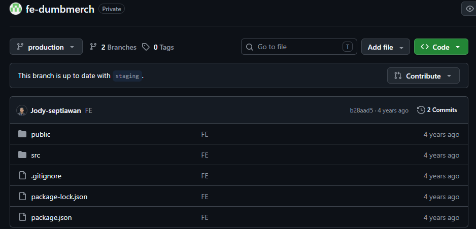

    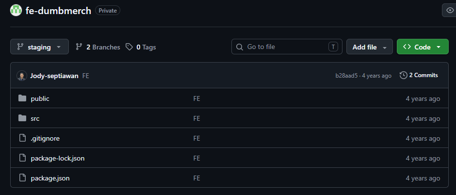

    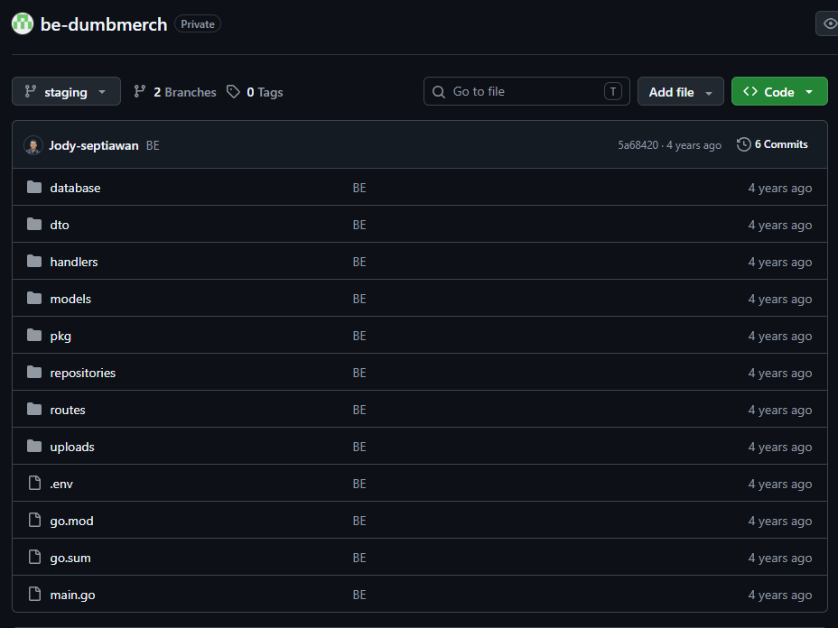

    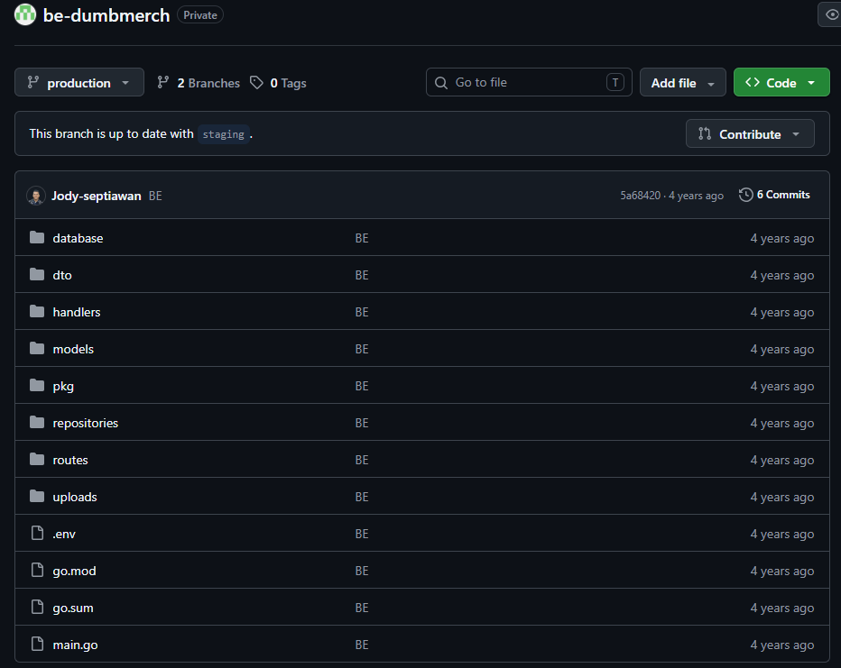

### 3. Servers

1. Di WSL, buat direktori Ansible di dalam direktori automation, kemudian buat direktori group_vars di dalam direktori Ansible.

2. Buat file [all](src/automation/Ansible/group_vars/all) untuk mendefinisikan variabel global yang digunakan dalam proses otomatisasi Ansible.

2. Buat file bernama [Inventory](src/automation/Ansible/Inventory) di dalam direktori automation. File tersebut berisi daftar host beserta alamat IP masing-masing server.

3. Buat file bernama [ansible.cfg](src/automation/Ansible/ansible.cfg) di dalam direktori Ansible untuk menyimpan konfigurasi utama Ansible. Konfigurasi remote_port = 3333 sementara dinonaktifkan dengan komentar karena beberapa server masih menggunakan port SSH 22. Setelah seluruh server selesai dikonfigurasi untuk menggunakan port SSH 3333, komentar pada baris tersebut akan dihapus agar Ansible menggunakan port 3333 saat terhubung ke seluruh server.

4. Buat file bernama [all](src/automation/Ansible/group_vars/all) di dalam direktori group_vars untuk menyimpan variabel yang digunakan secara global oleh Ansible. File tersebut berisi konfigurasi user awal untuk login ke server, Python interpreter yang digunakan Ansible, user baru yang akan dibuat, password user, serta lokasi SSH key yang digunakan dalam proses konfigurasi.

5. Buat file [create-user.yaml](src/automation/Ansible/create-user.yaml) di dalam direktori Ansible untuk membuat user baru dan mengatur konfigurasi SSH pada seluruh server yang terdaftar di Inventory. Playbook ini membuat user baru, mengatur akses sudo, memasang SSH key beserta permission-nya, mengaktifkan autentikasi password dan public key, mengubah port SSH dari 22 menjadi 3333, memvalidasi konfigurasi SSH, lalu me-restart layanan SSH.

6. Buat file [config](src/.ssh/config) pada directory ~/.ssh untuk menyimpan konfigurasi koneksi SSH ke seluruh server. Konfigurasi ini digunakan agar koneksi ke server dapat dilakukan menggunakan hostname yang telah ditentukan tanpa perlu memasukkan IP address, username, port, dan private key secara manual.

7. Buat file [install-docker.yaml](src/automation/Ansible/install-docker.yaml) di dalam direktori Ansible untuk melakukan instalasi dan konfigurasi Docker Engine pada seluruh server. Playbook ini melakukan update dan upgrade package, menginstal dependency Docker, menambahkan GPG key dan repository resmi Docker, menginstal Docker Engine beserta Docker CLI, Containerd, Buildx, dan Compose Plugin, kemudian mengaktifkan service Docker serta menambahkan user ke group docker.

8. Jalankan perintah ' ansible-playbook create-user.yaml --syntax-check'  dan ' ansible-playbook install-docker.yaml --syntax-check ' untuk memastikan sintaks playbook sudah benar sebelum dijalankan.

    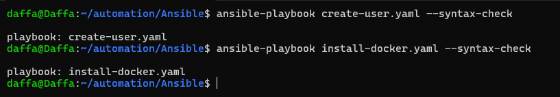

9. Jalankan perintah ' ansible-playbook create-user.yaml ' untuk membuat user baru dan mengatur konfigurasi SSH pada seluruh server.

    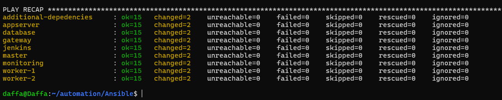

    Playbook berhasil dijalankan. Selanjutnya, hapus tanda komentar pada remote_port = 3333 di ansible.cfg agar Ansible menggunakan port SSH 3333.

    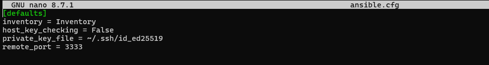

10. Jalankan perintah ' ansible-playbook install-docker.yaml ' untuk menginstal dan mengonfigurasi Docker Engine pada seluruh server.

    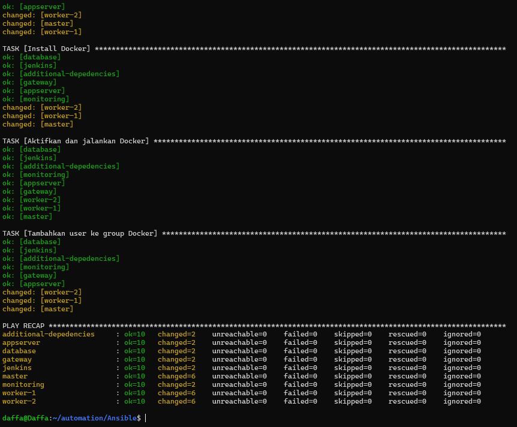

    Playbook berhasil dijalankan pada seluruh server dan Docker Engine berhasil diinstal.

### 4. Web Server

1. Buat file [setup-nginx-certbot-ssl.yaml](src/automation/Ansible/setup-nginx-certbot-ssl.yaml) di dalam direktori Ansible untuk melakukan instalasi dan konfigurasi Nginx, Certbot, serta reverse proxy pada server gateway. Playbook ini membuat struktur direktori, konfigurasi Nginx dan reverse proxy, kredensial Cloudflare, membangun image Docker Nginx, membuat sertifikat SSL wildcard menggunakan Certbot dengan DNS Cloudflare, serta menjalankan Nginx dalam container Docker. Konfigurasi juga mencakup reverse proxy untuk monitoring, Prometheus, docker registry, SonarQube, Node Exporter, serta load balancing untuk aplikasi dan API staging.

2. Buat file [renew-certificates.yaml](src/automation/Ansible/renew-certificates.yaml) di dalam direktori Ansible untuk untuk mengotomatisasi perpanjangan sertifikat SSL pada server gateway. Playbook ini membuat Bash script yang menjalankan proses renewal sertifikat menggunakan Certbot melalui Docker, menggunakan kredensial DNS Cloudflare, serta melakukan reload Nginx secara otomatis setelah sertifikat berhasil diperbarui. Selain itu, playbook membuat cronjob yang menjalankan proses perpanjangan sertifikat secara otomatis setiap hari pada pukul 03.00.

3. Jalankan perintah ' ansible-playbook install-nginx-certbot-reverse-proxy.yaml ' untuk menginstal dan mengonfigurasi Nginx, Certbot, sertifikat SSL wildcard, serta reverse proxy pada server gateway.

    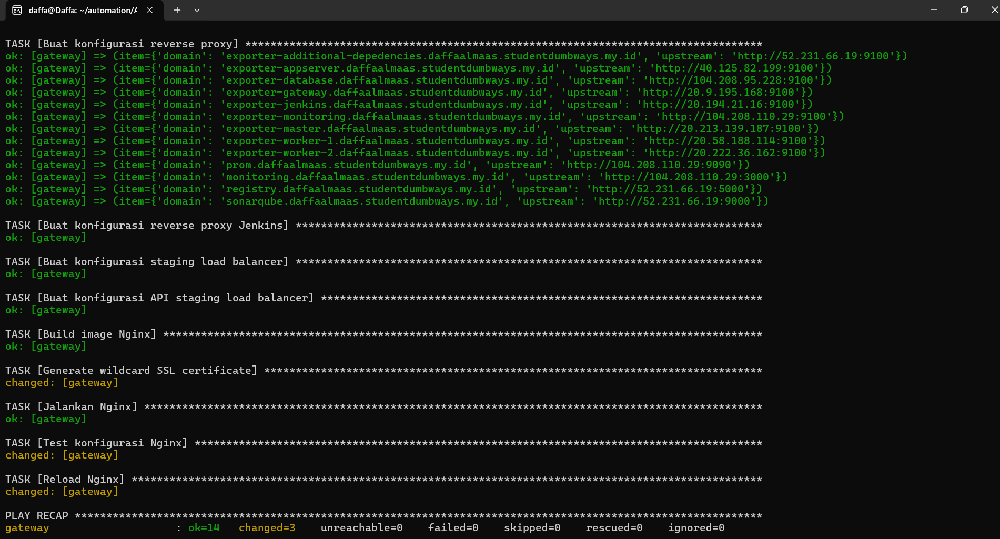

4. Jalankan perintah ' ansible-playbook renew-certificates.yaml ' untuk mengatur perpanjangan sertifikat SSL secara otomatis menggunakan Certbot dan DNS Cloudflare, termasuk konfigurasi cronjob serta reload Nginx setelah sertifikat berhasil diperbarui.

    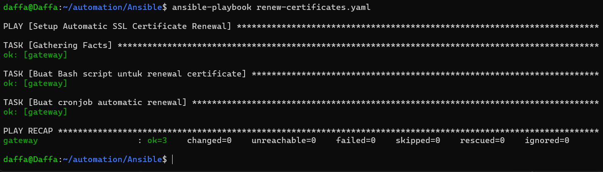

5. Instalasi dan konfigurasi Nginx, Certbot, SSL wildcard, reverse proxy, serta load balancing berhasil diterapkan pada gateway. Konfigurasi renewal SSL otomatis menggunakan Certbot dan cronjob juga berhasil dibuat.

    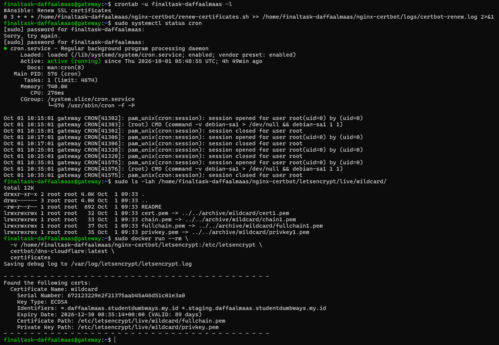

### 5. Docker Registry Private

1. Buat file [install-docker-registry-private.yaml](src/automation/Ansible/install-docker-registry-private.yaml.yaml) didalam direktori Ansible untuk melakukan instalasi dan konfigurasi Private Docker Registry pada server additional-depedencies. Playbook ini membuat direktori penyimpanan registry dengan bind mount, menginstal apache2-utils untuk menyediakan htpasswd, membuat autentikasi menggunakan username dan password, serta menjalankan container Docker Registry pada port 5000.

2. Jalankan perintah ' ansible-playbook install-docker-registry-private.yaml ' untuk melakukan instalasi dan konfigurasi Private Docker Registry pada server additional-depedencies.

    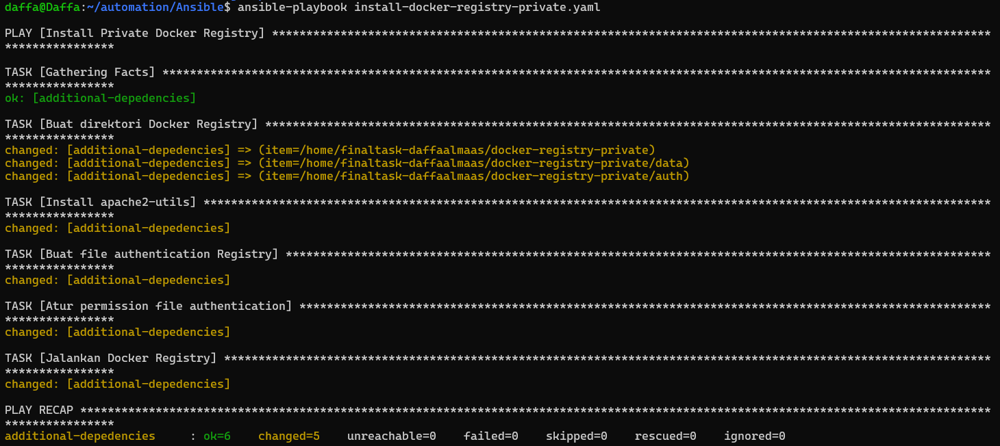

3. Tambahkan inbound rule pada NSG Azure untuk mengizinkan akses melalui port 5000 pada server additional-depedencies.

    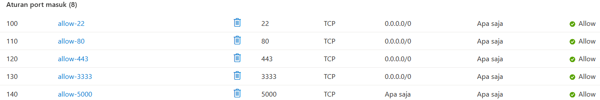

4. Docker Registry Private berhasil diinstal dan dikonfigurasi pada server additional-depedencies.

    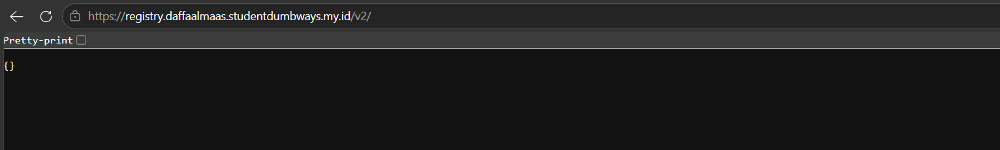

### 6. Deployment Apps (Staging)

#### 1. Database

1. buat file [install-postgresql.yaml](src/automation/Ansible/install-postgresql.yaml) didalam direktori Ansible untuk menginstall dan konfigurasi PostgreSQL menggunakan Docker Compose pada server database. Playbook ini membuat direktori PostgreSQL, Dockerfile, file init.sql untuk melakukan inisialisasi database dengan membuat user daffaalmaas, database dumbmerch, serta memberikan hak akses penuh kepada user tersebut pada database dan schema public. Selanjutnya, playbook membuat konfigurasi docker-compose.yaml, melakukan build image PostgreSQL, dan menjalankan container PostgreSQL.

2. Jalankan perintah ' ansible-playbook install-postgresql.yaml ' untuk melakukan instalasi dan konfigurasi PostgreSQL pada server database.

    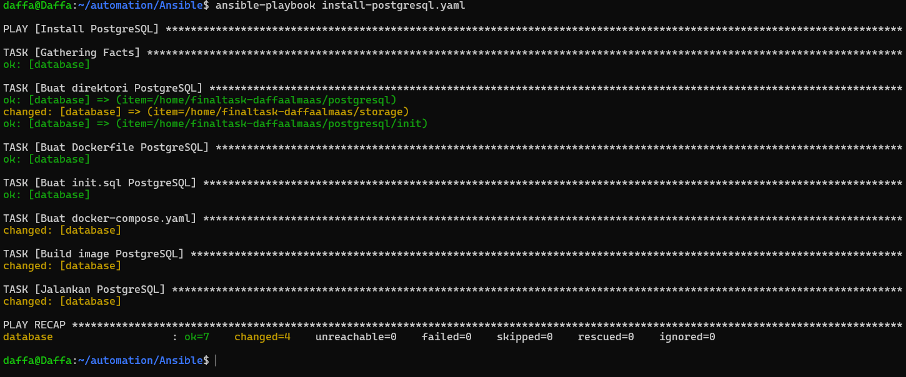

3. Tambahkan inbound rule pada NSG Azure untuk mengizinkan akses melalui port 5432 pada server database.

    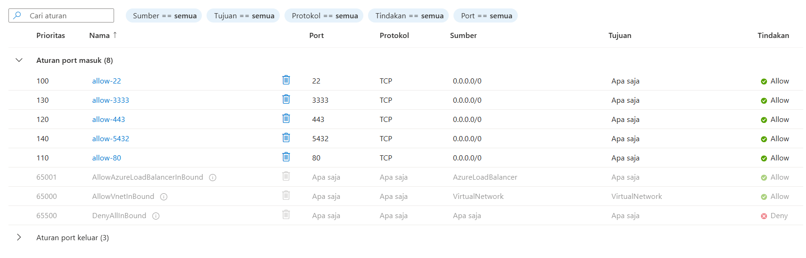

4. Postgresql berhasil diinstal dan dikonfigurasi pada server database. User daffaalmaas dan database dumbmerch juga berhasil dibuat dengan hak akses yang telah dikonfigurasi dan database bisa di remote dari server lain.

    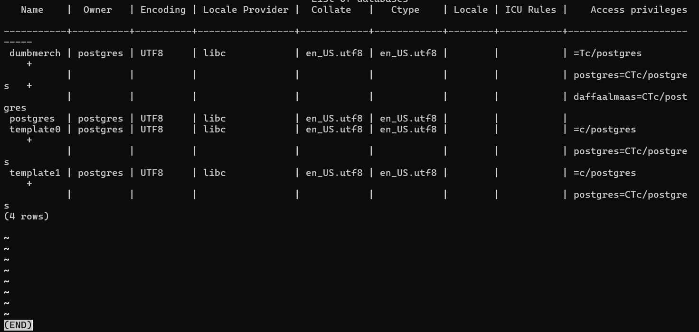

    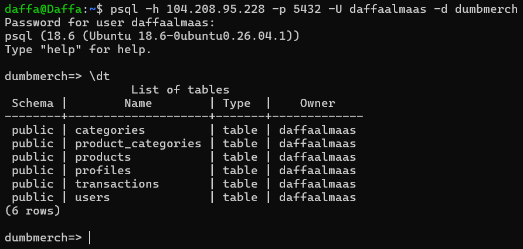    

#### 2. Backend

1. Di WSL, pada direktori /dumbmerch/staging/be-dumbmerch, Ubah isi file .env agar menyesuaikan konfigurasi PostgreSQL pada server database, meliputi URL Pathfile, IP server database, username, password, nama database, dan port PostgreSQL, serta menyesuaikan port yang digunakan oleh aplikasi be-dumbmerch.

    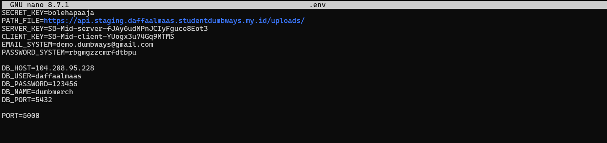

2. Lakukan perintah ' git add . ' ,  ' git commit -m "isi_komentar" ' , dan ' git push -u origin staging ' untuk menyimpan dan mengirim perubahan konfigurasi .env ke repository pada branch staging.

    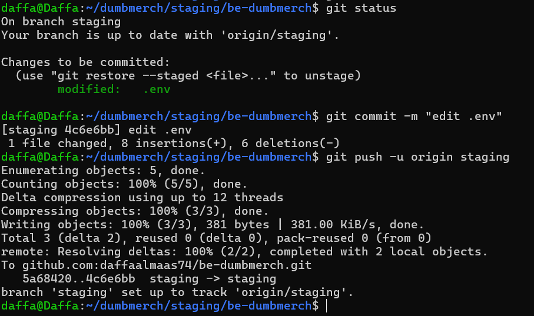

3. buat file [deploy-be-dumbmerch-staging.yaml](src/automation/Ansible/deploy-be-dumbmerch-staging.yaml) didalam direktori Ansible untuk melakukan deployment be-dumbmerch pada server appserver dan gateway. Playbook ini mencakup proses clone repository branch staging, pembuatan Dockerfile dan Docker Compose, login ke private Docker Registry, build serta menjalankan container, dan push image hasil build ke private Docker Registry.

4. Jalankan perintah 'ansible-playbook deploy-be-dumbmerch-staging.yaml' untuk melakukan untuk melakukan deployment be-dumbmerch.

    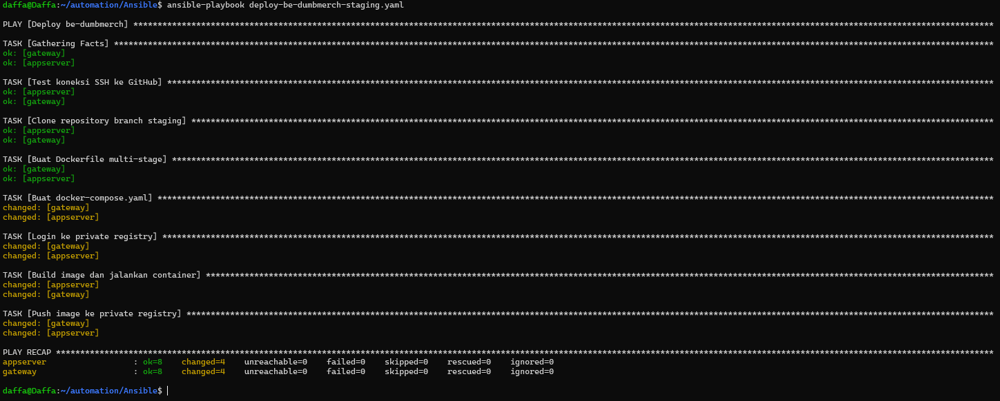

5. Tambahkan inbound rule pada NSG Azure untuk mengizinkan akses melalui port 5000 pada server gateway dan appserver.

    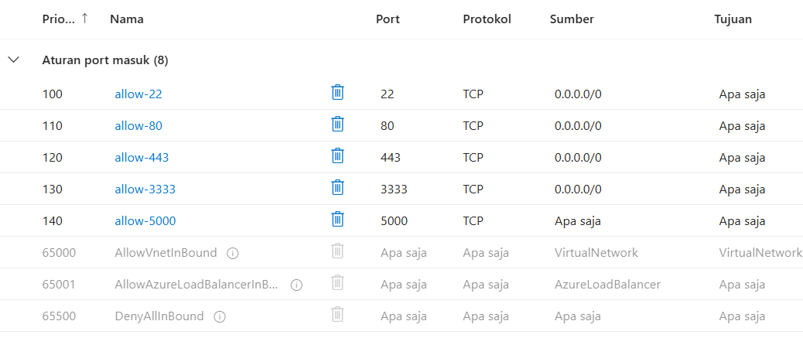

6. Deployment be-dumbmerch berhasil dilakukan pada server appserver dan gateway.

    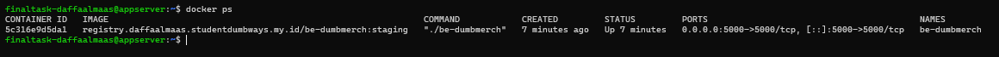

    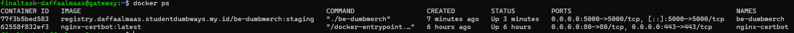

#### 3. Frontend

1. Di WSL, pada direktori /dumbmerch/staging/fe-dumbmerch, buat file .env untuk menentukan base URL API backend yang digunakan oleh aplikasi fe-dumbmerch.

    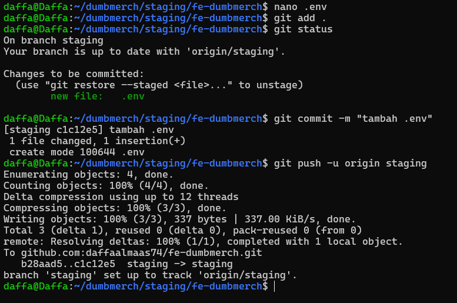

    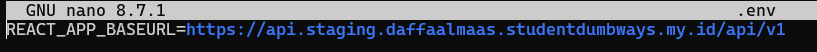

2. Lakukan perintah ' git add . ' ,  ' git commit -m "isi_komentar" ' , dan ' git push -u origin staging ' untuk menyimpan dan mengirim perubahan .env ke repository pada branch staging.

    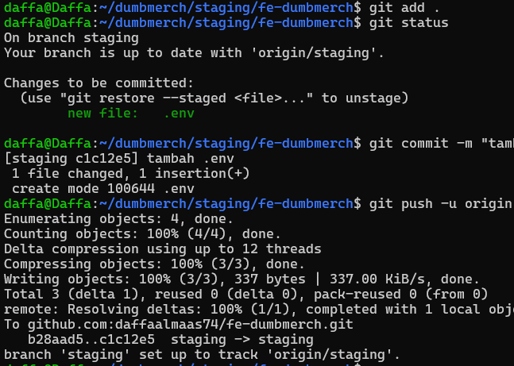

3. buat file [deploy-fe-dumbmerch-staging.yaml](src/automation/Ansible/deploy-fe-dumbmerch-staging.yaml) didalam direktori Ansible untuk melakukan deployment fe-dumbmerch pada server appserver dan database. Playbook ini mencakup proses clone repository branch staging, pembuatan Dockerfile dan Docker Compose, login ke private Docker Registry, build serta menjalankan container, dan push image hasil build ke private Docker Registry.

4. Jalankan perintah 'ansible-playbook deploy-fe-dumbmerch-staging.yaml' untuk melakukan untuk melakukan deployment fe-dumbmerch.

    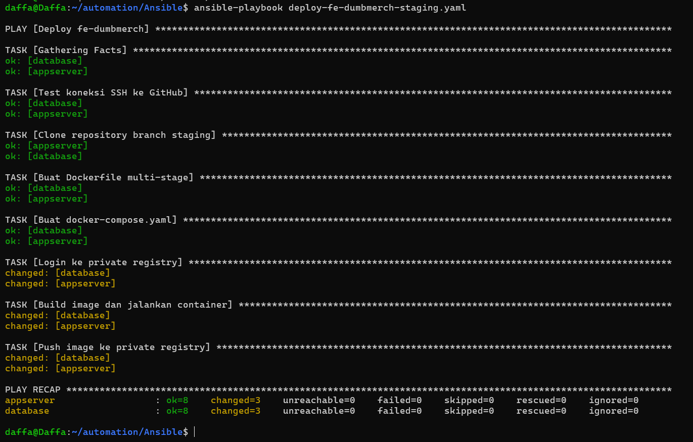

5. Tambahkan inbound rule pada NSG Azure untuk mengizinkan akses melalui port 3000 pada server appserver dan database.

    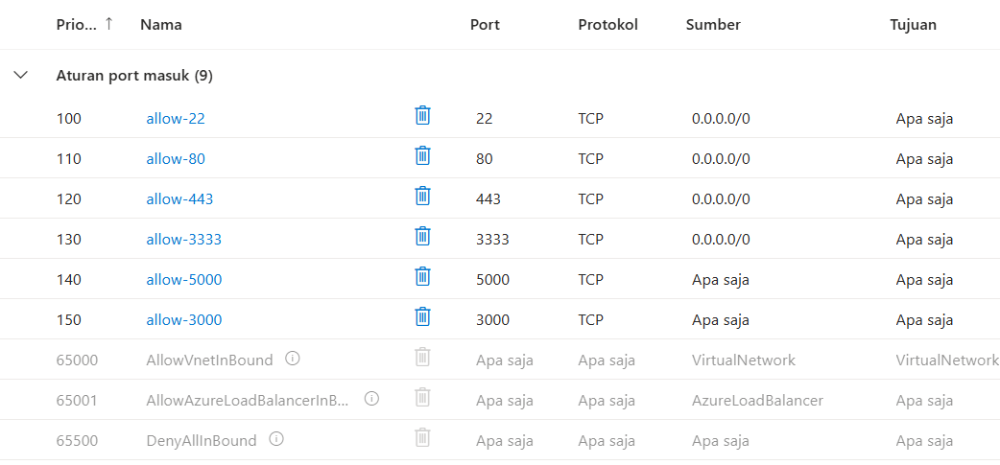

    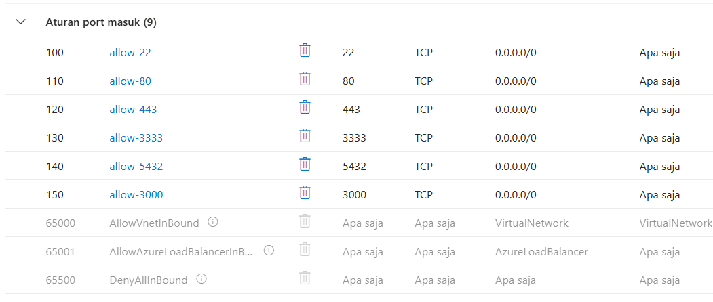

5. Deployment fe-dumbmerch berhasil dilakukan pada server appserver dan database. Aplikasi fe-dumbmerch dapat diakses melalui https://staging.daffaalmaas.studentdumbways.my.id. Aplikasi berjalan dengan baik dan saling terhubung antara frontend, backend, dan database.

    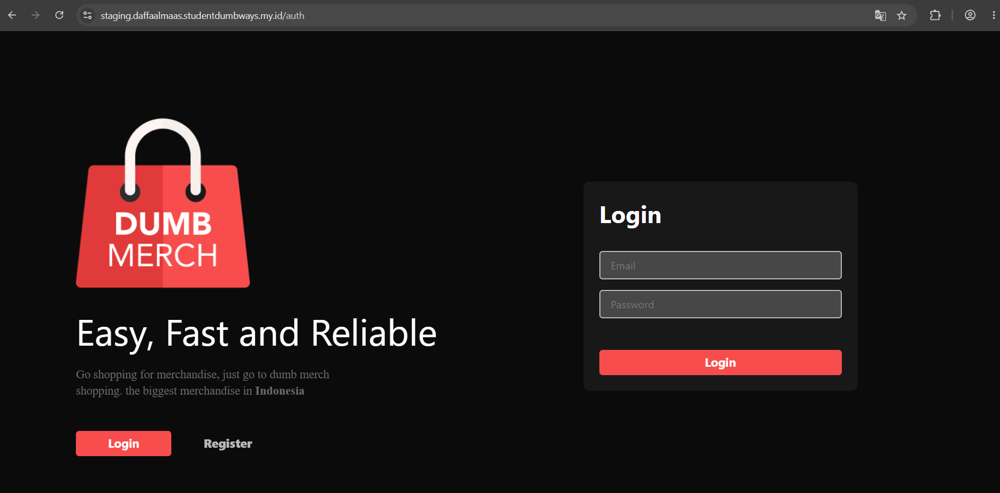

    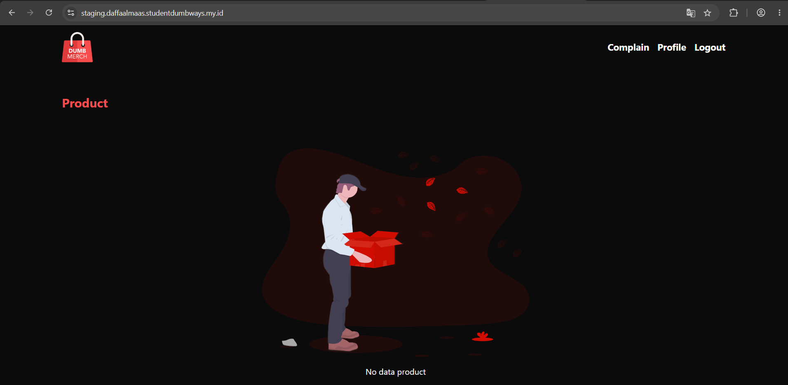

### 7. Kubernetes (Production)

#### 1. Install K3S

1. Tambahkan inbound rule pada NSG Azure untuk mengizinkan akses melalui port 6443 pada server master.

    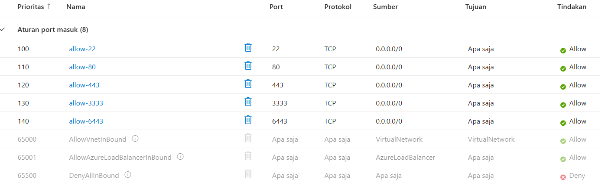

2. buat file [install-kubernetes.yaml](src/automation/Ansible/install-kubernetes.yaml) didalam direktori Ansible untuk melakukan untuk melakukan instalasi dan konfigurasi K3s pada server master, worker-1, dan worker-2 menggunakan Ansible. Playbook ini mencakup proses instalasi K3s Server pada master, pengambilan token K3s untuk proses join worker, instalasi K3s Agent pada worker menggunakan private IP master, serta pemberian role master dan worker pada masing-masing node.

3. Jalankan perintah ' ansible-playbook install-kubernetes.yaml ' untuk menjalankan proses instalasi dan konfigurasi K3s pada server master, worker-1, dan worker-2.

    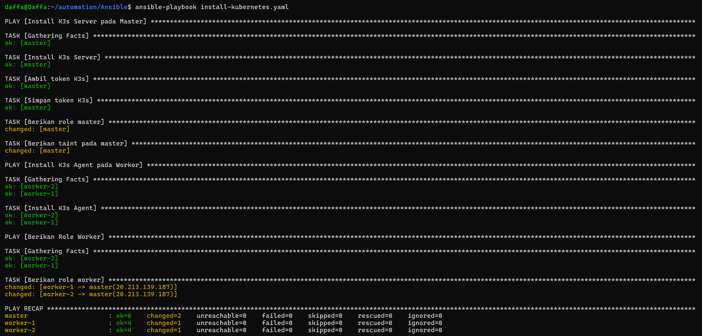

4. Instalasi K3s berhasil dilakukan pada master, worker-1, dan worker-2. Semua node berstatus Ready dan sudah memiliki role sesuai konfigurasi.

    

#### 2. Database

1. Buat file [install-postgresql-k3s.yaml](src/automation/Ansible/install-postgresql-k3s.yaml) didalam direktori Ansible untuk melakukan deployment PostgreSQL pada cluster K3s menggunakan Ansible. Playbook ini mencakup pembuatan namespace, Secret, ConfigMap, PVC, Deployment, dan Service PostgreSQL.

2. Jalankan perintah ' ansible-playbook install-postgresql-k3s.yaml ' untuk melakukan deployment PostgreSQL pada cluster K3s.

    

3. Deployment PostgreSQL berhasil dilakukan pada cluster K3s dan berjalan pada node worker-2.

    

#### 3. be-dumbmerch

1. Di WSL, pada direktori /dumbmerch/production/be-dumbmerch, ubah isi file .env agar menyesuaikan konfigurasi PostgreSQL yang digunakan pada cluster K3s.

    

2. Lakukan perintah ' git add . ' ,  ' git commit -m "isi_komentar" ' , dan ' git push -u origin production ' untuk menyimpan dan mengirim perubahan .env ke repository pada branch production.

    

1.  Buat file [deploy-be-dumbmerch-production.yaml](src/automation/Ansible/deploy-be-dumbmerch-production.yaml) didalam direktori Ansible untuk melakukan deployment backend be-dumbmerchpada cluster K3s menggunakan Ansible. Playbook ini mencakup proses clone repository branch production, pembuatan Dockerfile, build dan push Docker image ke private registry, pembuatan namespace dan Secret registry, Deployment, dan Service backend.

2. Jalankan perintah ' ansible-playbook deploy-be-dumbmerch-production.yaml ' untuk deployment backend be-dumbmerch pada cluster K3s.

    

3. Deployment be-dumbmerch pada cluster k3s berhasil berjalan pada worker-1.

    

#### 4. fe-dumbmerch

1. Di WSL, pada direktori /dumbmerch/production/fe-dumbmerch, buat file .env untuk menentukan base URL API backend yang digunakan oleh aplikasi fe-dumbmerch.

    

2. Lakukan perintah ' git add . ' ,  ' git commit -m "isi_komentar" ' , dan ' git push -u origin production ' untuk menyimpan dan mengirim perubahan .env ke repository pada branch production.

    

3. Buat file [deploy-fe-dumbmerch-production.yaml](src/automation/Ansible/deploy-fe-dumbmerch-production.yaml) didalam direktori Ansible untuk melakukan deployment frontend fe-dumbmerch pada cluster K3s menggunakan Ansible. Playbook ini mencakup proses clone repository branch production, pembuatan Dockerfile, build dan push Docker image ke private registry, pembuatan namespace dan Secret registry, Deployment, dan Service frontend.

4. Jalankan perintah ' ansible-playbook deploy-fe-dumbmerch-production.yaml ' untuk deployment fe-dumbmerch pada cluster K3s.

    

5. Deployment be-dumbmerch pada cluster k3s berhasil berjalan pada worker-2.

    

#### 5. Setup Ingress-Nginx, Cert-Manager & SSL Wildcard

1. Buat file [setup-ingress-certmanager-ssl.yaml](src/automation/Ansible/setup-ingress-certmanager-ssl.yaml) untuk konfigurasi Ingress NGINX, Cert-Manager, dan SSL Cloudflare pada cluster K3s menggunakan Ansible. Playbook ini mencakup penonaktifan Traefik bawaan K3s, instalasi dan konfigurasi Ingress NGINX, instalasi Cert-Manager, konfigurasi Cloudflare API Token dan ClusterIssuer Let’s Encrypt, pembuatan wildcard SSL certificate, serta konfigurasi Ingress untuk menghubungkan domain frontend dan backend ke masing-masing Service pada cluster K3s.

2. Jalankan perintah ' ansible-playbook setup-ingress-certmanager-ssl.yaml ' untuk menjalankan playbook konfigurasi Ingress NGINX, Cert-Manager, dan SSL Cloudflare pada cluster K3s melalui server master.

    

3. Konfigurasi Ingress NGINX, Cert-Manager, dan SSL Cloudflare berhasil diterapkan.Aplikasi frontend berhasil diakses melalui https://daffaalmaas.studentdumbways.my.id, sedangkan backend tersedia pada https://api.daffaalmaas.studentdumbways.my.id. Seluruh aplikasi telah berjalan dengan baik.

    

    

    

### 8. CI/CD & Testing

#### 1. Install SonarQube

1. Buat file [install-sonarqube.yaml](src/automation/Ansible/install-sonarqube.yaml) didalam direktori Ansible untuk melakukan instalasi dan konfigurasi SonarQube pada server additional-depedencies menggunakan Ansible. Playbook ini mengatur kebutuhan sistem SonarQube, membuat direktori dan volume penyimpanan, mengatur permission menggunakan ACL, membuat konfigurasi Docker Compose, serta menjalankan container SonarQube.

2. Jalankan perintah ' ansible-playbook install-sonarqube.yaml ' untuk menjalankan proses instalasi dan konfigurasi SonarQube pada server additional-depedencies.

2. Login ke dalam sonarqube melalui http://sonarqube.daffaalmaas.studentdumbways.my.id. 

3. Buat new project bernama fe-dumbmerch-staging, fe-dumbmerch-production, be-dumbmerch-staging, dan be-dumbmerch-production.

    

4. Di menu account/security, Buat token bernama jenkins dan copy token tersebut.

    

#### 2.  Install Jenkins

1. Buat file [install-jenkins.yaml](src/automation/Ansible/install-jenkins.yaml) didalam direktori Ansible untuk instalasi dan konfigurasi Jenkins pada server jenkins menggunakan Ansible. Playbook ini membuat volume Jenkins, mengatur permission dan SSH known_hosts, membuat konfigurasi Docker Compose, menjalankan container Jenkins, menunggu Jenkins siap digunakan, serta menyimpan initial admin password Jenkins.

2.Jalankan perintah ' ansible-playbook install-jenkins.yaml ' untuk menjalankan proses instalasi dan konfigurasi Jenkins pada server jenkins.

3. Buka Jenkins pada https://jenkins.daffaalmaas.studentdumbways.my.id. Masukkan token yang tersimpan di server jenkins finaltask-daffaalmaas/jenkins/token ke dalam field administrator password.

    

4. Selanjutnya, buat akun untuk jenkins.

    

5. Setelah login ke dalam jenkins, buat credentials baru untuk token sonarqube,registry credentials untuk akun docker registry private, username with private-key untuk server, dan secret-text untuk password server.

    

6. Selanjutnya, lakukan konfigurasi sonarqube scanner installations pada menu tools.

    

#### 3. CI/CD Staging

1. Pada server appserver, jalankan perintah ' git add . ', '  git commit ', dan ' git push origin staging ' pada direktori fe-dumbmerch dan be-dumbmerch. Kemudian, di WSL jalankan perintah ' git pull origin staging ' pada repositori lokal staging/fe-dumbmerch dan staging/be-dumbmerch untuk mengambil perubahan terbaru.

2. Didalam jenkins, buat pipeline bernama fe-dumbmerch-staging dengan isi konfigurasi seperti pada gambar dibawah.

    

    

3. buat pipeline bernama be-dumbmerch-staging dengan isi konfigurasi seperti pada gambar dibawah.

    

    

4. Pada repositori fe-dumbmerch dan be-dumbmerch di github,tambahkan webhook https://jenkins.daffaalmaas.studentdumbways.my.id/github-webhook/.

    

5. Di dalam repositori lokal staging/fe-dumbmerch, buat file [Jenkinsfile](src/staging/fe-dumbmerch/Jenkinsfile) untuk untuk mengatur proses CI/CD fe-dumbmerch-staging.

6. Jalankan perintah ' git add . ', ' git commit ', dan ' git push -u origin staging ' untuk menyimpan dan mengirim perubahan Jenkinsfile ke repository fe-dumbmerch branch staging. Setelah perubahan berhasil di-push, auto trigger akan menjalankan pipeline CI/CD Jenkins secara otomatis.

    

7. CI/CD fe-dumbmerch-staging berhasil berjalan dengan alur SonarQube untuk mengecek kualitas kode, kemudian Quality Gate. Setelah itu, source code dari branch staging diambil dan dibuat menjadi Docker image, lalu dilakukan pengecekan keamanan menggunakan Trivy. Image yang sudah lolos pengecekan di-push ke Docker Registry, kemudian di-deploy ke Appserver dan dilakukan testing menggunakan wget. Setelah berhasil, image juga di-deploy ke Database Server dan dilakukan testing kembali.

    

8. Di dalam repositori lokal staging/be-dumbmerch, buat file [Jenkinsfile](src/staging/be-dumbmerch/Jenkinsfile) untuk untuk mengatur proses CI/CD be-dumbmerch-staging.

9. Jalankan perintah ' git add . ', ' git commit ', dan ' git push -u origin staging ' untuk menyimpan dan mengirim perubahan Jenkinsfile ke repository be-dumbmerch branch staging. Setelah perubahan berhasil di-push, auto trigger akan menjalankan pipeline CI/CD Jenkins secara otomatis.

    

10. CI/CD be-dumberch-staging berhasil berjalan dengan alur SonarQube untuk mengecek kualitas kode, kemudian Quality Gate. Setelah itu, source code dari branch staging diambil dan dibuat menjadi Docker image, lalu dilakukan pengecekan keamanan menggunakan Trivy. Image yang sudah lolos pengecekan di-push ke Docker Registry, kemudian di-deploy ke Appserver dan dilakukan testing menggunakan wget. Setelah berhasil, image di-deploy ke Gateway Server dan dilakukan testing kembali.

    

#### 4. CI/CD Production

1. Pada server master, jalankan perintah ' git add . ', '  git commit ', dan ' git push origin production ' pada direktori fe-dumbmerch dan be-dumbmerch. Kemudian, di WSL jalankan perintah ' git pull origin production ' pada repositori lokal production/fe-dumbmerch dan production/be-dumbmerch untuk mengambil perubahan terbaru.

2. Didalam jenkins, buat pipeline bernama fe-dumbmerch-production dengan isi konfigurasi seperti pada gambar dibawah.

    

    

3. buat pipeline bernama be-dumbmerch-production dengan isi konfigurasi seperti pada gambar dibawah.

    

    

4. Di dalam repositori lokal production/fe-dumbmerch, buat file [Jenkinsfile](src/production/fe-dumbmerch/Jenkinsfile) untuk untuk mengatur proses CI/CD fe-dumbmerch-production.

5. Jalankan perintah ' git add . ', ' git commit ', dan ' git push -u origin production ' untuk menyimpan dan mengirim perubahan Jenkinsfile ke repository fe-dumbmerch branch production. Setelah perubahan berhasil di-push, auto trigger akan menjalankan pipeline CI/CD Jenkins secara otomatis.

    

6. CI/CD fe-dumbmerch-production berhasil berjalan dengan alur SonarQube untuk mengecek kualitas kode, kemudian Quality Gate. Setelah itu, source code dari branch production diambil, dibuat menjadi Docker image, dan dicek menggunakan Trivy. Image yang lolos pengecekan di-push ke Docker Registry, kemudian di-deploy ke K3s Cluster menggunakan Kubernetes. Setelah deployment selesai, dilakukan pengecekan rollout dan testing aplikasi menggunakan wget untuk memastikan aplikasi berjalan dengan baik.

    

7. Di dalam repositori lokal production/be-dumbmerch, buat file [Jenkinsfile](src/production/be-dumbmerch/Jenkinsfile) untuk untuk mengatur proses CI/CD be-dumbmerch-production.

8. Jalankan perintah ' git add . ', ' git commit ', dan ' git push -u origin production ' untuk menyimpan dan mengirim perubahan Jenkinsfile ke repository be-dumbmerch branch production. Setelah perubahan berhasil di-push, auto trigger akan menjalankan pipeline CI/CD Jenkins secara otomatis.

    

9. CI/CD be-dumbmerch-production berhasil berjalan dengan alur SonarQube untuk mengecek kualitas kode, kemudian Quality Gate. Setelah itu, source code dari branch production diambil, dibuat menjadi Docker image, dan dicek menggunakan Trivy. Image yang lolos pengecekan di-push ke Docker Registry, kemudian di-deploy ke K3s Cluster menggunakan Kubernetes. Setelah deployment selesai, dilakukan pengecekan rollout dan testing API menggunakan wget untuk memastikan aplikasi berjalan dengan baik.

    

### 9. Monitoring

#### 1. Install Node-Exporter

1. Buat file [install-node-exporter.yaml](src/automation/Ansible/install-node-exporter.yaml) di dalam direktori Ansible untuk melakukan instalasi dan menjalankan Node Exporter pada seluruh server.

2. Jalankan perintah ' ansible-playbook install-node-exporter.yaml ' untuk melakukan instalasi dan menjalankan Node Exporter pada seluruh server.

    

3. Node Exporter berhasil diinstal dan dijalankan pada seluruh server.

#### 2. Install cAdvisor

1. Buat file [install-cadvisor.yaml](src/automation/Ansible/install-cadvisor.yaml) di dalam direktori Ansible untuk melakukan instalasi dan menjalankan cAdvisor pada seluruh server.

2. Jalankan perintah ' ansible-playbook install-cadvisor.yaml ' untuk melakukan instalasi dan menjalankan cAdvisor pada seluruh server.

    

3. cAdvisor berhasil diinstal dan dijalankan pada seluruh server.

#### 4. Install Prometheus

1. Buat file [install-prometheus.yaml](src/automation/Ansible/install-prometheus.yaml) di dalam direktori Ansible untuk melakukan instalasi dan konfigurasi Prometheus pada server monitoring, termasuk konfigurasi Node Exporter, cAdvisor, dan autentikasi Basic Auth.

2. Jalankan perintah ansible-playbook install-prometheus.yaml untuk melakukan instalasi dan konfigurasi Prometheus pada server monitoring.

    

3. Prometheus berhasil diinstal dan dikonfigurasi pada server monitoring.

#### 5. Install Grafana

1. Buat file [install-grafana.yaml](src/automation/Ansible/install-grafana.yaml) di dalam direktori Ansible untuk melakukan instalasi dan konfigurasi Grafana pada server monitoring.

2. Jalankan perintah ' ansible-playbook install-grafana.yaml ' untuk melakukan instalasi dan konfigurasi Grafana pada server monitoring.

    

3. Buka Grafana melalui https://monitoring.daffaalmaas.studentdumbways.my.id, lalu login menggunakan username admin dan password admin. Setelah itu, tambahkan Prometheus melalui Connections / Data Sources dengan URL https://prom-daffaalmaas.studentdumbways.my.id/, username daffaalmaas, dan password 123456.

    

#### 6. Dashboard

##### 1. CPU Usage

1. Buat New Dashboard, lalu tambahkan New Panel dengan nama CPU Usage dan gunakan tipe visualisasi Time Series. Setelah itu, masukkan query dan legend seperti pada gambar di bawah.

    

2. Pada Standard options, pilih Unit: Percent (0-100), lalu isi min 0 dan max 100.

    

##### 2. Memory Usage

1. Buat New Dashboard, lalu tambahkan New Panel dengan nama Memory Usage dan gunakan tipe visualisasi Time Series. Setelah itu, masukkan query dan legend seperti pada gambar di bawah.

    

2. Pada Standard options, pilih Unit: Percent (0-100), lalu isi min 0 dan max 100.

    

##### 3. Disk Usage

1. Buat New Dashboard, lalu tambahkan New Panel dengan nama Disk Usage dan gunakan tipe visualisasi Time Series. Setelah itu, masukkan query dan legend seperti pada gambar di bawah.

    

2. Pada Standard options, pilih Unit: Percent (0-100), lalu isi min 0 dan max 100.

    

##### 4. VM Network Receive

1. Buat New Dashboard, lalu tambahkan New Panel dengan nama VM Network Receive dan gunakan tipe visualisasi Time Series. Setelah itu, masukkan query dan legend seperti pada gambar di bawah.

    

2. Pada Standard options, pilih Unit: bytes/sec(SI), lalu isi min 0 dan max auto.

    

##### 5. VM Network Transmit

1. Buat New Dashboard, lalu tambahkan New Panel dengan nama VM Network Transmit dan gunakan tipe visualisasi Time Series. Setelah itu, masukkan query dan legend seperti pada gambar di bawah.

    

2. Pada Standard options, pilih Unit: bytes/sec(SI), lalu isi min 0 dan max auto.

    

##### 6. Docker Container CPU Usage

1. Buat New Dashboard, lalu tambahkan New Panel dengan nama Docker Container CPU Usage dan gunakan tipe visualisasi Time Series. Setelah itu, masukkan query dan legend seperti pada gambar di bawah.

    

2. Pada Standard options, pilih Unit: Percent (0-100), lalu isi min 0 dan max auto.

    

##### 7. Docker Container Memory Usage

1. Buat New Dashboard, lalu tambahkan New Panel dengan nama Docker Container Memory Usage dan gunakan tipe visualisasi Time Series. Setelah itu, masukkan query dan legend seperti pada gambar di bawah.

    

2. Pada Standard options, pilih Unit: Percent (0-100), lalu isi min 0 dan max auto.

    

##### 8. K3s Container CPU Usage

1. Buat New Dashboard, lalu tambahkan New Panel dengan nama K3s Container CPU Usage dan gunakan tipe visualisasi Time Series. Setelah itu, masukkan query dan legend seperti pada gambar di bawah.

    

2. Pada Standard options, pilih Unit: Percent (0-100), lalu isi min 0 dan max auto.

    

##### 9. K3s Container Memory Usage

1. Buat New Dashboard, lalu tambahkan New Panel dengan nama K3s Container Memory Usage dan gunakan tipe visualisasi Time Series. Setelah itu, masukkan query dan legend seperti pada gambar di bawah.

    

2. Pada Standard options, pilih Unit: Percent (0-100), lalu isi min 0 dan max auto.

    

Dashboard berhasil dibuat yang berisi panel CPU Usage, Memory Usage, Disk Usage, VM Network Receive, VM Network Transmit, Docker Container CPU Usage, Docker Container Memory Usage, K3s Container CPU Usage, dan K3s Container Memory Usage.


#### 7. Alerting

1. Tambahkan Contact Point Telegram melalui menu Alerting / Notification configuration / Contact points, kemudian masukkan Bot Token dan Chat ID Telegram.

    

2. Buat Alert Rule baru pada menu Alerting / Alert Rules  bernama cpu-usage, Lalu isi konfigurasi alert rule seperti pada gambar dibawah.

    

    

    

3. Alerting untuk cpu-usage berhasil dibuat dengan threshold above 60, dan terhubung dengan contact point telegram untuk mengirim notification.

    

4.  Buat Alert Rule baru pada menu Alerting / Alert Rules  bernama memory-usage, Lalu isi konfigurasi alert rule seperti pada gambar dibawah.

    

    

    

5. Alerting untuk memory-usage berhasil dibuat dengan threshold above 60, dan terhubung dengan contact point telegram untuk mengirim notification.

    

    

6. Buat Alert Rule baru pada menu Alerting / Alert Rules  bernama free-storage, Lalu isi konfigurasi alert rule seperti pada gambar dibawah.

    

    

    

7. Alerting untuk free-storage berhasil dibuat dengan threshold below 20, dan terhubung dengan contact point telegram untuk mengirim notification.

    

8. Buat Alert Rule baru pada menu Alerting / Alert Rules  bernama network-transmit-gateway-server, Lalu isi konfigurasi alert rule seperti pada gambar dibawah.

    

    

9. Alerting untuk network-transmit-gateway-server berhasil dibuat dengan threshold above 5000, dan terhubung dengan contact point telegram untuk mengirim notification.

    

10. Buat Alert Rule baru pada menu Alerting / Alert Rules  bernama network-receive-gateway-server, Lalu isi konfigurasi alert rule seperti pada gambar dibawah.

    

    

11. Alerting untuk network-receive-gateway-server berhasil dibuat dengan threshold above 5000, dan terhubung dengan contact point telegram untuk mengirim notification.

    
