# Penjelasan Server
Terdapat 5 server,yaitu :
1. frontend
2. backend
3. jenkins
4. webserver
5. database

untuk build dan deploy aplikasi dilakukan di server frontend dan backend.

setiap server telah dibuat user baru bernama daffaalmaas.

# Docker
## instalasi Docker Engine
1. Pada setiap server, buat sebuah Bash script dengan nama install-docker.sh yang digunakan untuk melakukan instalasi Docker. Kemudian, isi script tersebut seperti pada gambar di bawah.
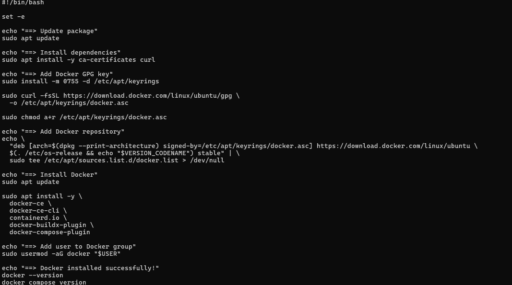

2. Jalankan perintah " chmod +x install-docker.sh " untuk memberikan izin eksekusi (execute permission) pada file tersebut.

3. Jalankan perintah " ./install-docker.sh " untuk menjalankan file script install-docker.sh.

## Instalasi MySQL on top docker

1. Pada server database,buat sebuah direktori bernama " mysql ".

2. Buat Dockerfile untuk menentukan image MySQL. Isi file seperti pada gambar dibawah.

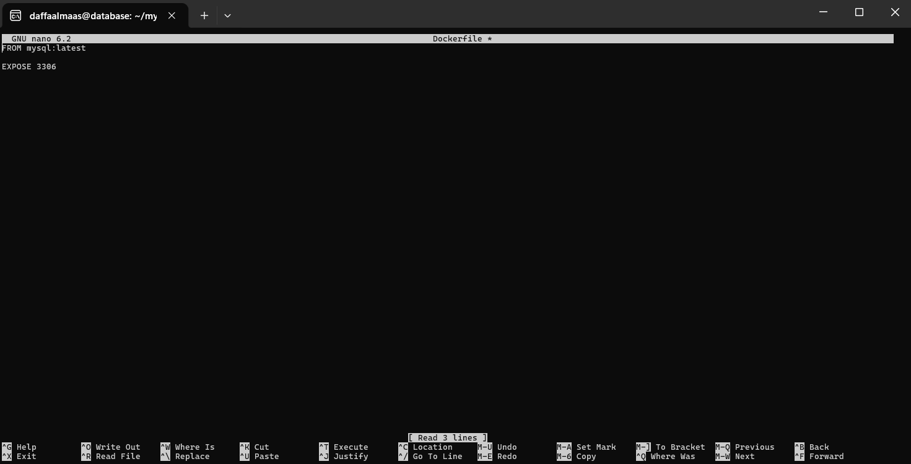

3. Buat file .env untuk menyimpan variable username, database, dan password. Isi file seperti pada gambar dibawah.

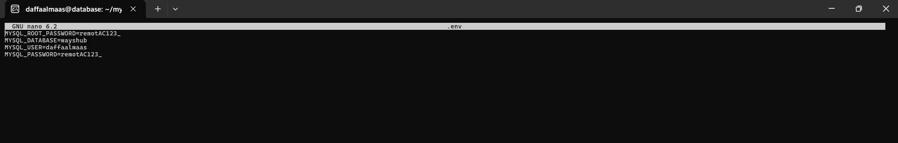

4. Buat docker-compose.yml untuk mengatur container MySQL. Isi file seperti pada gambar dibawah.

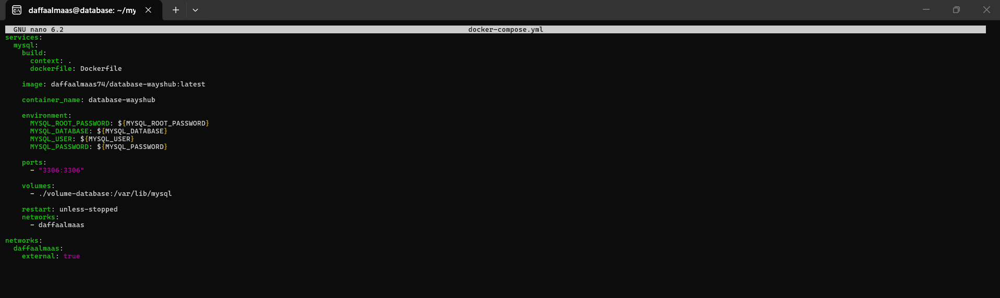

5. Buat Docker network dengan perintah " docker network create daffaalmaas "

6. Buat direktori bernama " volume-database " yang berfungsi sebagai volume mysql.

7. Jalankan perintah " docker compose up -d " untuk membuat image jika image belum pernah di build dan menjalankan container.

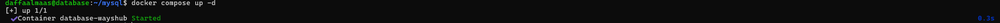

8. jalankan perintah " docker ps " untuk melihat container yang sedang berjalan.

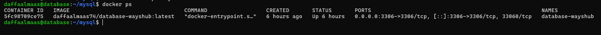

9. Login ke MySQL dengan perintah " docker exec -it database-wayshub mysql -u daffaalmaas -p "

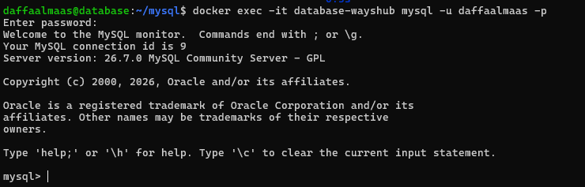

10. MySQL berhasil dijalankan on top docker.

# Instalasi nginx dan certbot on top docker serta serta penerapan wildcard SSL

1. Instalasi dilakukan didalam server webserver.

2. buat docker network dengan perintah " docker network create daffaalmaas ".

3. Buat direktori bernama nginx.

4. Didalam direktori nginx, buat direktori bernama cloudflare dan reverse-proxy.

5. Didalam direktori cloudflare buat file bernama credentials.ini

5. Buka platform Cloudflare dan lakukan login. Setelah berhasil masuk, buka menu Profile, lalu pilih API Tokens. Selanjutnya, buat token baru menggunakan template Edit Zone DNS.

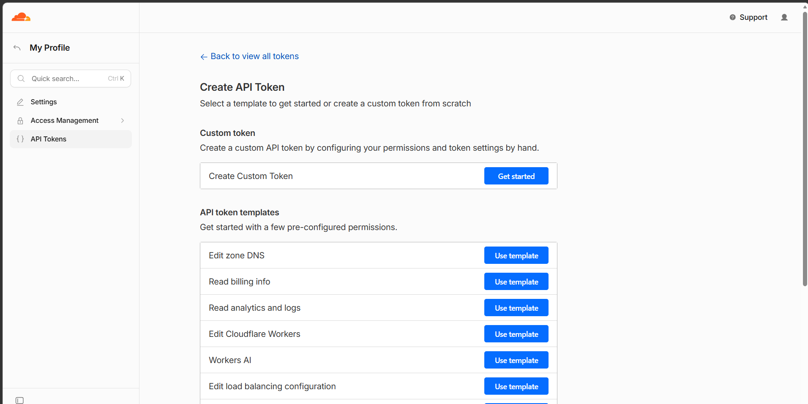

6. pada konfigurasi zone resource,pilih studentdumbways.my.id,lalu klik continue.

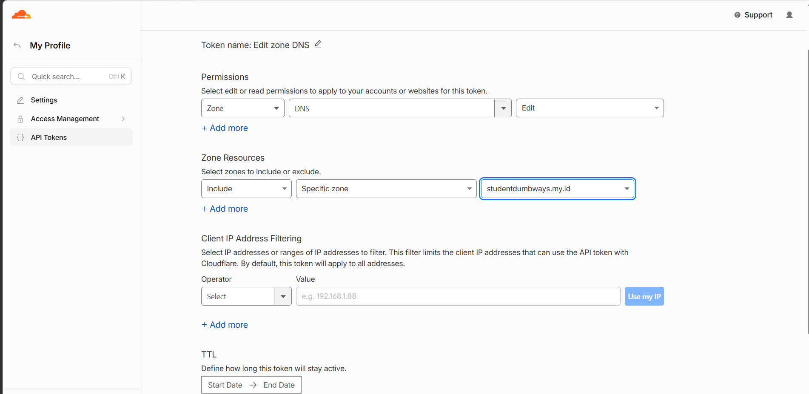

7. Token API yang telah dibuat copy ke dalam file credentials.ini

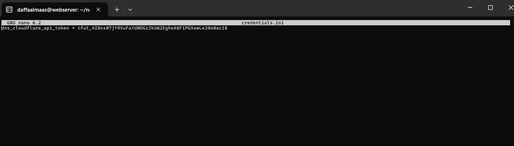

8. Berikan permission terhadap credentials.ini dengan perintah " chmod 600 credentials.ini " .

9. Di dalam direktori reverse-proxy, buat file bernama "nginx.conf ", " jenkins.daffaalmaas.studentdumbways.my.id ", " daffaalmaas.studentdumbways.my.id ", " api.daffaalmaas.studentdumbways.my.id " . 

10. isi file nginx.conf seperti pada gambar dibawah.

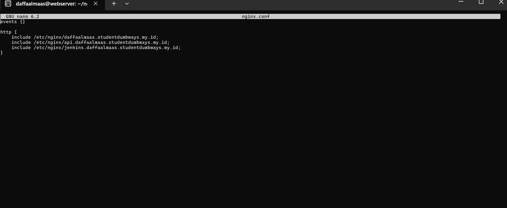

11. isi file daffaalmaas.studentdumbways.my.id seperti gambar dibawah.

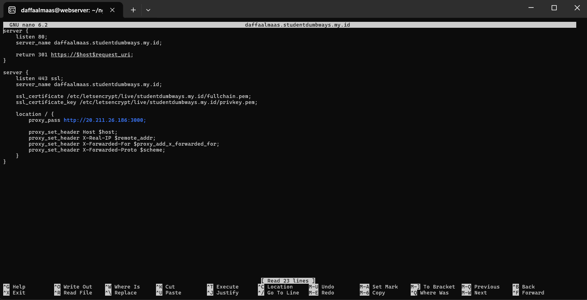

12. Isi file api.daffaalmaas.studentdumbways.my.id seperti gambar dibawah.

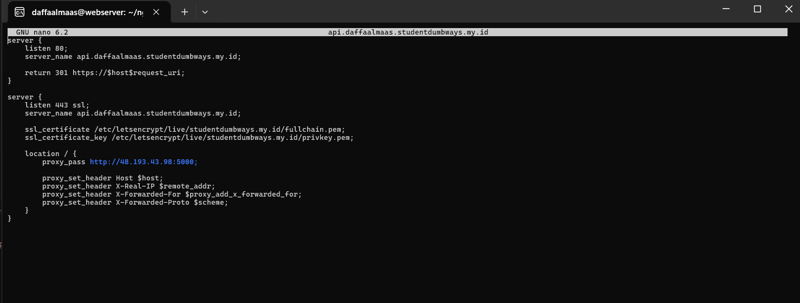

13. Isi file jenkins.daffaalmaas.studentdumbways.my.id seperti gambar dibawah.

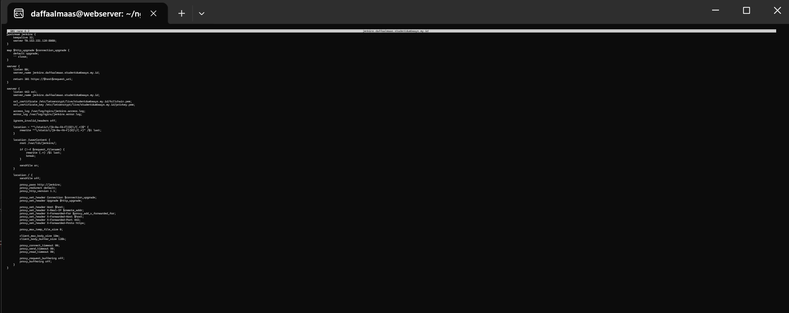

14. didalam direktori nginx, buat docker-compose.yml dan isi file seperti pada gambar dibawah.

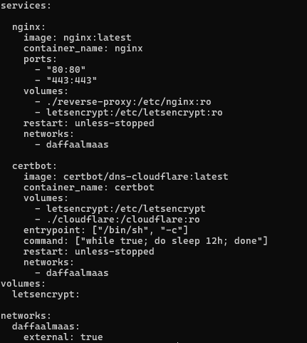

15. jalankan perintah " docker compose up -d certbot " untuk build image cerbot dan menjalankan container.

16. Buat sertifikat wildcard dengan perintah :

    docker exec certbot certbot certonly \
  --dns-cloudflare \
  --dns-cloudflare-credentials /cloudflare/credentials.ini \
  --dns-cloudflare-propagation-seconds 30 \
  -d studentdumbways.my.id \
  -d "*.studentdumbways.my.id" \
  -d "*.daffaalmaas.studentdumbways.my.id"

17. Jalankan perintah " docker exec certbot certbot certificates " untuk melihat daftar sertifikat SSL.

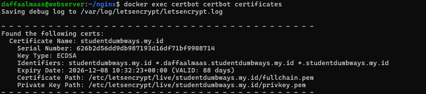

18. Jalankan perintah " docker compose up -d nginx " untuk build image nginx dan menjalankan container.

19. Jalankan perintah " docker exec nginx nginx -t " untuk uji konfigurasi nginx dan perintah " docker exec nginx nginx -s reload " untuk memuat ulang konfigurasi nginx.

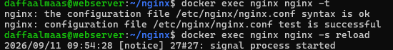

20. Instalasi nginx dan certbot on top docker serta serta penerapan wildcard SSL berhasil dilakukan.

# Deploy Front-End on top docker

1. deploy dilakukan pada server frontend

2. lakukan git clone terhadap https://github.com/dumbwaysdev/wayshub-frontend.git dengan perintah "git clone https://github.com/dumbwaysdev/wayshub-frontend.git "

3. Di dalam direktori wayshub-frontend/src/config, edit file " api.js " agar baseURL diganti menjadi  "https://api.daffaalmaas.studentdumbways.my.id/api/v1".

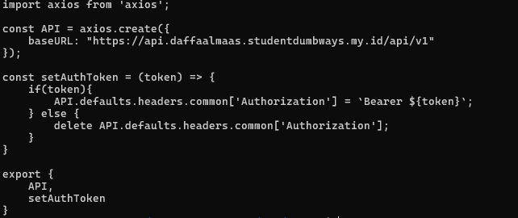

4. Di dalam direktori wayshub-frontend, buat file bernama " ecosystem.config.js " yang berfungsi untuk menjalankan aplikasi menggunakan PM2. Isi file tersebut seperti pada gambar dibawah.

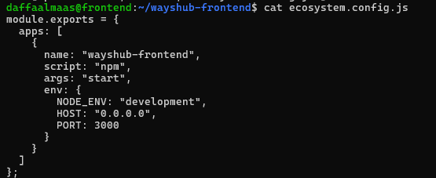

5. selanjutnya, buat file bernama " Dockerfile "  yang berfungsi menentukan proses pembuatan dan konfigurasi image aplikasi. Isi file tersebut seperti gambar dibawah.

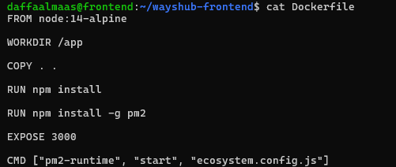

6. selanjutnya, buat file " docker-compose.yml " yang berfungsi untuk mengatur konfigurasi serta menjalankan container aplikasi berdasarkan image yang dibuat dari Dockerfile. Isi file tersebut seperti gambar dibawah.

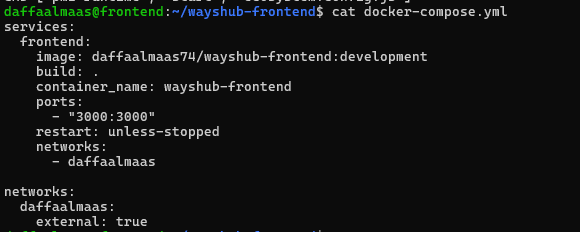

7. Jalankan perintah " docker compose up -d " untuk build image dan menjalankan container aplikasi.

8. Jalankan perintah " docker ps " untuk memeriksa container yang sedang berjalan dan memastikan container aplikasi berhasil dijalankan.

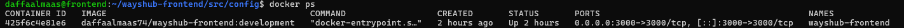

9. Karena sebelumnya telah dilakukan reverse-proxy dan memasang SSL, aplikasi berhasil berjalan dan dapat diakses pada url https://daffaalmaas.studentdumbways.my.id/

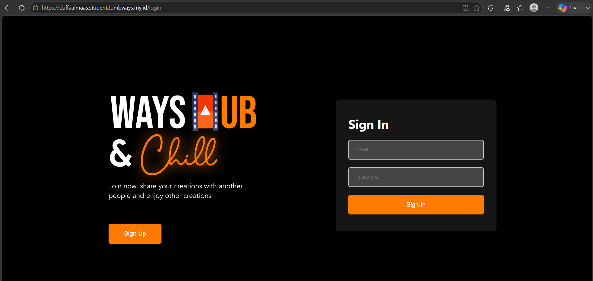

# Deploy Back-End on top docker

1. Deploy dilakukan pada server backend

2. Lakukan git clone terhadap https://github.com/dumbwaysdev/wayshub-backend.git dengan perintah "git clone https://github.com/dumbwaysdev/wayshub-backend.git "

3. Di dalam direktori wayshub-frontend, buat file bernama " ecosystem.config.js " yang berfungsi untuk menjalankan aplikasi menggunakan PM2. Isi file tersebut seperti pada gambar dibawah.

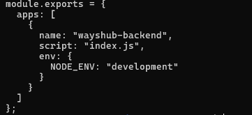

4. selanjutnya buat file bernama " entrypoint.sh  "yang berfungsi untuk menjalankan database migration menggunakan Sequelize dan menjalankan aplikasi backend menggunakan PM2. Isi file tersebut seperti gambar dibawah.

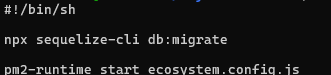

5. Buat file bernama " Dockerfile " yang berfungsi untuk menentukan proses pembuatan dan konfigurasi image aplikasi backend. Isi file tersebut seperti gambar di bawah.

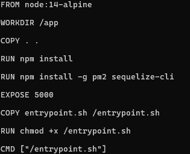

6. Buat file bernama " docker-compose.yml " yang berfungsi untuk mengatur konfigurasi kontainer. Isi file tersebut seperti gambar di bawah.

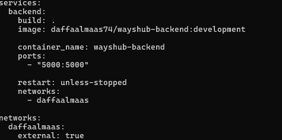

7. Didalam direktori wayshub-backend/config, edit file bernama config.json agar isi environment development disesuaikan dengan akun mysql yang memiliki akses terhadap database wayshub.

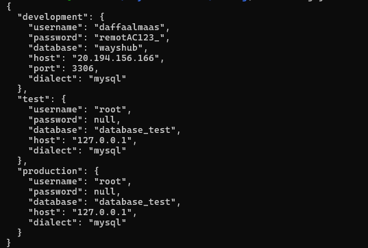

8.  Jalankan perintah docker compose up -d untuk build image dan menjalankan container backend sesuai konfigurasi file compose.

9. Jalankan perintah " docker ps " untuk memeriksa container backend dan memastikan container berhasil berjalan.

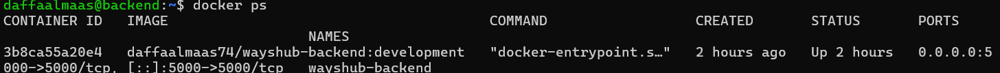

10. Container aplikasi berhasil berjalan dan aplikasi backend berjalan pada https://api.daffaalmaas.studentdumbways.my.id/ karena sudah dilakukan reverse-proxy dan memasang SSL pada tahap sebelumnya.

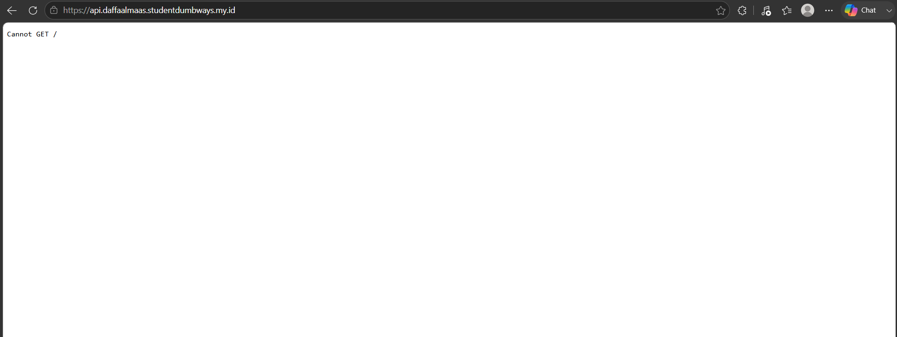

# Install Jenkins on top Docker

1. Instalasi dilakukan pada server jenkins.

2. Buat docker network dengan perintah " docker network create daffaalmaas " .

3. Buat direktori bernama jenkins, lalu masuk ke dalam direktori tersebut.

4. Buat direktori bernama "jenkins_volume" yang berfungsi sebagai volume jenkins.

5. Buat file docker-compose.yml yang berfungsi untuk mengatur konfigurasi kontainer. Isi file tersebut seperti pada gambar dibawah.

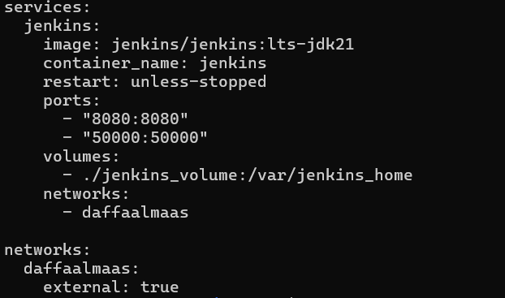

6. Jalankan perintah docker compose up -d untuk build image dan menjalankan kontainer.

7. Jalankan perintah docker ps untuk memeriksa container Jenkins dan memastikan Jenkins berhasil berjalan.

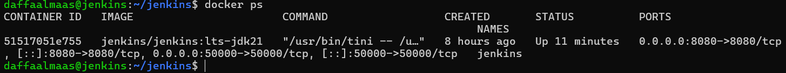

8. Dikarenakan sudah dilakukan reverse-proxy, jenkins dapat diakses pada url https://jenkins.daffaalmaas.studentdumbways.my.id/ .

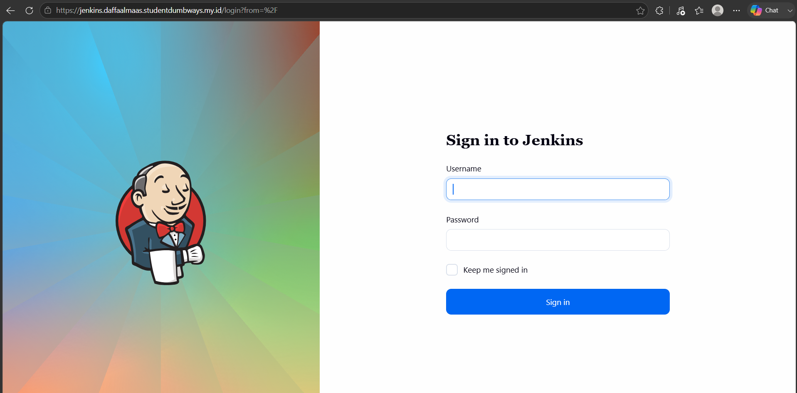

9. Saat pertama kali mengakses Jenkins melalui URL https://jenkins.daffaalmaas.studentdumbways.my.id/, jalankan perintah " docker compose logs jenkins " pada server untuk mendapatkan administrator password. Copy dan paste adminstrator password ke halaman awal setup jenkins.

10. Selanjutnya, buat akun Jenkins. Setelah akun berhasil dibuat, Jenkins siap digunakan.

# CI/CD Aplikasi Front-end menggunakan Jenkins

1. Login ke dalam jenkins.

2. Setelah berhasil login, buka menu manage dan buka menu credentials.

3. Tambahkan Credentials dengan tipe SSH Username with Private Key, kemudian masukkan private key dari server frontend dan berikan nama pada credentials tersebut. Selanjutnya, tambahkan Credentials dengan tipe Secret Text untuk menyimpan direktori project frontend, API webhook Discord, dan IP address server.

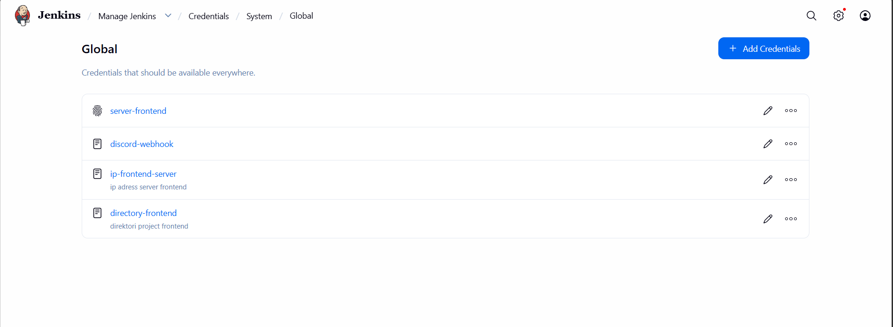

4. Selanjutnya buka menu plugin dan install ssh agent plugin dan discord notifier.

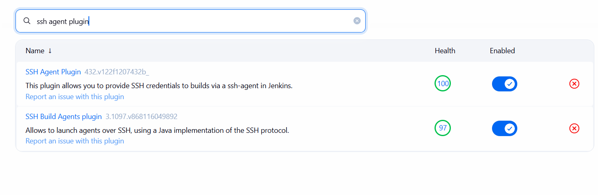
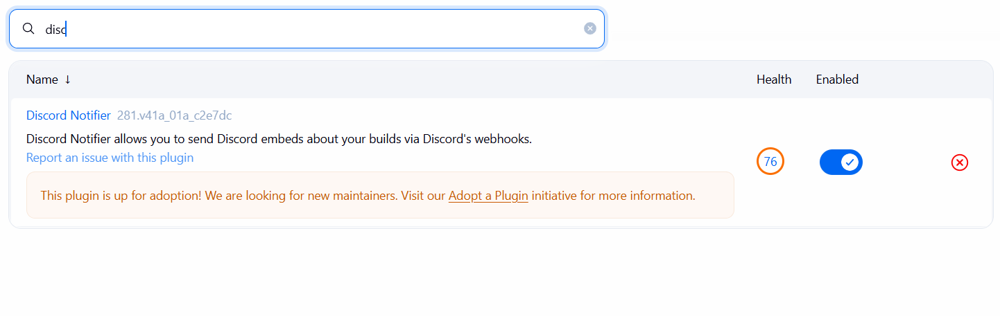

5. Buka platform github, lalu tambahkan SSH Keys server frontend.

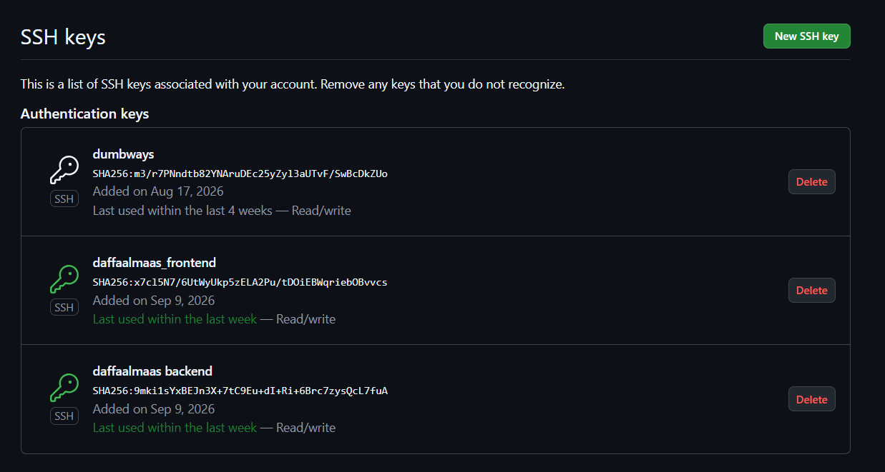

6. Buat repository baru di github bernama " wayshub-frontend "

7. Pada repository wayshub-frontend, buka menu Settings, kemudian pilih Webhooks. Tambahkan webhook baru dan masukkan https://jenkins.daffaalmaas.studentdumbways.my.id/github-webhook/ pada bagian Payload URL.

8. Pada server frontend, di direktori wayshub-frontend, jalankan perintah " git remote add origin git@github.com:daffaalmaas74/wayshub-frontend.git " untuk menghubungkan project ke repository.

9. Cek status dengan perintah " git remote -v "

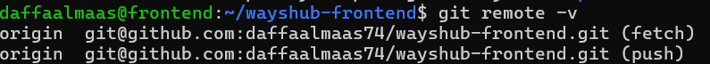

10. Buat file bernama Jenkinsfile yang berfungsi sebagai instruksi atau tahapan otomatisasi yang akan dijalankan oleh Jenkins. Isi file seperti dibawah ini :
    pipeline {
        agent any

        environment {
            FRONTEND_SERVER    = credentials('ip-frontend-server')
            FRONTEND_DIRECTORY = credentials('directory-frontend')
            DISCORD_WEBHOOK    = credentials('discord-webhook')
        }

        stages {

            stage('Pull Code') {
                steps {
                    sshagent(['server-frontend']) {
                        sh '''
                            ssh -o StrictHostKeyChecking=no "$FRONTEND_SERVER" "
                                set -e
                                cd '$FRONTEND_DIRECTORY'
                                git pull origin master
                            "
                        '''
                    }
                }
            }

            stage('Testing') {
                steps {
                    sshagent(['server-frontend']) {
                        sh '''
                            ssh -o StrictHostKeyChecking=no "$FRONTEND_SERVER" "
                                set -e
                                cd '$FRONTEND_DIRECTORY'

                                docker build \
                                    -t daffaalmaas74/wayshub-frontend:testing \
                                    .

                                docker compose down

                                docker rm -f frontend-testing 2>/dev/null || true

                                docker run -d \
                                    --name frontend-testing \
                                    --network daffaalmaas \
                                    -p 3000:3000 \
                                    daffaalmaas74/wayshub-frontend:testing

                                sleep 15

                                if wget \
                                    --timeout=10 \
                                    --tries=1 \
                                    -q \
                                    -O /dev/null \
                                    http://localhost:3000; then

                                    docker stop frontend-testing
                                    docker rm frontend-testing
                                    docker rmi daffaalmaas74/wayshub-frontend:testing

                                else

                                    docker logs frontend-testing || true

                                    docker stop frontend-testing || true
                                    docker rm frontend-testing || true
                                    docker rmi daffaalmaas74/wayshub-frontend:testing || true

                                    docker compose up -d --no-build

                                    exit 1
                                fi
                            "
                        '''
                    }
                }
            }

            stage('Build') {
                steps {
                    sshagent(['server-frontend']) {
                        sh '''
                            ssh -o StrictHostKeyChecking=no "$FRONTEND_SERVER" "
                                set -e
                                cd '$FRONTEND_DIRECTORY'
                                docker compose build
                            "
                        '''
                    }
                }
            }

            stage('Push Registry') {
                steps {
                    sshagent(['server-frontend']) {
                        sh '''
                            ssh -o StrictHostKeyChecking=no "$FRONTEND_SERVER" "
                                set -e
                                cd '$FRONTEND_DIRECTORY'
                                docker compose push frontend
                            "
                        '''
                    }
                }
            }

            stage('Deploy') {
                steps {
                    sshagent(['server-frontend']) {
                        sh '''
                            ssh -o StrictHostKeyChecking=no "$FRONTEND_SERVER" "
                                set -e
                                cd '$FRONTEND_DIRECTORY'
                                docker compose up -d --no-build
                            "
                        '''
                    }
                }
            }
        }

        post {

            success {
                discordSend(
                    webhookURL: DISCORD_WEBHOOK,
                    title: "Jenkins Build SUCCESS",
                    description: "wayshub-frontend berhasil pull,test,build, dan deploy.",
                    result: "SUCCESS"
                )
            }

            failure {
                discordSend(
                    webhookURL: DISCORD_WEBHOOK,
                    title: "Jenkins Build FAILED",
                    description: "wayshub-frontend gagal pada proses pipeline.",
                    result: "FAILURE"
                )
            }
        }
    }

11. Pada aplikasi Jenkins, buat pipeline bernama wayshub-frontend

12. Pada konfigurasi triggers, centang opsi Github hook trigger for GITScm polling

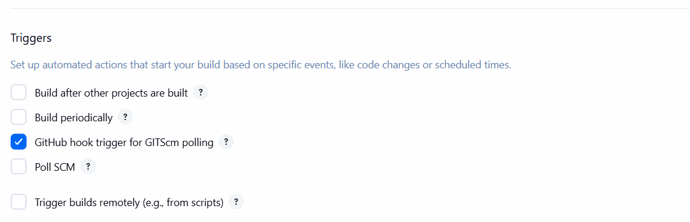

13. Pada konfigurasi Pipeline, pilih Pipeline script from SCM pada bagian Definition. Kemudian, pilih Git pada bagian SCM, masukkan URL repository GitHub wayshub-frontend, pilih credential server-frontend, dan tentukan branch yang digunakan, yaitu master.

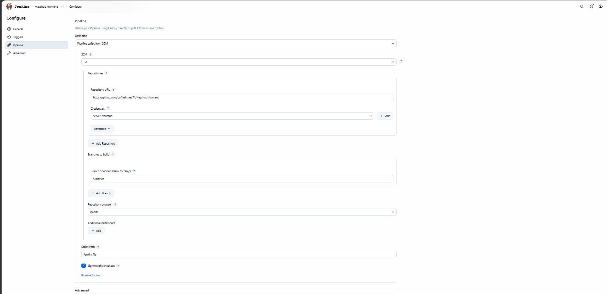

14. Di dalam direktori wayshub-frontend, jalankan perintah git add . untuk menambahkan perubahan, kemudian git commit -m "isi commit" untuk membuat commit, dan git push origin master untuk mengirim perubahan ke repository GitHub pada branch master.

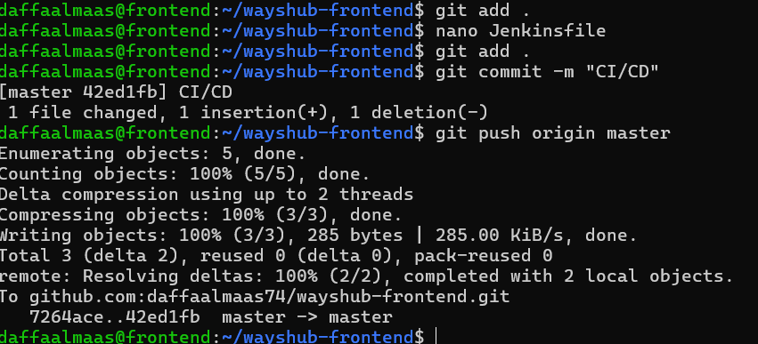

15. Pada platform Jenkins, buka pipeline wayshub-frontend, kemudian pilih pipeline tersebut. Pada halaman tersebut, dapat dilihat proses CI/CD yang berjalan dengan tahapan Pull Code → Testing → Build → Push Registry → Deploy → Post Action (Notifikasi Discord).

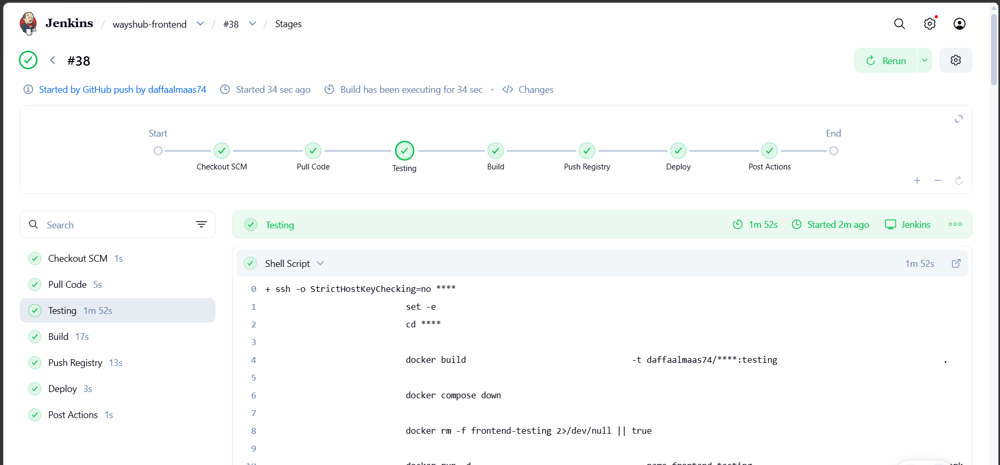

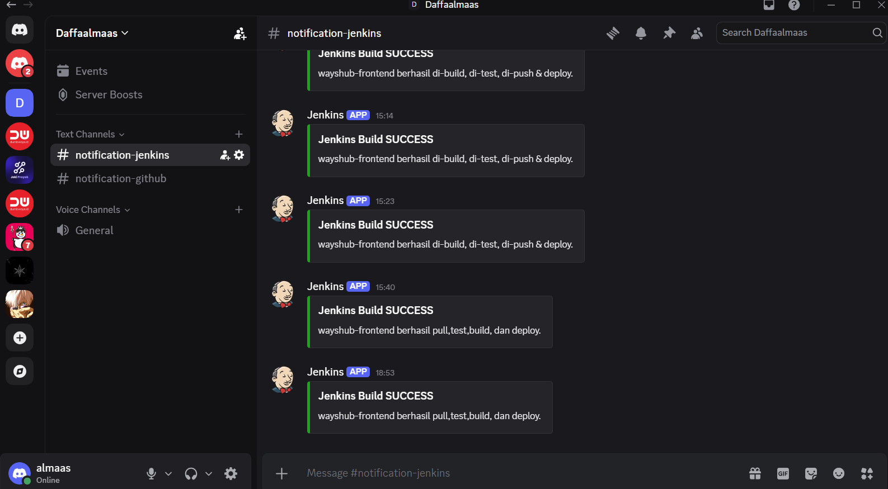

# CI/CD Aplikasi back-end menggunakan github actions

1. Di platform github, masukkan ssh key server backend.

2. Buat repositori github bernama " wayshub-backend ".

3. Di dalam direktori wayshub-backend pada server backend, jalankan perintah " git remote add origin git@github.com:daffaalmaas74/wayshub-frontend.git " untuk menghubungkan project ke repositori.

4. Buka platform Docker, kemudian masuk ke Account Settings dan pilih menu Personal Access Tokens. Buat access token baru dengan permission Read & Write, lalu salin access token yang telah dibuat.

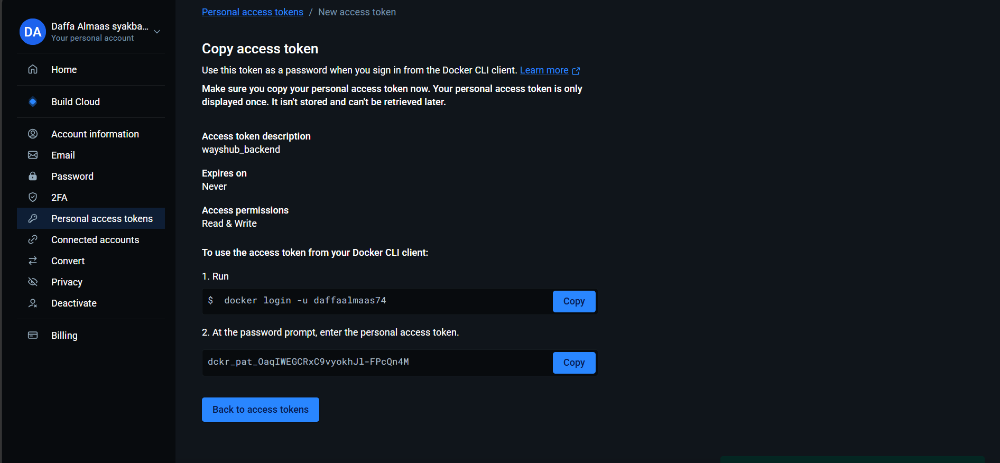

4. Pada repository GitHub wayshub-backend, buka menu Settings, kemudian pilih Environments. Buat environment baru dengan nama development. Setelah itu, buka environment tersebut dan tambahkan Environment Secrets berupa Docker username, Personal Access Token, Discord webhook, private key server backend, dan IP address server backend.

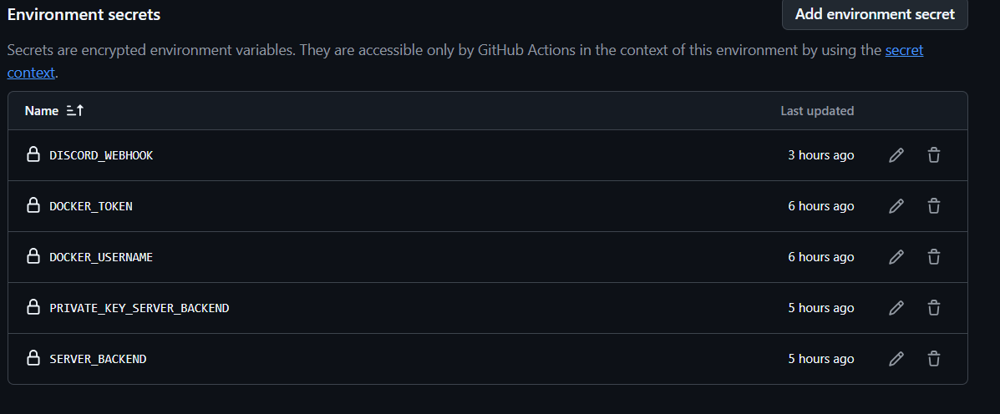

5. Pada direktori wayshub-backend di server backend, buat direktori bernama " .github ". Kemudian, buat direktori " workflows " di dalam .github. Selanjutnya, buat file bernama " docker-image.yml " di dalam direktori workflows yang berfungsi sebagai instruksi dan tahapan otomatisasi yang akan dijalankan oleh Github Actions. Isi file docker-image.yml seperti dibawah :

    name: Workflow Wayshub-backend

on:
  push:
    branches: ["master"]

  pull_request:
    branches: ["master"]

jobs:

  pull-code:
    runs-on: ubuntu-22.04
    environment: development

    steps:
      - name: Setup SSH Agent
        uses: webfactory/ssh-agent@v0.9.1
        with:
          ssh-private-key: ${{ secrets.PRIVATE_KEY_SERVER_BACKEND }}

      - name: Pull code
        env:
          BACKEND_SERVER: ${{ secrets.SERVER_BACKEND }}
        run: |
          ssh -o StrictHostKeyChecking=no "$BACKEND_SERVER" << 'EOF'
          set -e

          cd ~/wayshub-backend

          git pull origin master
          EOF

  testing:
    needs: pull-code
    runs-on: ubuntu-22.04
    environment: development

    steps:
      - name: Setup SSH Agent
        uses: webfactory/ssh-agent@v0.9.1
        with:
          ssh-private-key: ${{ secrets.PRIVATE_KEY_SERVER_BACKEND }}

      - name: Testing
        env:
          BACKEND_SERVER: ${{ secrets.SERVER_BACKEND }}
        run: |
          ssh -o StrictHostKeyChecking=no "$BACKEND_SERVER" << 'EOF'
          set -e

          cd ~/wayshub-backend

          docker compose down

          docker build \
            -t wayshub-backend:testing \
            .

          docker rm -f backend-testing 2>/dev/null || true

          docker run -d \
            --name backend-testing \
            --network daffaalmaas \
            -p 5000:5000 \
            wayshub-backend:testing

          sleep 15

          HTTP_CODE=$(curl \
            --max-time 10 \
            -s \
            -o /dev/null \
            -w "%{http_code}" \
            http://localhost:5000 || true)

          if [ "$HTTP_CODE" -ge 100 ] && [ "$HTTP_CODE" -lt 500 ]; then

              docker stop backend-testing
              docker rm backend-testing

              docker rmi wayshub-backend:testing

          else

              docker logs backend-testing || true

              docker stop backend-testing || true
              docker rm backend-testing || true

              docker rmi wayshub-backend:testing || true

              docker compose up -d --no-build

              exit 1
          fi
          EOF

  build:
    needs: testing
    runs-on: ubuntu-22.04
    environment: development

    steps:
      - name: Setup SSH Agent
        uses: webfactory/ssh-agent@v0.9.1
        with:
          ssh-private-key: ${{ secrets.PRIVATE_KEY_SERVER_BACKEND }}

      - name: Build image development
        env:
          BACKEND_SERVER: ${{ secrets.SERVER_BACKEND }}
        run: |
          ssh -o StrictHostKeyChecking=no "$BACKEND_SERVER" << 'EOF'
          set -e

          cd ~/wayshub-backend

          docker compose build
          EOF

  push-registry:
    needs: build
    runs-on: ubuntu-22.04
    environment: development

    steps:
      - name: Setup SSH Agent
        uses: webfactory/ssh-agent@v0.9.1
        with:
          ssh-private-key: ${{ secrets.PRIVATE_KEY_SERVER_BACKEND }}

      - name: Push image
        env:
          BACKEND_SERVER: ${{ secrets.SERVER_BACKEND }}
          DOCKER_USERNAME: ${{ secrets.DOCKER_USERNAME }}
          DOCKER_TOKEN: ${{ secrets.DOCKER_TOKEN }}
        run: |
          ssh -o StrictHostKeyChecking=no "$BACKEND_SERVER" << EOF
          set -e

          cd ~/wayshub-backend

          docker login \
            -u "${DOCKER_USERNAME}" \
            -p "${DOCKER_TOKEN}"

          docker compose push backend
          EOF

  deploy:
    needs: push-registry
    runs-on: ubuntu-22.04
    environment: development

    steps:
      - name: Setup SSH Agent
        uses: webfactory/ssh-agent@v0.9.1
        with:
          ssh-private-key: ${{ secrets.PRIVATE_KEY_SERVER_BACKEND }}

      - name: Deploy
        env:
          BACKEND_SERVER: ${{ secrets.SERVER_BACKEND }}
        run: |
          ssh -o StrictHostKeyChecking=no "$BACKEND_SERVER" << 'EOF'
          set -e

          cd ~/wayshub-backend

          docker compose up -d --no-build
          EOF
      - name: Discord SUCCESS
        if: success()
        env:
          DISCORD_WEBHOOK: ${{ secrets.DISCORD_WEBHOOK }}
        run: |
          curl -H "Content-Type: application/json" \
            -d '{
              "embeds": [{
                "title": "GitHub Actions SUCCESS",
                "description": "wayshub-backend berhasil pull,test,build, dan deploy.",
                "color": 5763719
              }]
            }' \
            "$DISCORD_WEBHOOK"

      - name: Discord FAILED
        if: failure()
        env:
          DISCORD_WEBHOOK: ${{ secrets.DISCORD_WEBHOOK }}
        run: |
          curl -H "Content-Type: application/json" \
            -d '{
              "embeds": [{
                "title": "GitHub Actions FAILED",
                "description": "wayshub-backend gagal pada proses pipeline.",
                "color": 15548997
              }]
            }' \
            "$DISCORD_WEBHOOK"

6. Di dalam direktori wayshub-backend, jalankan perintah git add . untuk menambahkan perubahan, kemudian git commit -m "isi commit" untuk membuat commit, dan git push origin master untuk mengirim perubahan ke repository GitHub pada branch master.

7. Pada platform GitHub, buka repository wayshub-backend, kemudian pilih menu Actions. Pada halaman tersebut, dapat dilihat proses CI/CD yang berjalan dengan tahapan Pull Code → Testing → Build → push registry → deploy (+Notifikasi Discord).

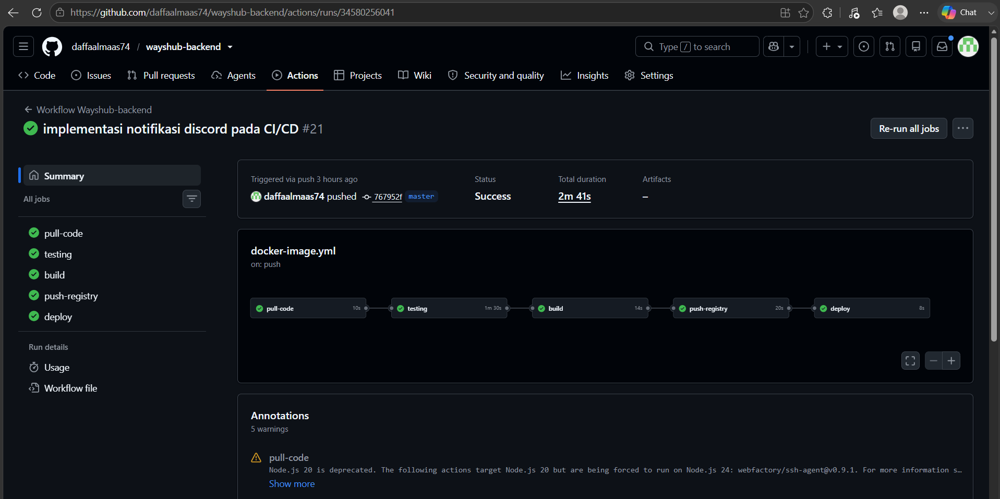

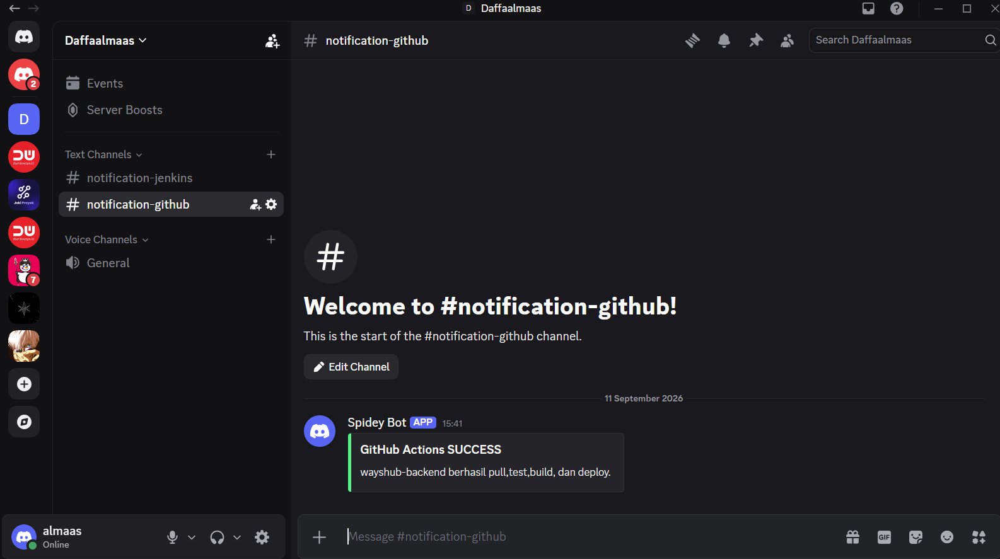