# Repository Automation

https://github.com/daffaalmaas74/automation.git

# Penjelasan WSL

Pada WSL, dilakukan instalasi ansible dan terraform.

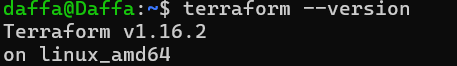

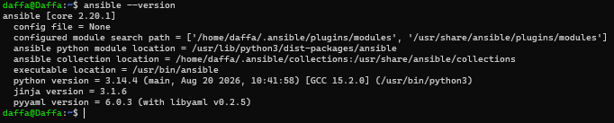

# Penjelasan Server

Terdapat empat server yang dibuat menggunakan Terraform dengan provider Microsoft Azure, yaitu:

1. **debian-server-1**: `20.92.92.134`
2. **ubuntu-server-1**: `20.5.122.76`
3. **ubuntu-server-2**: `52.253.96.31`
4. **ubuntu-server-3**: `20.48.112.177`

Konfigurasi setiap server adalah sebagai berikut:

- **debian-server-1** digunakan untuk menjalankan Prometheus dan Grafana.
- **ubuntu-server-1** digunakan untuk melakukan deployment aplikasi `wayshub-frontend`.
- **ubuntu-server-2** digunakan sebagai web server dengan Nginx dan Certbot untuk pengelolaan SSL.

Node Exporter diinstal pada seluruh server untuk memantau metrik sistem.

Seluruh layanan dijalankan di atas Docker dan proses instalasi serta konfigurasinya dilakukan menggunakan Ansible.

# Membuat Server dengan Terraform

1. Pastikan sudah menginstal Terraform dan azure CLI pada WSL.

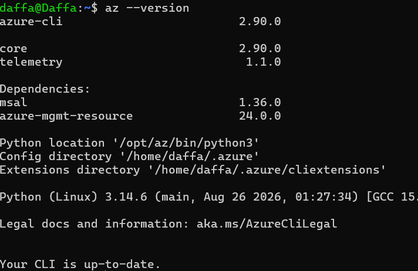

2. Pastikan juga sudah login ke Azure CLI.

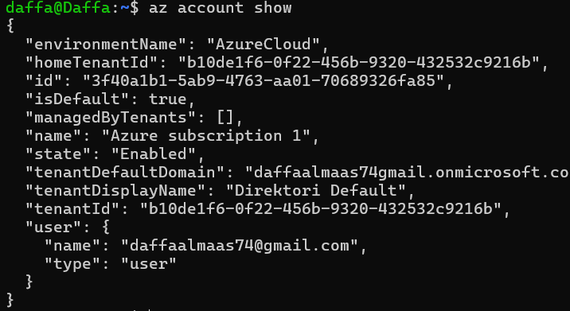

3. Pada WSL, buat struktur direktori berikut:

automation/
└── Terraform/
	└── azure/

4. Didalam direktori azure buat file bernama providers.tf yang berguna untuk menentukan provider yang digunakan oleh Terraform untuk berkomunikasi dengan platform atau layanan yang akan dikelola. Isi file berikut seperti gambar dibawah.

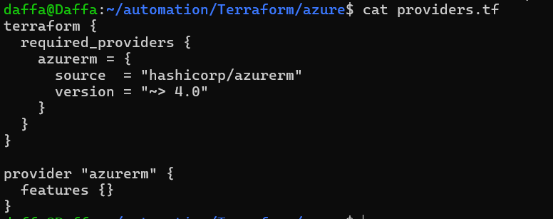

5. Jalankan perintah ' terraform init ' untuk membaca konfigurasi provider dan mengunduh AzureRM provider yang dibutuhkan oleh project Terraform.

6. buat file bernama variables.tf yang digunakan digunakan untuk menyimpan nilai konfigurasi yang dibutuhkan dalam pembuatan infrastruktur Azure, yaitu nama Resource Group, lokasi server, nama dan IP range Virtual Network serta Subnet, nama Network Security Group, username VM, ukuran VM, lokasi SSH public key, jenis storage, ukuran data disk, dan konfigurasi caching disk. Isi file seperti pada dibawah :

        variable "resource_group_name" {
        default = "rg-terraform"
        }

        variable "location" {
        default = "Australia East"
        }

        variable "vnet_name" {
        default = "vnet-terraform"
        }

        variable "vnet_address_space" {
        default = ["10.0.0.0/16"]
        }

        variable "subnet_name" {
        default = "subnet-terraform"
        }

        variable "subnet_address_prefixes" {
        default = ["10.0.1.0/24"]
        }

        variable "nsg_name" {
        default = "nsg-terraform"
        }

        variable "username" {
        default = "azureuser"
        }

        variable "vm_size" {
        default = "Standard_B2ats_v2"
        }

        variable "ssh_public_key_path" {
        default = "~/.ssh/id_ed25519.pub"
        }

        variable "storage_account_type" {
        default = "Standard_LRS"
        }

        variable "data_disk_size_gb" {
        default = 10
        }

        variable "data_disk_caching" {
        default = "ReadWrite"
        }

7. Buat file bernama main.tf yang digunakan untuk mendefinisikan seluruh resource infrastruktur Azure yang akan dibuat dan dikelola oleh Terraform. Resource yang didefinisikan meliputi Resource Group, Virtual Network, Subnet, Network Security Group, Public IP, Network Interface, Ubuntu Virtual Machine, Debian Virtual Machine, Managed Disk, serta attachment data disk ke masing-masing VM. Konfigurasi pada resource menggunakan variable yang telah ditentukan di variables.tf. Isi file seperti pada dibawah:

        resource "azurerm_resource_group" "main" {
        name     = var.resource_group_name
        location = var.location
        }

        resource "azurerm_virtual_network" "main" {
        name                = var.vnet_name
        location            = azurerm_resource_group.main.location
        resource_group_name = azurerm_resource_group.main.name
        address_space       = var.vnet_address_space
        }

        resource "azurerm_subnet" "main" {
        name                 = var.subnet_name
        resource_group_name  = azurerm_resource_group.main.name
        virtual_network_name = azurerm_virtual_network.main.name
        address_prefixes     = var.subnet_address_prefixes
        }

        resource "azurerm_network_security_group" "main" {
        name                = var.nsg_name
        location            = azurerm_resource_group.main.location
        resource_group_name = azurerm_resource_group.main.name

        security_rule {
            name                       = "allow-all-inbound"
            priority                   = 100
            direction                  = "Inbound"
            access                     = "Allow"
            protocol                   = "*"
            source_port_range          = "*"
            destination_port_range     = "*"
            source_address_prefix      = "0.0.0.0/0"
            destination_address_prefix = "*"
        }

        security_rule {
            name                       = "allow-all-outbound"
            priority                   = 110
            direction                  = "Outbound"
            access                     = "Allow"
            protocol                   = "*"
            source_port_range          = "*"
            destination_port_range     = "*"
            source_address_prefix      = "*"
            destination_address_prefix = "0.0.0.0/0"
        }
        }

        resource "azurerm_public_ip" "ubuntu" {
        name                = "pip-ubuntu"
        location            = azurerm_resource_group.main.location
        resource_group_name = azurerm_resource_group.main.name
        allocation_method   = "Static"
        sku                 = "Standard"
        }

        resource "azurerm_public_ip" "debian" {
        name                = "pip-debian"
        location            = azurerm_resource_group.main.location
        resource_group_name = azurerm_resource_group.main.name
        allocation_method   = "Static"
        sku                 = "Standard"
        }

        resource "azurerm_network_interface" "ubuntu" {
        name                = "nic-ubuntu"
        location            = azurerm_resource_group.main.location
        resource_group_name = azurerm_resource_group.main.name

        ip_configuration {
            name                          = "internal"
            subnet_id                     = azurerm_subnet.main.id
            private_ip_address_allocation = "Dynamic"
            public_ip_address_id          = azurerm_public_ip.ubuntu.id
        }
        }

        resource "azurerm_network_interface" "debian" {
        name                = "nic-debian"
        location            = azurerm_resource_group.main.location
        resource_group_name = azurerm_resource_group.main.name

        ip_configuration {
            name                          = "internal"
            subnet_id                     = azurerm_subnet.main.id
            private_ip_address_allocation = "Dynamic"
            public_ip_address_id          = azurerm_public_ip.debian.id
        }
        }

        resource "azurerm_network_interface_security_group_association" "ubuntu" {
        network_interface_id      = azurerm_network_interface.ubuntu.id
        network_security_group_id = azurerm_network_security_group.main.id
        }

        resource "azurerm_network_interface_security_group_association" "debian" {
        network_interface_id      = azurerm_network_interface.debian.id
        network_security_group_id = azurerm_network_security_group.main.id
        }

        resource "azurerm_linux_virtual_machine" "ubuntu" {
        name                = "ubuntu-server-1"
        resource_group_name = azurerm_resource_group.main.name
        location            = azurerm_resource_group.main.location
        size                = var.vm_size
        admin_username      = var.username

        network_interface_ids = [
            azurerm_network_interface.ubuntu.id
        ]

        admin_ssh_key {
            username   = var.username
            public_key = file(var.ssh_public_key_path)
        }

        os_disk {
            caching              = var.data_disk_caching
            storage_account_type = var.storage_account_type
        }

        source_image_reference {
            publisher = "Canonical"
            offer     = "0001-com-ubuntu-server-jammy"
            sku       = "22_04-lts-gen2"
            version   = "latest"
        }
        }

        resource "azurerm_linux_virtual_machine" "debian" {
        name                = "debian-server-1"
        resource_group_name = azurerm_resource_group.main.name
        location            = azurerm_resource_group.main.location
        size                = var.vm_size
        admin_username      = var.username

        network_interface_ids = [
            azurerm_network_interface.debian.id
        ]

        admin_ssh_key {
            username   = var.username
            public_key = file(var.ssh_public_key_path)
        }

        os_disk {
            caching              = var.data_disk_caching
            storage_account_type = var.storage_account_type
        }

        source_image_reference {
            publisher = "Debian"
            offer     = "debian-11"
            sku       = "11"
            version   = "latest"
        }
        }

        resource "azurerm_managed_disk" "ubuntu_data" {
        name                 = "disk-ubuntu"
        location             = azurerm_resource_group.main.location
        resource_group_name  = azurerm_resource_group.main.name
        storage_account_type = var.storage_account_type
        create_option        = "Empty"
        disk_size_gb         = var.data_disk_size_gb
        }

        resource "azurerm_managed_disk" "debian_data" {
        name                 = "disk-debian"
        location             = azurerm_resource_group.main.location
        resource_group_name  = azurerm_resource_group.main.name
        storage_account_type = var.storage_account_type
        create_option        = "Empty"
        disk_size_gb         = var.data_disk_size_gb
        }

        resource "azurerm_virtual_machine_data_disk_attachment" "ubuntu" {
        managed_disk_id    = azurerm_managed_disk.ubuntu_data.id
        virtual_machine_id = azurerm_linux_virtual_machine.ubuntu.id
        lun                = 0
        caching            = var.data_disk_caching
        }

        resource "azurerm_virtual_machine_data_disk_attachment" "debian" {
        managed_disk_id    = azurerm_managed_disk.debian_data.id
        virtual_machine_id = azurerm_linux_virtual_machine.debian.id
        lun                = 0
        caching            = var.data_disk_caching
        }

8. Jalankan perintah ' terraform validate ' untuk memeriksa apakah konfigurasi Terraform yang dibuat sudah benar secara sintaks dan struktur.

9. Jalankan perintah ' terraform plan ' untuk melihat rencana perubahan yang akan dilakukan Terraform terhadap infrastruktur Azure tanpa benar-benar membuat atau mengubah resource.

10. Jalankan perintah ' terraform apply ' untuk menerapkan konfigurasi Terraform dan membuat atau mengubah resource di Azure sesuai hasil dari terraform plan.

11. Buat direktori bernama additional-server didalam direktori azure sebagai project baru untuk membuat 2 server tambahan.

12. Buat file providers.tf. Isi file seperti gambar dibawah.

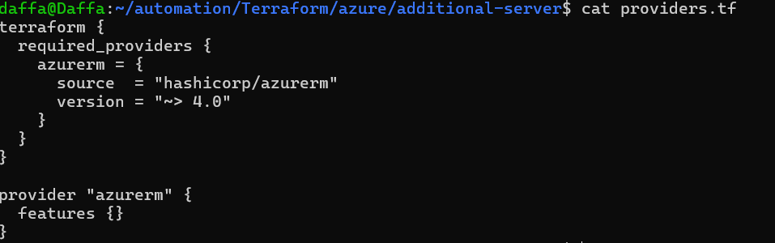

13. Jalankan perintah ' terraform init ' untuk membaca konfigurasi provider dan mengunduh AzureRM provider yang dibutuhkan oleh project Terraform.

14. Buat file bernama variables.tf. Isi file seperti pada dibawah:

        variable "resource_group_name" {
        default = "rg-additional-server"
        }

        variable "location" {
        default = "Japan East"
        }

        variable "vnet_name" {
        default = "vnet-additional-server"
        }

        variable "vnet_address_space" {
        default = ["10.1.0.0/16"]
        }

        variable "subnet_name" {
        default = "subnet-additional-server"
        }

        variable "subnet_address_prefixes" {
        default = ["10.1.1.0/24"]
        }

        variable "nsg_name" {
        default = "nsg-additional-server"
        }

        variable "username" {
        default = "azureuser"
        }

        variable "vm_size" {
        default = "Standard_B2ats_v2"
        }

        variable "ssh_public_key_path" {
        default = "~/.ssh/id_ed25519.pub"
        }

        variable "storage_account_type" {
        default = "Standard_LRS"
        }

        variable "data_disk_size_gb" {
        default = 10
        }

        variable "data_disk_caching" {
        default = "ReadWrite"
        }

15. Buat file main.tf. Isi file seperti pada dibawah:

        resource "azurerm_resource_group" "main" {
        name     = var.resource_group_name
        location = var.location
        }

        resource "azurerm_virtual_network" "main" {
        name                = var.vnet_name
        location            = azurerm_resource_group.main.location
        resource_group_name = azurerm_resource_group.main.name
        address_space       = var.vnet_address_space
        }

        resource "azurerm_subnet" "main" {
        name                 = var.subnet_name
        resource_group_name  = azurerm_resource_group.main.name
        virtual_network_name = azurerm_virtual_network.main.name
        address_prefixes     = var.subnet_address_prefixes
        }

        resource "azurerm_network_security_group" "main" {
        name                = var.nsg_name
        location            = azurerm_resource_group.main.location
        resource_group_name = azurerm_resource_group.main.name

        security_rule {
            name                       = "allow-all-inbound"
            priority                   = 100
            direction                  = "Inbound"
            access                     = "Allow"
            protocol                   = "*"
            source_port_range          = "*"
            destination_port_range     = "*"
            source_address_prefix      = "0.0.0.0/0"
            destination_address_prefix = "*"
        }

        security_rule {
            name                       = "allow-all-outbound"
            priority                   = 110
            direction                  = "Outbound"
            access                     = "Allow"
            protocol                   = "*"
            source_port_range          = "*"
            destination_port_range     = "*"
            source_address_prefix      = "*"
            destination_address_prefix = "0.0.0.0/0"
        }
        }

        resource "azurerm_public_ip" "ubuntu_2" {
        name                = "pip-ubuntu-server-2"
        location            = azurerm_resource_group.main.location
        resource_group_name = azurerm_resource_group.main.name
        allocation_method   = "Static"
        sku                 = "Standard"
        }

        resource "azurerm_public_ip" "ubuntu_3" {
        name                = "pip-ubuntu-server-3"
        location            = azurerm_resource_group.main.location
        resource_group_name = azurerm_resource_group.main.name
        allocation_method   = "Static"
        sku                 = "Standard"
        }

        resource "azurerm_network_interface" "ubuntu_2" {
        name                = "nic-ubuntu-server-2"
        location            = azurerm_resource_group.main.location
        resource_group_name = azurerm_resource_group.main.name

        ip_configuration {
            name                          = "internal"
            subnet_id                     = azurerm_subnet.main.id
            private_ip_address_allocation = "Dynamic"
            public_ip_address_id          = azurerm_public_ip.ubuntu_2.id
        }
        }

        resource "azurerm_network_interface" "ubuntu_3" {
        name                = "nic-ubuntu-server-3"
        location            = azurerm_resource_group.main.location
        resource_group_name = azurerm_resource_group.main.name

        ip_configuration {
            name                          = "internal"
            subnet_id                     = azurerm_subnet.main.id
            private_ip_address_allocation = "Dynamic"
            public_ip_address_id          = azurerm_public_ip.ubuntu_3.id
        }
        }

        resource "azurerm_network_interface_security_group_association" "ubuntu_2" {
        network_interface_id      = azurerm_network_interface.ubuntu_2.id
        network_security_group_id = azurerm_network_security_group.main.id
        }

        resource "azurerm_network_interface_security_group_association" "ubuntu_3" {
        network_interface_id      = azurerm_network_interface.ubuntu_3.id
        network_security_group_id = azurerm_network_security_group.main.id
        }

        resource "azurerm_linux_virtual_machine" "ubuntu_2" {
        name                = "ubuntu-server-2"
        resource_group_name = azurerm_resource_group.main.name
        location            = azurerm_resource_group.main.location
        size                = var.vm_size
        admin_username      = var.username

        network_interface_ids = [
            azurerm_network_interface.ubuntu_2.id
        ]

        admin_ssh_key {
            username   = var.username
            public_key = file(var.ssh_public_key_path)
        }

        os_disk {
            caching              = var.data_disk_caching
            storage_account_type = var.storage_account_type
        }

        source_image_reference {
            publisher = "Canonical"
            offer     = "0001-com-ubuntu-server-jammy"
            sku       = "22_04-lts-gen2"
            version   = "latest"
        }
        }

        resource "azurerm_linux_virtual_machine" "ubuntu_3" {
        name                = "ubuntu-server-3"
        resource_group_name = azurerm_resource_group.main.name
        location            = azurerm_resource_group.main.location
        size                = var.vm_size
        admin_username      = var.username

        network_interface_ids = [
            azurerm_network_interface.ubuntu_3.id
        ]

        admin_ssh_key {
            username   = var.username
            public_key = file(var.ssh_public_key_path)
        }

        os_disk {
            caching              = var.data_disk_caching
            storage_account_type = var.storage_account_type
        }

        source_image_reference {
            publisher = "Canonical"
            offer     = "0001-com-ubuntu-server-jammy"
            sku       = "22_04-lts-gen2"
            version   = "latest"
        }
        }

        resource "azurerm_managed_disk" "ubuntu_2_data" {
        name                 = "disk-ubuntu-server-2"
        location             = azurerm_resource_group.main.location
        resource_group_name  = azurerm_resource_group.main.name
        storage_account_type = var.storage_account_type
        create_option        = "Empty"
        disk_size_gb         = var.data_disk_size_gb
        }

        resource "azurerm_managed_disk" "ubuntu_3_data" {
        name                 = "disk-ubuntu-server-3"
        location             = azurerm_resource_group.main.location
        resource_group_name  = azurerm_resource_group.main.name
        storage_account_type = var.storage_account_type
        create_option        = "Empty"
        disk_size_gb         = var.data_disk_size_gb
        }

        resource "azurerm_virtual_machine_data_disk_attachment" "ubuntu_2" {
        managed_disk_id    = azurerm_managed_disk.ubuntu_2_data.id
        virtual_machine_id = azurerm_linux_virtual_machine.ubuntu_2.id
        lun                = 0
        caching            = var.data_disk_caching
        }

        resource "azurerm_virtual_machine_data_disk_attachment" "ubuntu_3" {
        managed_disk_id    = azurerm_managed_disk.ubuntu_3_data.id
        virtual_machine_id = azurerm_linux_virtual_machine.ubuntu_3.id
        lun                = 0
        caching            = var.data_disk_caching
        }

16. Jalankan perintah ' terraform validate ' untuk memeriksa apakah konfigurasi Terraform yang dibuat sudah benar secara sintaks dan struktur.

17. Jalankan perintah ' terraform plan ' untuk melihat rencana perubahan yang akan dilakukan Terraform terhadap infrastruktur Azure tanpa benar-benar membuat atau mengubah resource.

18. Jalankan perintah ' terraform apply ' untuk menerapkan konfigurasi Terraform dan membuat atau mengubah resource di Azure sesuai hasil dari terraform plan.

19. Jalankan perintah ' az resource list --output table ' untuk melihat seluruh resource yang telah dibuat pada semua Resource Group di Azure beserta nama, Resource Group, lokasi, dan jenis resource.

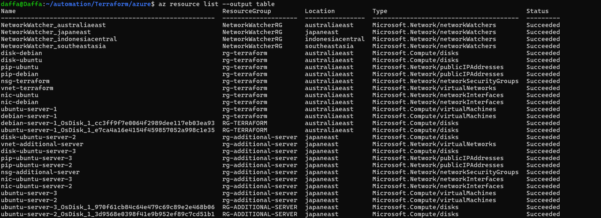

20. Berdasarkan hasil pengecekan menggunakan az resource list --output table, berhasil dibuat 4 VM, 2 Resource Group, 2 VNet, 2 NSG, 4 NIC, 4 Public IP, dan 4 data disk. Seluruh resource memiliki status Succeeded, yang menunjukkan bahwa proses pembuatan resource di Azure berhasil dilakukan.

# Penggunaan Ansible

1. Pada WSL, buat direktori Ansible di dalam direktori automation. Kemudian, buat direktori group_vars di dalam direktori Ansible, dengan struktur berikut:

    automation/
    ├── Terraform/
    └── Ansible/
        └── group_vars/

1. Didalam direktori Ansible,buat file bernama Inventory untuk mendaftarkan server yang akan dikelola oleh Ansible serta mengelompokkannya berdasarkan jenis server. Isi file seperti pada gambar dibawah.

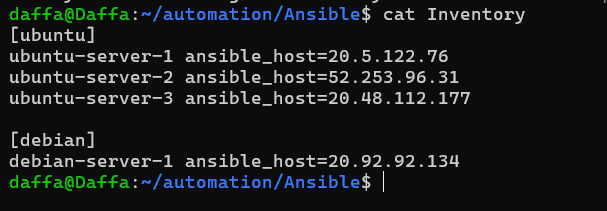

2. Buat file bernama ansible.cfg untuk menyimpan konfigurasi utama Ansible, sehingga Ansible mengetahui inventory yang digunakan dan cara melakukan koneksi ke server. Isi file seperti pada gambar dibawah.

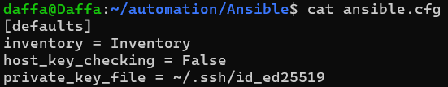

3. Didalam direktori group_vars, buat file bernama all untuk menyimpan variable Ansible yang digunakan secara bersama oleh seluruh server yang terdapat di Inventory. Isi file seperti pada gambar dibawah.

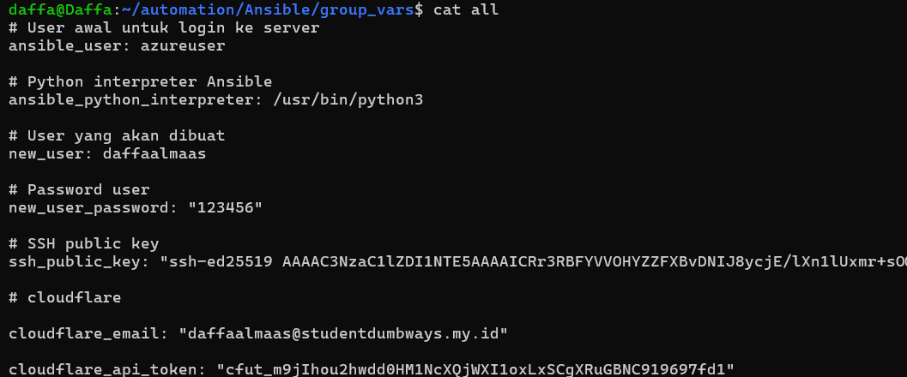

4. di dalam direktori Ansible,buat file bernama create-user.yaml yang berfungsi sebagai Ansible Playbook untuk mengotomatisasi pembuatan dan konfigurasi user baru pada seluruh server yang terdapat di Inventory. Playbook ini membuat user dengan akses sudo, membuat direktori .ssh, menambahkan SSH public key untuk autentikasi, mengaktifkan password authentication dan public key authentication pada konfigurasi SSH, kemudian melakukan restart layanan SSH agar seluruh perubahan konfigurasi diterapkan. Isi file seperti pada gambar dibawah.

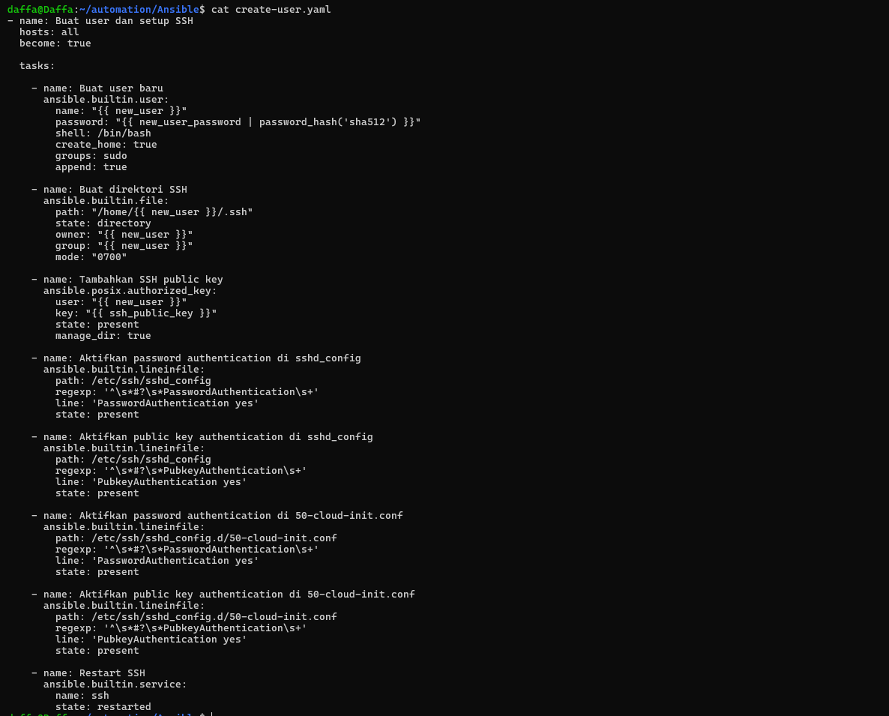

5. Jalankan perintah ansible-playbook create-user.yaml untuk menjalankan seluruh proses sesuai dengan konfigurasi yang telah didefinisikan pada playbook create-user.yaml.

6. buat file bernama install-docker.yaml yang berfungsi sebagai Ansible Playbook untuk mengotomatisasi instalasi dan konfigurasi Docker pada seluruh server Ubuntu dan Debian yang terdapat di Inventory. Playbook ini menyesuaikan proses instalasi berdasarkan sistem operasi, memasang Docker Engine, Docker CLI, Containerd, Docker Buildx, dan Docker Compose, serta melakukan konfigurasi repository yang diperlukan pada Debian 11. Setelah instalasi selesai, Docker diaktifkan agar berjalan otomatis saat server menyala dan user new_user ditambahkan ke group docker agar dapat menjalankan Docker tanpa menggunakan sudo. Isi file seperti pada dibawah:

        - name: Install Docker di Ubuntu dan Debian
        hosts: all
        become: true

        tasks:

            - name: Install dependency Docker Ubuntu
            ansible.builtin.apt:
                name:
                - ca-certificates
                - curl
                - gnupg
                state: present
                update_cache: true
            when:
                - ansible_facts['distribution'] == 'Ubuntu'

            - name: Buat direktori Docker keyrings Ubuntu
            ansible.builtin.file:
                path: /etc/apt/keyrings
                state: directory
                owner: root
                group: root
                mode: "0755"
            when:
                - ansible_facts['distribution'] == 'Ubuntu'

            - name: Download Docker GPG key Ubuntu
            ansible.builtin.get_url:
                url: https://download.docker.com/linux/ubuntu/gpg
                dest: /etc/apt/keyrings/docker.asc
                owner: root
                group: root
                mode: "0644"
            when:
                - ansible_facts['distribution'] == 'Ubuntu'

            - name: Tambahkan Docker repository Ubuntu
            ansible.builtin.apt_repository:
                repo: >-
                deb [signed-by=/etc/apt/keyrings/docker.asc]
                https://download.docker.com/linux/ubuntu
                {{ ansible_facts['distribution_release'] }} stable
                filename: docker
                state: present
                update_cache: true
            when:
                - ansible_facts['distribution'] == 'Ubuntu'

            - name: Install Docker Ubuntu
            ansible.builtin.apt:
                name:
                - docker-ce
                - docker-ce-cli
                - containerd.io
                - docker-buildx-plugin
                - docker-compose-plugin
                state: present
                update_cache: true
            when:
                - ansible_facts['distribution'] == 'Ubuntu'

            - name: Ganti repository Debian 11 ke Debian Archive
            ansible.builtin.copy:
                dest: /etc/apt/sources.list
                owner: root
                group: root
                mode: "0644"
                content: |
                deb http://archive.debian.org/debian bullseye main
            when:
                - ansible_facts['distribution'] == 'Debian'
                - ansible_facts['distribution_major_version'] == '11'

            - name: Nonaktifkan pemeriksaan Valid-Until Debian Archive
            ansible.builtin.copy:
                dest: /etc/apt/apt.conf.d/99no-check-valid-until
                owner: root
                group: root
                mode: "0644"
                content: |
                Acquire::Check-Valid-Until "false";
            when:
                - ansible_facts['distribution'] == 'Debian'
                - ansible_facts['distribution_major_version'] == '11'

            - name: Update repository Debian 11
            ansible.builtin.apt:
                update_cache: true
            when:
                - ansible_facts['distribution'] == 'Debian'
                - ansible_facts['distribution_major_version'] == '11'

            - name: Install dependency Docker Debian
            ansible.builtin.apt:
                name:
                - nftables
                state: present
            when:
                - ansible_facts['distribution'] == 'Debian'
                - ansible_facts['distribution_major_version'] == '11'

            - name: Buat directory temporary Docker Debian
            ansible.builtin.file:
                path: /tmp/docker-deb
                state: directory
                owner: root
                group: root
                mode: "0755"
            when:
                - ansible_facts['distribution'] == 'Debian'
                - ansible_facts['distribution_major_version'] == '11'

            - name: Download containerd.io Debian
            ansible.builtin.get_url:
                url: https://download.docker.com/linux/debian/dists/bullseye/pool/stable/amd64/containerd.io_2.3.4-2~debian.11~bullseye_amd64.deb
                dest: /tmp/docker-deb/containerd.io.deb
                owner: root
                group: root
                mode: "0644"
            when:
                - ansible_facts['distribution'] == 'Debian'
                - ansible_facts['distribution_major_version'] == '11'

            - name: Download Docker CE Debian
            ansible.builtin.get_url:
                url: https://download.docker.com/linux/debian/dists/bullseye/pool/stable/amd64/docker-ce_29.8.0-1~debian.11~bullseye_amd64.deb
                dest: /tmp/docker-deb/docker-ce.deb
                owner: root
                group: root
                mode: "0644"
            when:
                - ansible_facts['distribution'] == 'Debian'
                - ansible_facts['distribution_major_version'] == '11'

            - name: Download Docker CE CLI Debian
            ansible.builtin.get_url:
                url: https://download.docker.com/linux/debian/dists/bullseye/pool/stable/amd64/docker-ce-cli_29.8.0-1~debian.11~bullseye_amd64.deb
                dest: /tmp/docker-deb/docker-ce-cli.deb
                owner: root
                group: root
                mode: "0644"
            when:
                - ansible_facts['distribution'] == 'Debian'
                - ansible_facts['distribution_major_version'] == '11'

            - name: Download Docker Buildx plugin Debian
            ansible.builtin.get_url:
                url: https://download.docker.com/linux/debian/dists/bullseye/pool/stable/amd64/docker-buildx-plugin_0.37.0-1~debian.11~bullseye_amd64.deb
                dest: /tmp/docker-deb/docker-buildx-plugin.deb
                owner: root
                group: root
                mode: "0644"
            when:
                - ansible_facts['distribution'] == 'Debian'
                - ansible_facts['distribution_major_version'] == '11'

            - name: Download Docker Compose plugin Debian
            ansible.builtin.get_url:
                url: https://download.docker.com/linux/debian/dists/bullseye/pool/stable/amd64/docker-compose-plugin_5.5.1-1~debian.11~bullseye_amd64.deb
                dest: /tmp/docker-deb/docker-compose-plugin.deb
                owner: root
                group: root
                mode: "0644"
            when:
                - ansible_facts['distribution'] == 'Debian'
                - ansible_facts['distribution_major_version'] == '11'

            - name: Install containerd.io Debian
            ansible.builtin.command:
                cmd: dpkg -i /tmp/docker-deb/containerd.io.deb
            register: containerd_install
            changed_when: "'Setting up' in containerd_install.stdout"
            when:
                - ansible_facts['distribution'] == 'Debian'
                - ansible_facts['distribution_major_version'] == '11'

            - name: Install Docker CE CLI Debian
            ansible.builtin.command:
                cmd: dpkg -i /tmp/docker-deb/docker-ce-cli.deb
            register: docker_cli_install
            changed_when: "'Setting up' in docker_cli_install.stdout"
            when:
                - ansible_facts['distribution'] == 'Debian'
                - ansible_facts['distribution_major_version'] == '11'

            - name: Install Docker CE Debian
            ansible.builtin.command:
                cmd: dpkg -i /tmp/docker-deb/docker-ce.deb
            register: docker_ce_install
            changed_when: "'Setting up' in docker_ce_install.stdout"
            when:
                - ansible_facts['distribution'] == 'Debian'
                - ansible_facts['distribution_major_version'] == '11'

            - name: Install Docker Buildx plugin Debian
            ansible.builtin.command:
                cmd: dpkg -i /tmp/docker-deb/docker-buildx-plugin.deb
            register: buildx_install
            changed_when: "'Setting up' in buildx_install.stdout"
            when:
                - ansible_facts['distribution'] == 'Debian'
                - ansible_facts['distribution_major_version'] == '11'

            - name: Install Docker Compose plugin Debian
            ansible.builtin.command:
                cmd: dpkg -i /tmp/docker-deb/docker-compose-plugin.deb
            register: compose_install
            changed_when: "'Setting up' in compose_install.stdout"
            when:
                - ansible_facts['distribution'] == 'Debian'
                - ansible_facts['distribution_major_version'] == '11'

            - name: Aktifkan dan jalankan Docker
            ansible.builtin.systemd:
                name: docker
                enabled: true
                state: started

            - name: Tambahkan user ke group Docker
            ansible.builtin.user:
                name: "{{ new_user }}"
                groups: docker
                append: true

7. Jalankan perintah ansible-playbook install-docker.yaml untuk menjalankan seluruh proses sesuai dengan konfigurasi yang telah didefinisikan pada playbook install-docker.yaml.

8. Buat file bernama deploy-frontend.yaml yang berfungsi sebagai Ansible Playbook untuk mengotomatisasi proses deployment aplikasi Wayshub Frontend pada ubuntu-server-1 menggunakan Docker. Playbook ini mengambil source code dari repository, membuat konfigurasi PM2 untuk menjalankan aplikasi Node.js pada port 3000, membuat Dockerfile dan docker-compose.yml, kemudian membangun dan menjalankan container frontend menggunakan Docker Compose. Isi file seperti pada dibawah :

        - name: Deploy Wayshub Frontend
        hosts: ubuntu-server-1

        vars:
            ansible_user: "{{ new_user }}"
            ansible_become_password: "{{ new_user_password }}"

        become: true

        tasks:

            - name: Clone repository Wayshub Frontend
            ansible.builtin.git:
                repo: https://github.com/dumbwaysdev/wayshub-frontend.git
                dest: "/home/{{ new_user }}/wayshub-frontend"
                version: main
                update: true
            become: false

            - name: Buat ecosystem.config.js
            ansible.builtin.copy:
                dest: "/home/{{ new_user }}/wayshub-frontend/ecosystem.config.js"
                owner: "{{ new_user }}"
                group: "{{ new_user }}"
                mode: "0644"
                content: |
                module.exports = {
                    apps: [
                    {
                        name: "wayshub-frontend",
                        script: "npm",
                        args: "start",
                        env: {
                        NODE_ENV: "development",
                        HOST: "0.0.0.0",
                        PORT: 3000
                        }
                    }
                    ]
                }

            - name: Buat Dockerfile
            ansible.builtin.copy:
                dest: "/home/{{ new_user }}/wayshub-frontend/Dockerfile"
                owner: "{{ new_user }}"
                group: "{{ new_user }}"
                mode: "0644"
                content: |
                FROM node:14-alpine

                WORKDIR /app

                COPY . .

                RUN npm install
                RUN npm install -g pm2

                EXPOSE 3000

                CMD ["pm2-runtime", "start", "ecosystem.config.js"]

            - name: Buat docker-compose.yml
            ansible.builtin.copy:
                dest: "/home/{{ new_user }}/wayshub-frontend/docker-compose.yml"
                owner: "{{ new_user }}"
                group: "{{ new_user }}"
                mode: "0644"
                content: |
                services:
                    frontend:
                    image: daffaalmaas/74wayshub-frontend
                    build: .
                    container_name: frontend
                    ports:
                        - "3000:3000"
                    restart: unless-stopped

            - name: Jalankan Docker Compose
            ansible.builtin.command:
                cmd: docker compose up -d
                chdir: "/home/{{ new_user }}/wayshub-frontend"
            become: true

9. Jalankan perintah ansible-playbook deploy-frontend.yaml untuk menjalankan seluruh proses sesuai dengan konfigurasi yang telah didefinisikan pada playbook deploy-frontend.yaml.

10. Buat file bernama install-cadvisor.yaml yang berfungsi sebagai Ansible Playbook untuk mengotomatisasi instalasi dan menjalankan cAdvisor pada ubuntu-server-1 menggunakan Docker, dengan membuat direktori dan konfigurasi docker-compose.yml, kemudian menjalankan container cAdvisor. cAdvisor digunakan untuk memantau penggunaan resource pada server dan container Docker, seperti penggunaan CPU, RAM, filesystem, serta informasi container, dengan mengakses direktori sistem yang diperlukan melalui volume Docker. Isi file seperti pada gambar dibawah:

        - name: Install cAdvisor
        hosts: ubuntu-server-1

        vars:
            ansible_user: "{{ new_user }}"
            ansible_become_password: "{{ new_user_password }}"

        become: true

        tasks:

            - name: Buat directory cAdvisor
            ansible.builtin.file:
                path: "/home/{{ new_user }}/cadvisor"
                state: directory
                owner: "{{ new_user }}"
                group: "{{ new_user }}"
                mode: "0755"

            - name: Buat docker-compose.yml cAdvisor
            ansible.builtin.copy:
                dest: "/home/{{ new_user }}/cadvisor/docker-compose.yml"
                owner: "{{ new_user }}"
                group: "{{ new_user }}"
                mode: "0644"
                content: |
                services:
                    cadvisor:
                    image: gcr.io/cadvisor/cadvisor:latest
                    container_name: cadvisor
                    restart: unless-stopped

                    ports:
                        - "8080:8080"

                    volumes:
                        - /:/rootfs:ro
                        - /var/run:/var/run:ro
                        - /sys:/sys:ro
                        - /var/lib/docker/:/var/lib/docker:ro
                        - /dev/disk/:/dev/disk:ro

            - name: Jalankan cAdvisor
            community.docker.docker_compose_v2:
                project_src: "/home/{{ new_user }}/cadvisor"
                state: present

11. Jalankan perintah ansible-playbook install-cadvisor.yaml untuk menjalankan seluruh proses sesuai dengan konfigurasi yang telah didefinisikan pada playbook install-cadvisor.yaml.

12. Buat file bernama install-node-exporter.yaml yang berfungsi sebagai Ansible Playbook untuk mengotomatisasi instalasi dan menjalankan Node Exporter pada seluruh server yang terdapat di Inventory menggunakan Docker Compose. Playbook ini membuat direktori dan konfigurasi docker-compose.yml, kemudian menjalankan container Node Exporter pada port 9100. Node Exporter digunakan untuk mengumpulkan dan menyediakan metrik penggunaan resource server, seperti CPU, RAM, filesystem, dan informasi sistem lainnya, yang kemudian dapat diambil oleh Prometheus untuk kebutuhan monitoring. Isi file seperti pada dibawah :

        - name: Install Node Exporter with Docker Compose
        hosts: all

        vars:
            ansible_user: "{{ new_user }}"
            ansible_become_password: "{{ new_user_password }}"

        become: true

        tasks:

            - name: Buat directory Node Exporter
            ansible.builtin.file:
                path: "/home/{{ new_user }}/node-exporter"
                state: directory
                owner: "{{ new_user }}"
                group: "{{ new_user }}"
                mode: "0755"

            - name: Buat docker-compose.yml
            ansible.builtin.copy:
                dest: "/home/{{ new_user }}/node-exporter/docker-compose.yml"
                owner: "{{ new_user }}"
                group: "{{ new_user }}"
                mode: "0644"
                content: |
                services:
                    node-exporter:
                    image: prom/node-exporter:latest
                    container_name: node-exporter
                    restart: unless-stopped

                    ports:
                        - "9100:9100"

                    pid: host

                    volumes:
                        - "/:/host:ro,rslave"

                    command:
                        - "--path.rootfs=/host"

            - name: Jalankan Node Exporter
            ansible.builtin.command:
                cmd: docker compose up -d
                chdir: "/home/{{ new_user }}/node-exporter"

13. Jalankan perintah ansible-playbook install-node-exporter.yaml untuk menjalankan seluruh proses sesuai dengan konfigurasi yang telah didefinisikan pada playbook install-node-exporter.yaml.

14. Buat file bernama install-prometheus.yaml yang berfungsi sebagai Ansible Playbook untuk mengotomatisasi instalasi dan menjalankan Prometheus pada debian-server-1 menggunakan Docker Compose. Playbook ini membuat direktori Prometheus, membuat konfigurasi prometheus.yml untuk menentukan target monitoring Node Exporter pada seluruh server dan cAdvisor pada ubuntu-server-1, kemudian membuat konfigurasi Docker Compose dan menjalankan container Prometheus pada port 9090. Prometheus digunakan untuk mengumpulkan, menyimpan, dan menyediakan metrik monitoring dari Node Exporter dan cAdvisor yang nantinya dapat digunakan oleh Grafana untuk menampilkan dashboard monitoring. Isi file seperti pada gambar dibawah :

        - name: Install Prometheus with Docker Compose
        hosts: debian-server-1

        vars:
            ansible_user: "{{ new_user }}"
            ansible_become_password: "{{ new_user_password }}"

        become: true

        tasks:

            - name: Buat directory Prometheus
            ansible.builtin.file:
                path: "/home/{{ new_user }}/prometheus"
                state: directory
                owner: "{{ new_user }}"
                group: "{{ new_user }}"
                mode: "0755"

            - name: Buat prometheus.yml
            ansible.builtin.copy:
                dest: "/home/{{ new_user }}/prometheus/prometheus.yml"
                owner: "{{ new_user }}"
                group: "{{ new_user }}"
                mode: "0644"
                content: |
                global:
                    scrape_interval: 15s

                scrape_configs:

                    - job_name: "node-exporter"
                    static_configs:

                        - targets:
                            - "20.5.122.76:9100"
                        labels:
                            server: "ubuntu-server-1"

                        - targets:
                            - "52.253.96.31:9100"
                        labels:
                            server: "ubuntu-server-2"

                        - targets:
                            - "20.48.112.177:9100"
                        labels:
                            server: "ubuntu-server-3"

                        - targets:
                            - "20.92.92.134:9100"
                        labels:
                            server: "debian-server-1"

                    - job_name: "cadvisor"
                    static_configs:

                        - targets:
                            - "20.5.122.76:8080"
                        labels:
                            server: "ubuntu-server-1"

            - name: Buat docker-compose.yml
            ansible.builtin.copy:
                dest: "/home/{{ new_user }}/prometheus/docker-compose.yml"
                owner: "{{ new_user }}"
                group: "{{ new_user }}"
                mode: "0644"
                content: |
                services:

                    prometheus:
                    image: prom/prometheus:latest
                    container_name: prometheus
                    restart: unless-stopped

                    ports:
                        - "9090:9090"

                    volumes:
                        - ./prometheus.yml:/etc/prometheus/prometheus.yml:ro

            - name: Jalankan Prometheus
            community.docker.docker_compose_v2:
                project_src: "/home/{{ new_user }}/prometheus"
                state: present

15. Jalankan perintah ansible-playbook install-prometheus.yaml untuk menjalankan seluruh proses sesuai dengan konfigurasi yang telah didefinisikan pada playbook install-prometheus.yaml.

16. Buat file bernama install-grafana.yaml yang berfungsi sebagai Ansible Playbook untuk mengotomatisasi instalasi dan menjalankan Grafana pada debian-server-1 menggunakan Docker Compose. Playbook ini membuat direktori Grafana beserta direktori penyimpanan data secara persisten, membuat konfigurasi docker-compose.yml, serta mengatur URL dan domain Grafana yang digunakan untuk mengakses layanan melalui reverse proxy Nginx. Setelah konfigurasi selesai dibuat, playbook menjalankan container Grafana pada port 3000. Isi file seperti pada dibawah :

        - name: Install Grafana with Docker Compose
        hosts: debian-server-1

        vars:
            ansible_user: "{{ new_user }}"
            ansible_become_password: "{{ new_user_password }}"

        become: true

        tasks:

            - name: Buat directory Grafana
            ansible.builtin.file:
                path: "/home/{{ new_user }}/grafana"
                state: directory
                owner: "{{ new_user }}"
                group: "{{ new_user }}"
                mode: "0755"

            - name: Buat directory data Grafana
            ansible.builtin.file:
                path: "/home/{{ new_user }}/grafana/data"
                state: directory
                owner: "{{ new_user }}"
                group: "{{ new_user }}"
                mode: "0777"

            - name: Buat docker-compose.yml
            ansible.builtin.copy:
                dest: "/home/{{ new_user }}/grafana/docker-compose.yml"
                owner: "{{ new_user }}"
                group: "{{ new_user }}"
                mode: "0644"
                content: |
                services:
                    grafana:
                    image: grafana/grafana:latest
                    container_name: grafana
                    restart: unless-stopped

                    environment:
                        GF_SERVER_ROOT_URL: "https://monitoring-daffaalmaas.studentdumbways.my.id"
                        GF_SERVER_DOMAIN: "monitoring-daffaalmaas.studentdumbways.my.id"
                        GF_SERVER_PROTOCOL: "http"

                    ports:
                        - "3000:3000"

                    volumes:
                        - ./data:/var/lib/grafana

            - name: Jalankan Grafana
            ansible.builtin.command:
                cmd: docker compose up -d
                chdir: "/home/{{ new_user }}/grafana"

17. Jalankan perintah ansible-playbook install-grafana.yaml untuk menjalankan seluruh proses sesuai dengan konfigurasi yang telah didefinisikan pada playbook install-grafana.yaml.

18. Buat file bernama install-nginx-certbot.yaml yang berfungsi untuk mengotomatisasi instalasi dan konfigurasi Nginx serta Certbot pada ubuntu-server-2, termasuk pembuatan sertifikat SSL/TLS wildcard menggunakan Cloudflare DNS, konfigurasi reverse proxy untuk beberapa service, serta menjalankan Nginx menggunakan Docker Compose. Isi file seperti pada dibawah :

        - name: Install Nginx dan Certbot dengan Docker Compose
        hosts: ubuntu-server-2

        vars:
            ansible_user: "{{ new_user }}"
            ansible_become_password: "{{ new_user_password }}"

            nginx_dir: "/home/{{ new_user }}/nginx"
            certbot_dir: "/home/{{ new_user }}/certbot"

            reverse_proxies:
            - domain: prom-daffaalmaas.studentdumbways.my.id
                target: http://20.92.92.134:9090

            - domain: monitoring-daffaalmaas.studentdumbways.my.id
                target: http://20.92.92.134:3000

            - domain: daffaalmaas.studentdumbways.my.id
                target: http://20.5.122.76:3000

            - domain: exporter-ubuntu-1-daffaalmaas.studentdumbways.my.id
                target: http://20.5.122.76:9100

            - domain: exporter-ubuntu-2-daffaalmaas.studentdumbways.my.id
                target: http://52.253.96.31:9100

            - domain: exporter-ubuntu-3-daffaalmaas.studentdumbways.my.id
                target: http://20.48.112.177:9100

            - domain: exporter-debian-1-daffaalmaas.studentdumbways.my.id
                target: http://20.92.92.134:9100

        become: true

        tasks:

            - name: Buat directory Nginx
            ansible.builtin.file:
                path: "{{ nginx_dir }}"
                state: directory
                owner: "{{ new_user }}"
                group: "{{ new_user }}"
                mode: "0755"

            - name: Buat directory reverse proxy
            ansible.builtin.file:
                path: "{{ nginx_dir }}/reverse-proxy"
                state: directory
                owner: "{{ new_user }}"
                group: "{{ new_user }}"
                mode: "0755"

            - name: Buat directory Certbot
            ansible.builtin.file:
                path: "{{ certbot_dir }}/{{ item }}"
                state: directory
                owner: "{{ new_user }}"
                group: "{{ new_user }}"
                mode: "{{ '0700' if item == 'secrets' else '0755' }}"
            loop:
                - letsencrypt
                - lib
                - log
                - secrets

            - name: Buat Cloudflare credentials
            ansible.builtin.copy:
                dest: "{{ certbot_dir }}/secrets/cloudflare.ini"
                owner: "{{ new_user }}"
                group: "{{ new_user }}"
                mode: "0600"
                content: |
                dns_cloudflare_api_token = {{ cloudflare_api_token }}

            - name: Buat nginx.conf
            ansible.builtin.copy:
                dest: "{{ nginx_dir }}/nginx.conf"
                owner: "{{ new_user }}"
                group: "{{ new_user }}"
                mode: "0644"
                content: |
                events {}

                http {
                    include /etc/nginx/mime.types;
                    default_type application/octet-stream;

                    server_names_hash_bucket_size 128;

                    sendfile on;
                    keepalive_timeout 65;

                    include /etc/nginx/reverse-proxy/*;
                }

            - name: Buat docker-compose.yml Nginx
            ansible.builtin.copy:
                dest: "{{ nginx_dir }}/docker-compose.yml"
                owner: "{{ new_user }}"
                group: "{{ new_user }}"
                mode: "0644"
                content: |
                services:
                    nginx:
                    image: nginx:latest
                    container_name: nginx
                    restart: unless-stopped

                    ports:
                        - "80:80"
                        - "443:443"

                    volumes:
                        - ./nginx.conf:/etc/nginx/nginx.conf:ro
                        - ./reverse-proxy:/etc/nginx/reverse-proxy:ro
                        - ../certbot/letsencrypt:/etc/letsencrypt:ro

            - name: Buat docker-compose.yml Certbot
            ansible.builtin.copy:
                dest: "{{ certbot_dir }}/docker-compose.yml"
                owner: "{{ new_user }}"
                group: "{{ new_user }}"
                mode: "0644"
                content: |
                services:
                    certbot:
                    image: certbot/dns-cloudflare:latest
                    container_name: certbot
                    restart: "no"

                    volumes:
                        - ./letsencrypt:/etc/letsencrypt
                        - ./lib:/var/lib/letsencrypt
                        - ./log:/var/log/letsencrypt
                        - ./secrets:/secrets:ro

                    command: >
                        certonly
                        --dns-cloudflare
                        --dns-cloudflare-credentials /secrets/cloudflare.ini
                        --dns-cloudflare-propagation-seconds 30
                        --email {{ cloudflare_email }}
                        --agree-tos
                        --no-eff-email
                        --non-interactive
                        --keep-until-expiring
                        -d studentdumbways.my.id
                        -d "*.studentdumbways.my.id"

            - name: Jalankan Certbot
            ansible.builtin.command:
                cmd: docker compose run --rm certbot
                chdir: "{{ certbot_dir }}"

            - name: Buat konfigurasi SSL reverse proxy
            ansible.builtin.copy:
                dest: "{{ nginx_dir }}/reverse-proxy/{{ item.domain }}"
                owner: "{{ new_user }}"
                group: "{{ new_user }}"
                mode: "0644"
                content: |
                server {
                    listen 80;
                    server_name {{ item.domain }};

                    return 301 https://$host$request_uri;
                }

                server {
                    listen 443 ssl;
                    server_name {{ item.domain }};

                    ssl_certificate /etc/letsencrypt/live/studentdumbways.my.id/fullchain.pem;
                    ssl_certificate_key /etc/letsencrypt/live/studentdumbways.my.id/privkey.pem;

                    location / {
                    proxy_pass {{ item.target }};
                    proxy_set_header Host $host;
                    proxy_set_header X-Real-IP $remote_addr;
                    proxy_set_header X-Forwarded-For $proxy_add_x_forwarded_for;
                    proxy_set_header X-Forwarded-Proto $scheme;
                    }
                }
            loop: "{{ reverse_proxies }}"

            - name: Test konfigurasi Nginx sebelum dijalankan
            ansible.builtin.command:
                cmd: docker compose run --rm nginx nginx -t
                chdir: "{{ nginx_dir }}"

            - name: Recreate dan jalankan Nginx
            ansible.builtin.command:
                cmd: docker compose up -d --force-recreate
                chdir: "{{ nginx_dir }}"

            - name: Pastikan container Nginx berjalan
            ansible.builtin.command:
                cmd: docker inspect -f '{{.State.Status}}' nginx
            register: nginx_status
            changed_when: false
            failed_when: nginx_status.stdout.strip() != "running"

            - name: Reload Nginx
            ansible.builtin.command:
                cmd: docker exec nginx nginx -s reload
            changed_when: true

19. Jalankan perintah ansible-playbook install-nginx-certbot.yaml untuk menjalankan seluruh proses sesuai dengan konfigurasi yang telah didefinisikan pada playbook install-nginx-certbot.yaml.

20. Pada cloudflare, tambahkan DNS Record seperti pada gambar dibawah.

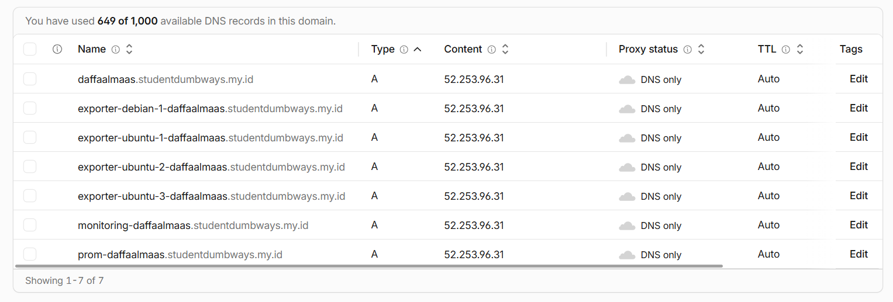

21. Setelah reverse proxy dikonfigurasi, beberapa layanan berikut dapat diakses melalui URL masing-masing:
     1. Node Exporter pada setiap server:
         1. ubuntu-server-1: https://exporter-ubuntu-1-daffaalmaas.studentdumbways.my.id/

        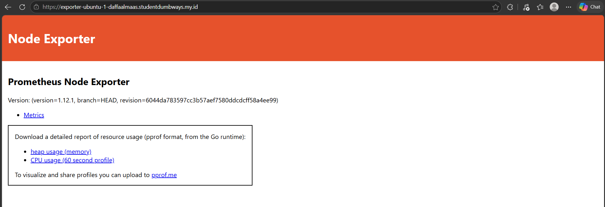

         2. ubuntu-server-2: https://exporter-ubuntu-2-daffaalmaas.studentdumbways.my.id/

        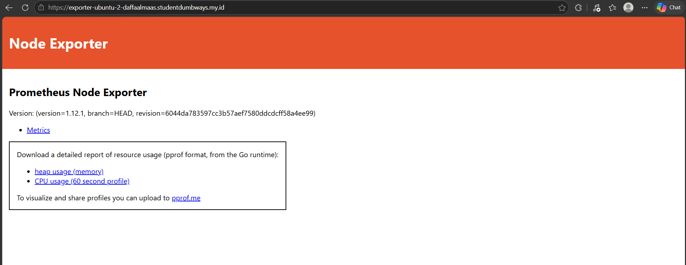

         3. ubuntu-server-3: https://exporter-ubuntu-3-daffaalmaas.studentdumbways.my.id/

        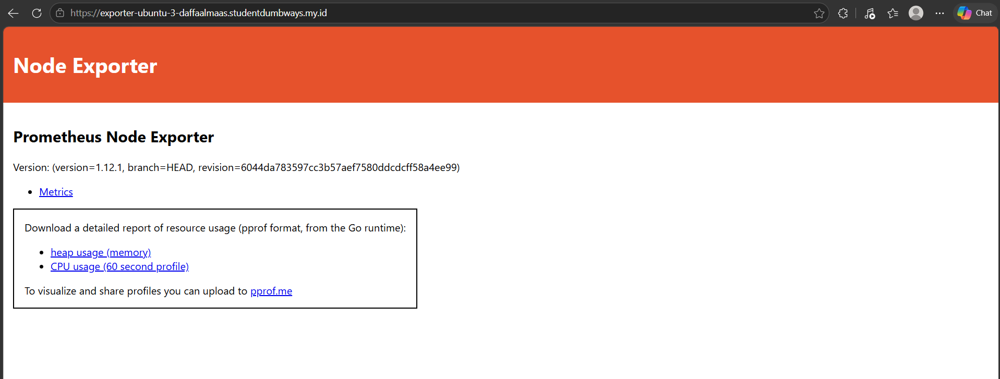

         4. debian-server-1: https://exporter-debian-1-daffaalmaas.studentdumbways.my.id/

        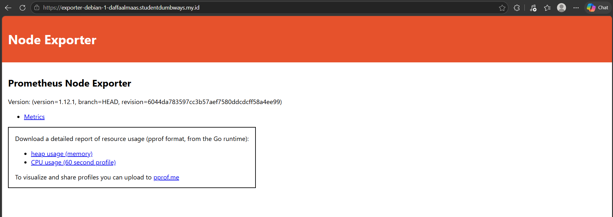

     2. Prometheus pada debian-server-1: https://prom-daffaalmaas.studentdumbways.my.id/

        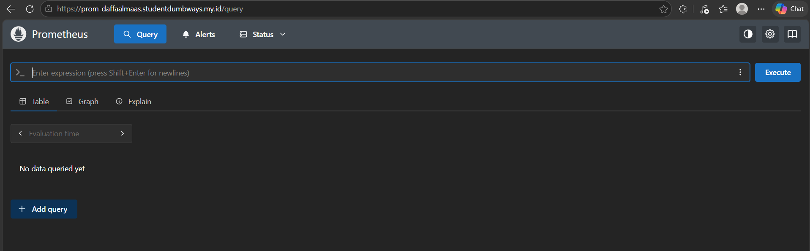

     3. Grafana pada debian-server-1: https://monitoring-daffaalmaas.studentdumbways.my.id/

        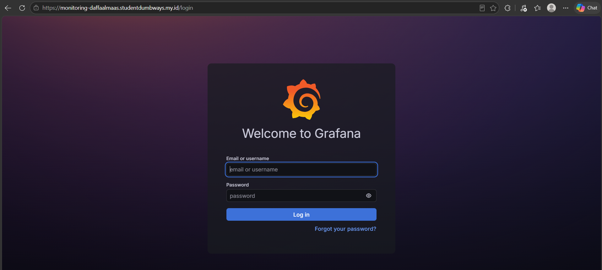

     4. Aplikasi wayshub-frontend pada ubuntu-server-1: https://daffaalmaas.studentdumbways.my.id/

        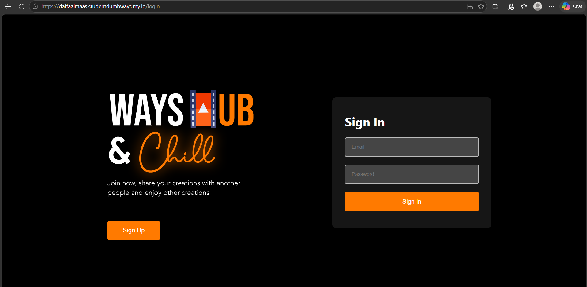

# Dashboard Grafana

1. Login ke grafana menggunakan akun yang telah dibuat saat pertama kali akses halaman https://monitoring-daffaalmaas.studentdumbways.my.id/

2. Buat dashboard baru.

3. Buat panel baru dengan nama Disk usage, lalu pilih tipe visualisasi 'Gauge'. Pada bagian Standard options, atur unit menjadi 'Percent (0-100)'', kemudian masukkan nilai min 0 dan max 100. Setelah itu, tambahkan query PromQL berikut:
            100 * (
            1 -
            (
                sum by (server) (
                node_filesystem_avail_bytes{
                    fstype!~"tmpfs|overlay|squashfs",
                    mountpoint="/"
                }
                )
                /
                sum by (server) (
                node_filesystem_size_bytes{
                    fstype!~"tmpfs|overlay|squashfs",
                    mountpoint="/"
                }
                )
            )
            )

query ini menghitung persentase penggunaan disk pada root filesystem / untuk setiap server yang dimonitor oleh Node Exporter, dengan mengecualikan filesystem tmpfs, overlay, dan squashfs.

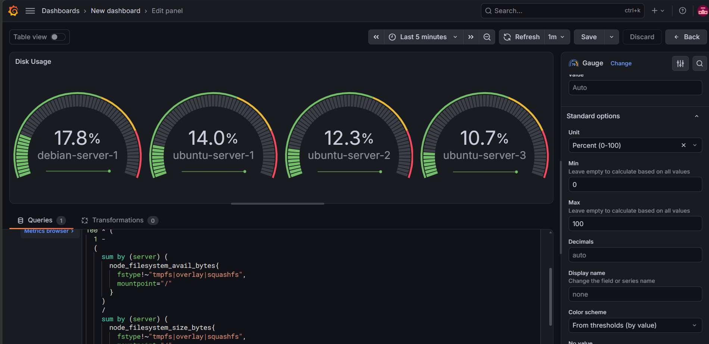

4. Buat panel baru dengan nama CPU usage, lalu pilih tipe visualisasi 'Gauge'. Pada bagian Standard options, atur unit menjadi 'Percent (0-100)'', kemudian masukkan nilai min 0 dan max 100. Setelah itu, tambahkan query PromQL berikut:
        100 * (
        1 -
        avg by (server) (
            rate(node_cpu_seconds_total{mode="idle"}[5m])
        )
        )
    
Query ini menghitung persentase penggunaan CPU setiap server dengan mengambil rata-rata CPU idle selama 5 menit terakhir, kemudian mengubahnya menjadi persentase CPU yang digunakan.

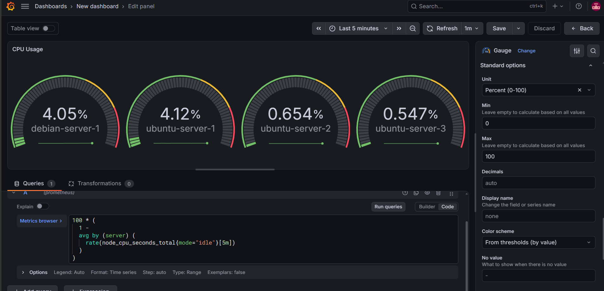

5. Buat panel baru dengan nama RAM usage, lalu pilih tipe visualisasi 'Gauge'. Pada bagian Standard options, atur unit menjadi 'Percent (0-100)'', kemudian masukkan nilai min 0 dan max 100. Setelah itu, tambahkan query PromQL berikut:

                100 * (
            1 -
            (
                sum by (server) (
                    node_memory_MemAvailable_bytes
                )
                /
                sum by (server) (
                    node_memory_MemTotal_bytes
                )
            )
        )

Query ini menghitung persentase penggunaan RAM pada masing-masing server, dengan membandingkan RAM yang tersedia (MemAvailable) dengan total RAM (MemTotal), kemudian hasilnya dikelompokkan berdasarkan server.

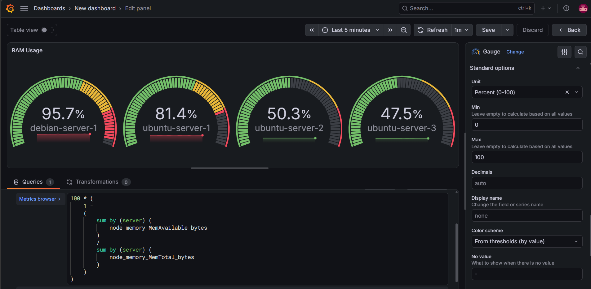

# alerting dengan Contact Point Discord

## Menambahkan Contact Point

1. Buka menu alerting -> Notification configuration, dan buat new contact point.

2. Masukkan nama Contact Point, pilih 'Discord' pada bagian Integration, lalu masukkan URL webhook Discord.

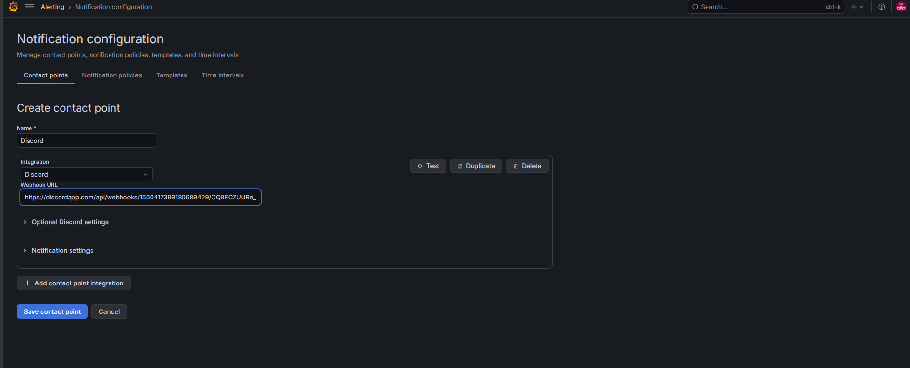

3. Klik save contact point untuk menyimpan.

## CPU Usage

1. Buka menu alerting->alert rules, dan buat new alert rule.

2. isi enter alert rule name(CPU Usage)

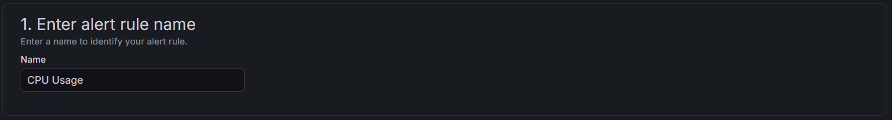

3. pada define query and alert condition, masukan query promQL berikut :

            100 * (
            1 -
            avg by (server) (
                rate(
                node_cpu_seconds_total{
                    job="node-exporter",
                    mode="idle"
                }[5m]
                )
            )
            )

Pada bagian Alert condition, atur kondisi agar alert aktif ketika nilai query lebih dari 20. Setelah itu, jalankan Preview alert rule condition untuk melihat hasilnya.

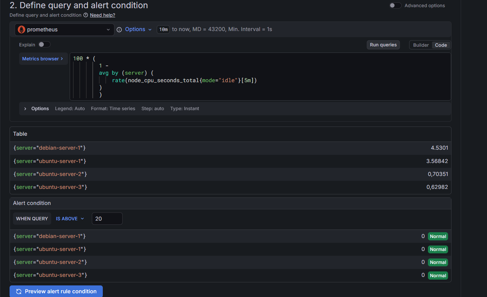

4. Pada bagian Add Folder and Labels buat folder baru bernama server monitoring.

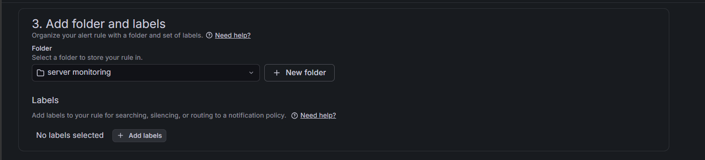

5. Pada bagian set evaluation behavior, buat elevation grup baru bernama server monitoring.Setelah itu, pada pending priod pilih 5m dan keep firing for pilih none.

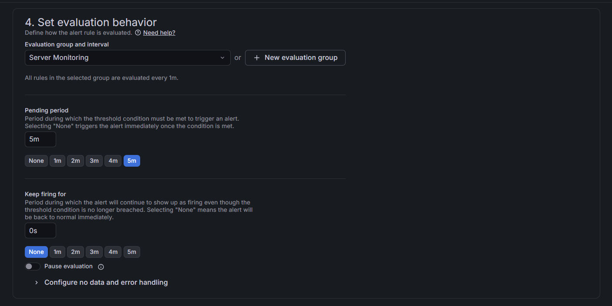

6. Pada bagian configure notifications, pilih contact point discord.

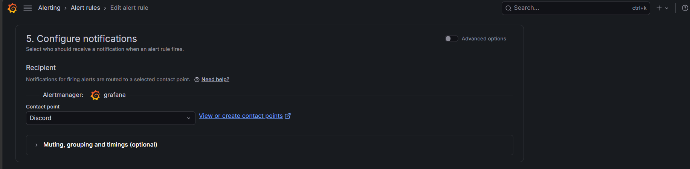

7. Pada bagian configure notification message, isi kolom summary seperti pada gambar dibawah.

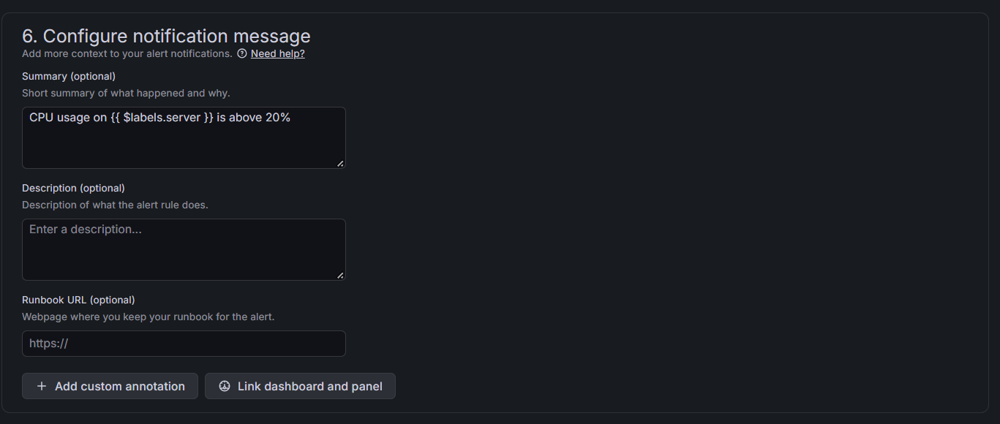

8. Klik save untuk menyimpan alert rule.

9. Alert rule berhasil diterapkan dan notifikasi dikirim ke discord jika CPU Usage > 20%.

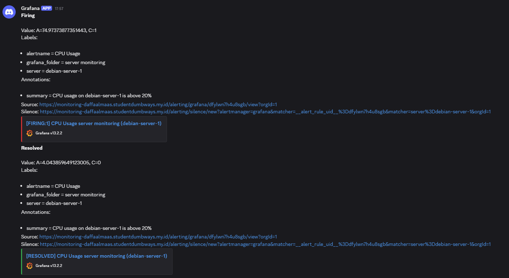

## RAM Usage 

1. Buka menu alert->alert rules, Lalu buat new alert rule.

2. isi enter alert rule name(RAM Usage)

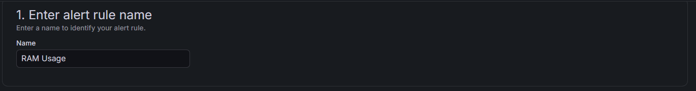

3. pada define query and alert condition, masukan query promQL berikut :

            100 * (
            1 -
            avg by (server) (
                rate(
                node_cpu_seconds_total{
                    job="node-exporter",
                    mode="idle"
                }[5m]
                )
            )
            )

Pada bagian Alert condition, atur kondisi agar alert aktif ketika nilai query lebih dari 75. Setelah itu, jalankan Preview alert rule condition untuk melihat hasilnya.

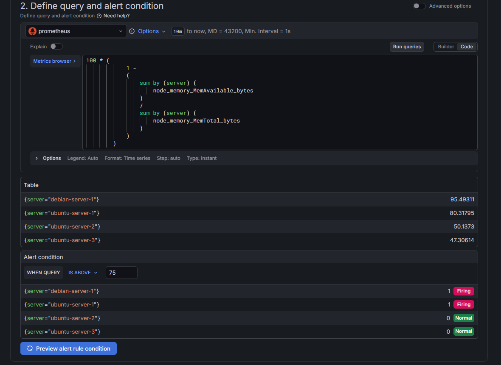

4. Pada bagian Add Folder and Labels pilih folder baru bernama server monitoring.

5. Pada bagian set evaluation behavior, pilih elevation grup baru bernama server monitoring.Setelah itu, pada pending priod pilih 5m dan keep firing for pilih none.

6. Pada bagian configure notifications, pilih contact point discord.

7. Pada bagian configure notification message, isi kolom summary seperti pada gambar dibawah.

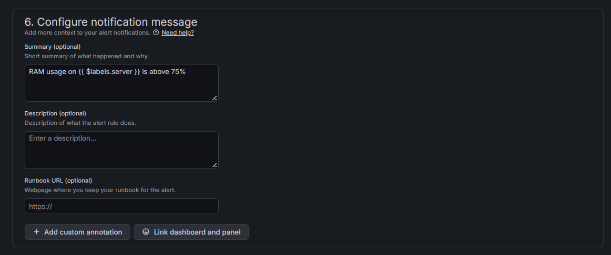

8. Klik save untuk menyimpan alert rule.

9. Alert rule berhasil diterapkan dan notifikasi dikirim ke discord jika RAM Usage > 75 %.

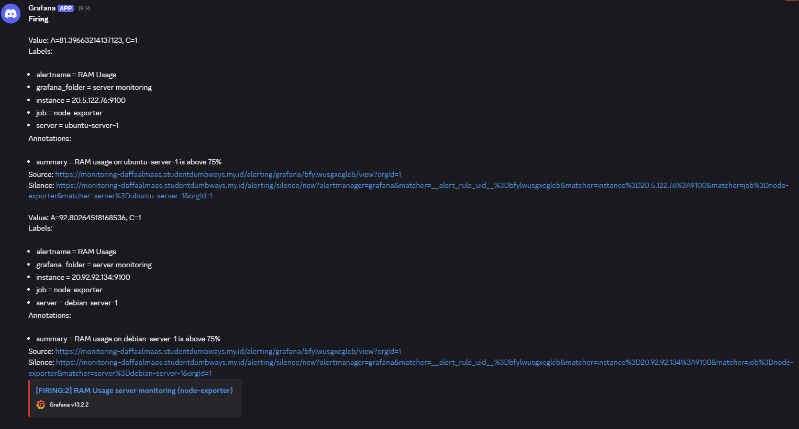