# Stage 2 Week 4 - Kubernetes

## Informasi Aplikasi Wayshub

    Aplikasi Wayshub dideploy pada cluster Kubernetes K3s yang terdiri dari satu server master dan dua server worker. Komponen aplikasi frontend dan backend berjalan pada namespace `apps-wayshub`, sedangkan database MySQL berjalan pada namespace `database`. Seluruh fungsi aplikasi dapat berjalan dengan baik pada cluster tersebut.

        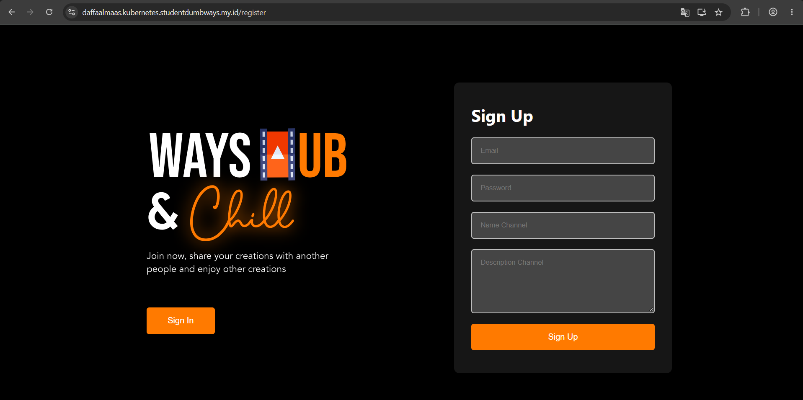

        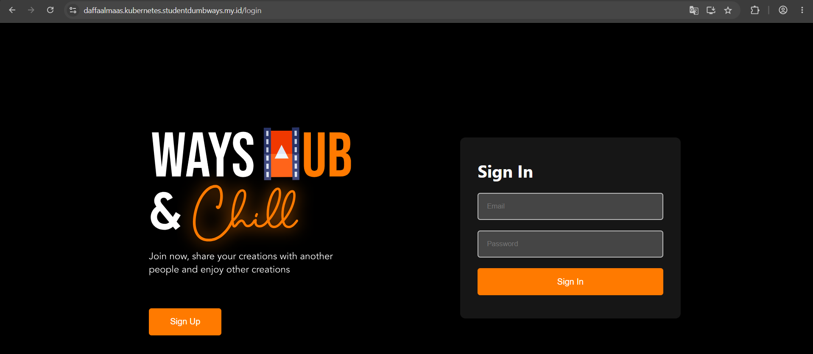
        
        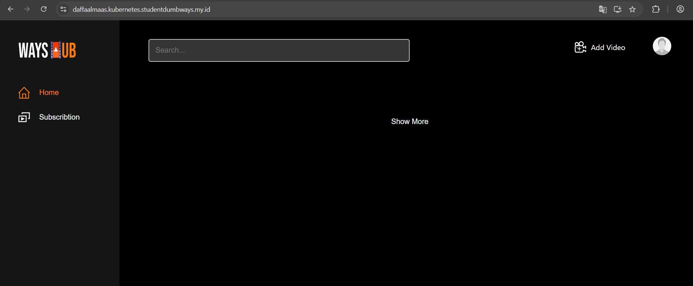

    Aplikasi diakses melalui domain berikut:

        - Frontend: https://daffaalmaas.kubernetes.studentdumbways.my.id
        - Backend :https://api-daffaalmaas.kubernetes.studentdumbways.my.id

## Informasi server

    1. Server master :
        - Public IP   : 20.58.164.146
        - Private IP  : 10.0.1.5

    2. Server worker-1 :
        - Public IP   : 20.213.145.240
        - Private IP  : 10.0.1.4

    3. Server worker-2 :
        - Public IP   : 13.78.22.163
        - Private IP  : 10.1.1.4

## Membuat kubernetes cluster

###  1. Instalasi K3S pada VM master

        1. Masuk ke dalam root dengan perintah ' sudo su '.

        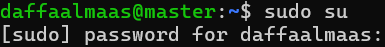

        2. Jalankan perintah ' curl -sfL https://get.k3s.io | sh - ' untuk melakukan instalasi K3S pada server master.

        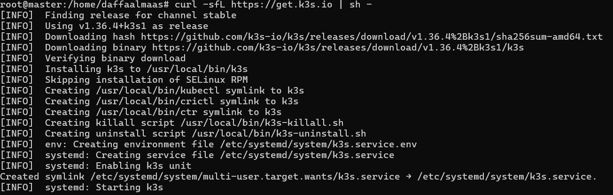

        3. Jalankan perintah ' k3s kubectl get nodes -o wide ' untuk mengecek K3s pada server master dan memastikan node master sudah berstatus Ready.

        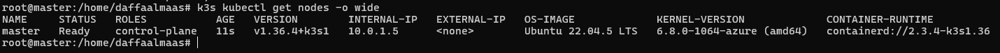

        4. Jalankan perintah ' cat /var/lib/rancher/k3s/server/node-token ' pada server master untuk mengambil token yang akan digunakan pada proses instalasi dan penggabungan worker-1 ke dalam cluster K3s. Setelah token ditampilkan, copy token tersebut untuk digunakan pada proses instalasi K3s di worker-1.

        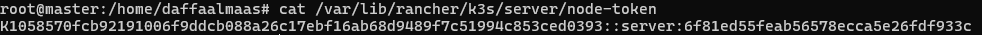

###  2. Instalasi K3S pada VM worker-1

        1. Masuk ke dalam root dengan perintah ' sudo su '.

        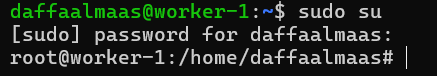

        2. Jalankan perintah ' curl -sfL https://get.k3s.io | K3S_URL=https://(Private IP master):6443 K3S_TOKEN='<token dari master>' sh - ' untuk menginstal K3s Agent dan menggabungkan worker-1 ke dalam cluster K3s pada server master.

        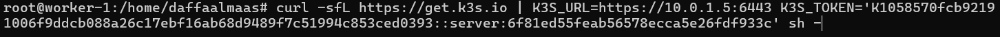

        3. Jalankan ' systemctl status k3s-agent --no-pager ' untuk memastikan K3s Agent berhasil dijalankan dan berstatus active (running).

        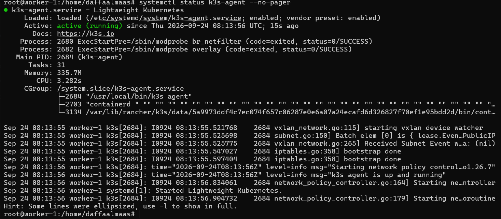

        4. Jalankan perintah ' k3s kubectl get nodes -o wide ' pada server master untuk memastikan worker-1 berhasil bergabung ke cluster K3s dan memiliki status Ready.

        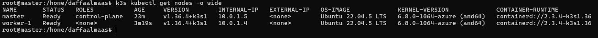

###  3. Instalasi K3S pada VM worker-2

        1. Masuk ke dalam root dengan perintah ' sudo su '.

        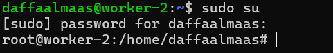

        2. Jalankan perintah ' curl -sfL https://get.k3s.io | K3S_URL=https://(Private IP master):6443 K3S_TOKEN='<token dari master>' sh - ' untuk menginstal K3s Agent dan menggabungkan worker-2 ke dalam cluster K3s pada server master.

        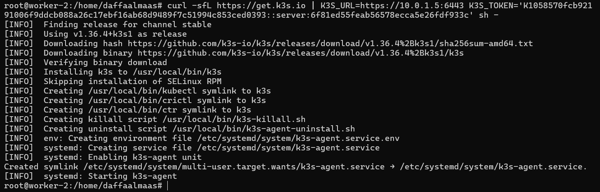

        3. Jalankan ' systemctl status k3s-agent --no-pager ' untuk memastikan K3s Agent berhasil dijalankan dan berstatus active (running).

        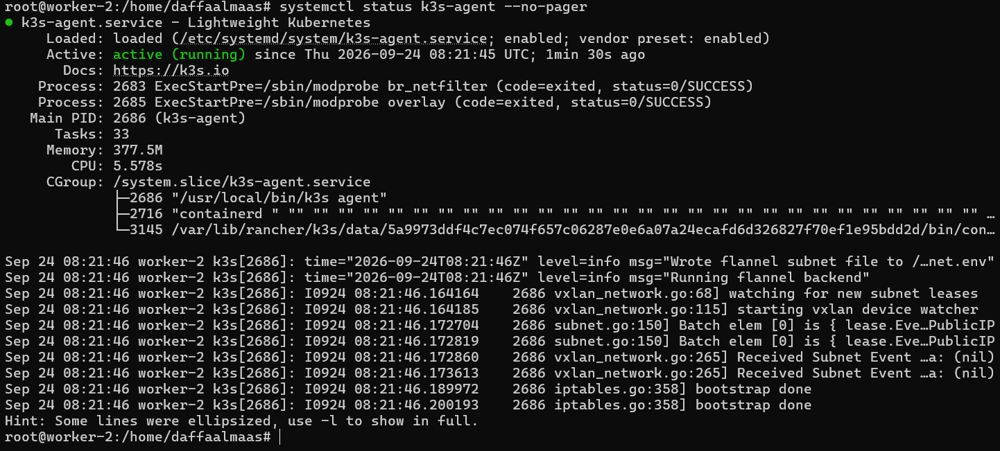

        4. Jalankan perintah ' k3s kubectl get nodes -o wide ' pada server master untuk memastikan worker-2 berhasil bergabung ke cluster K3s dan memiliki status Ready.

        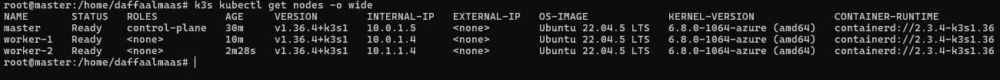

### 4. Memberikan Label Role pada Node Worker Kubernetes

        1. Pada server master, jalankan perintah ' k3s kubectl label node worker-1 node-role.kubernetes.io/worker=worker ' dan ' k3s kubectl label node worker-2 node-role.kubernetes.io/worker=worker ' untuk memberikan label worker pada worker-1 dan worker-2, sehingga kedua node tersebut dapat dikenali sebagai worker pada cluster Kubernetes.

        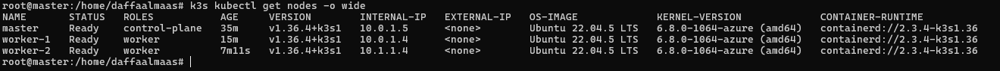

    Kubernetes cluster menggunakan K3s telah berhasil dibuat dengan tiga node, yaitu satu node master sebagai control-plane serta dua node worker, yaitu worker-1 dan worker-2. Seluruh node menunjukkan status Ready, sehingga cluster telah berhasil berjalan dan siap digunakan untuk tahap deployment aplikasi selanjutnya.

## Install ingress-nginx menggunakan helm

    1. Pada server master, jalankan Perintah ' curl https://raw.githubusercontent.com/helm/helm/main/scripts/get-helm-3 | bash ' untuk melakukan instalasi helm.

        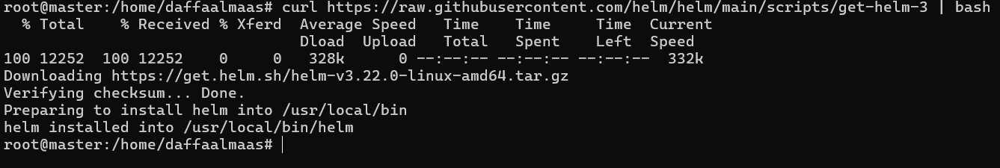

    2. Jalankan perintah ' helm version ' untuk memastikan Helm telah berhasil terpasang pada server master.

        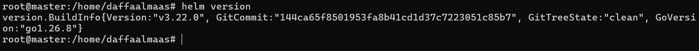

    3. Jalankan perintah ' helm repo add ingress-nginx https://kubernetes.github.io/ingress-nginx ' untuk menambahkan repository NGINX Ingress ke Helm sebagai sumber chart yang akan digunakan untuk instalasi NGINX Ingress Controller.

        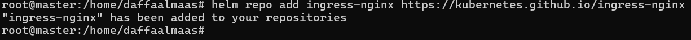

    4. Jalankan perintah ' helm repo update ' untuk memperbarui informasi chart dari seluruh repository Helm yang telah ditambahkan, termasuk repository NGINX Ingress.

        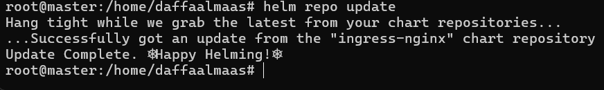

    5. Jalankan perintah ' echo 'export KUBECONFIG=/etc/rancher/k3s/k3s.yaml' >> /root/.bashrc ' untuk menyimpan konfigurasi KUBECONFIG ke dalam .bashrc sehingga konfigurasi tetap tersedia ketika login kembali sebagai root.

        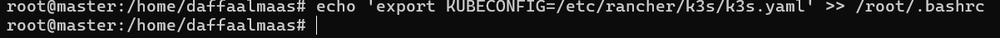

    6. Jalankan perintah ' source /root/.bashrc ' untuk menerapkan konfigurasi KUBECONFIG yang baru saja ditambahkan tanpa perlu logout dan login kembali.

        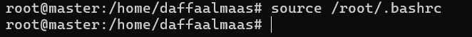

    7. Jalankan perintah ' echo $KUBECONFIG ' untuk memastikan variabel KUBECONFIG telah aktif dan mengarah ke file kubeconfig K3s.

        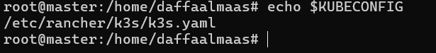

    8. Jalankan perintah ' mkdir -p /etc/rancher/k3s ' untuk membuat direktori yang digunakan sebagai lokasi penyimpanan file konfigurasi K3s.

        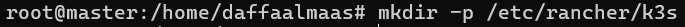

    9. Jalankan perintah ' nano /etc/rancher/k3s/config.yaml ' untuk untuk membuat dan membuka file config.yaml sebagai file konfigurasi K3s.

    10. Isi file config.yaml seperti dibawah :

        disable:
        - traefik

        Konfigurasi tersebut digunakan untuk menonaktifkan Traefik bawaan K3s, karena nantinya cluster akan menggunakan NGINX Ingress Controller sebagai Ingress Controller utama.

        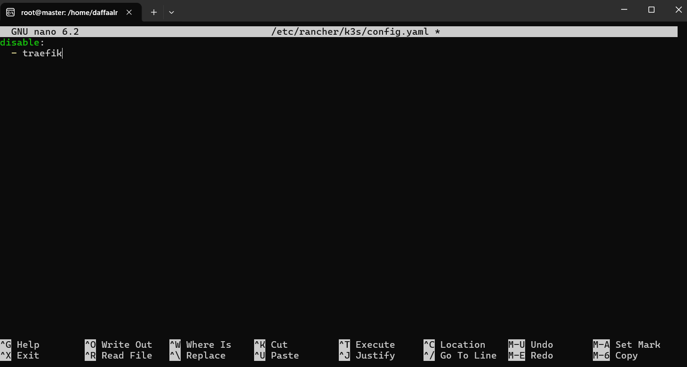

    11. Jalankan perintah ' systemctl restart k3s ' untuk menerapkan konfigurasi baru yang telah dibuat, yaitu menonaktifkan Traefik bawaan K3s.

        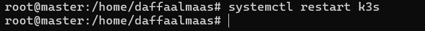

    12. Jalankan perintah ' helm list -A ' dan ' k3s kubectl get pods -n kube-system ' untuk memastikan Traefik bawaan K3s telah dinonaktifkan setelah konfigurasi diterapkan.

        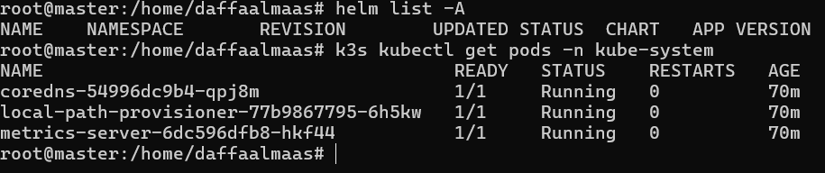

    13. Jalankan perintah : 

        helm install ingress-nginx ingress-nginx/ingress-nginx \
        --namespace ingress-nginx \
        --create-namespace 

        Perintah tersebut berfungsi untuk menginstal NGINX Ingress Controller ke dalam cluster Kubernetes menggunakan chart ingress-nginx dan membuat namespace ingress-nginx.

    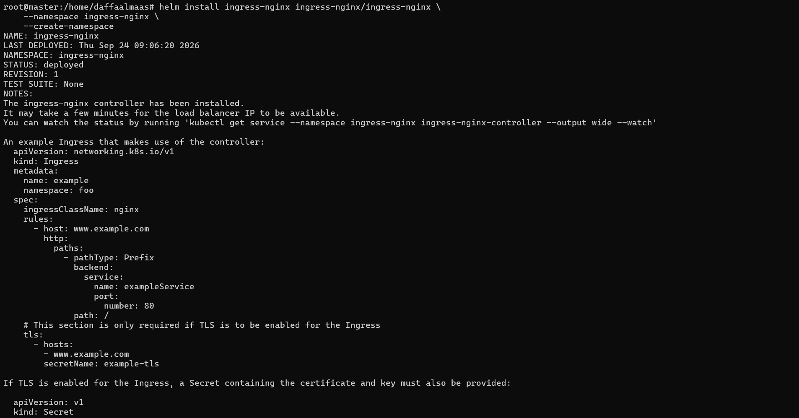

    14. Jalankan perintah ' k3s kubectl get pods -n ingress-nginx ' dan ' k3s kubectl get svc -n ingress-nginx ' untuk memastikan Pod NGINX Ingress Controller berjalan dengan status Running serta memeriksa Service, tipe, dan alamat IP yang digunakan.

        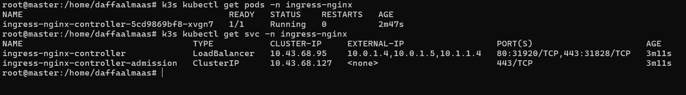

    15. NGINX Ingress Controller telah berhasil dipasang menggunakan Helm pada cluster Kubernetes. Pod NGINX Ingress berada dalam status Running, sedangkan Service ingress-nginx-controller berhasil dibuat dengan tipe LoadBalancer dan menyediakan akses melalui port HTTP 80 serta HTTPS 443.

## Setup Persistent Volume untuk database dan Deploy MySQL menggunakan StatefulSet dan Secrets

    1. Pada server master, Jalankan perintah ' k3s kubectl create namespace database ' untuk membuat namespace database.

        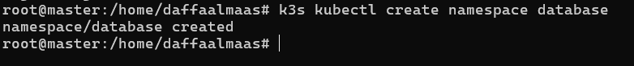

    2. Jalankan perintah ' k3s kubectl get storageclass ' untuk memastikan StorageClass local-path tersedia dan dapat digunakan sebagai penyedia penyimpanan persisten untuk database MySQL.

        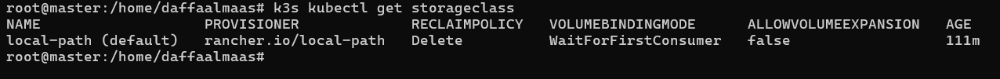

    3. Jalankan perintah ' mkdir -p /home/daffaalmaas/database ' untuk membuat direktori khusus yang digunakan sebagai tempat penyimpanan seluruh file konfigurasi YAML untuk database MySQL.

        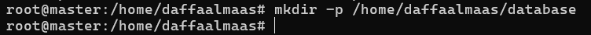

    4. Jalankan perintah ' nano /home/daffaalmaas/database/mysql-pvc.yaml ' untuk membuat file konfigurasi PersistentVolumeClaim (PVC) yang digunakan untuk menyediakan penyimpanan persisten bagi database MySQL. PVC ini menggunakan StorageClass local-path dengan kapasitas penyimpanan sebesar 10 GiB dan mode akses ReadWriteOnce. Isi file mysql-pvc.yaml seperti di bawah:

        apiVersion: v1
        kind: PersistentVolumeClaim
        metadata:
        name: mysql-pvc
        namespace: database
        spec:
        accessModes:
            - ReadWriteOnce
        storageClassName: local-path
        resources:
            requests:
            storage: 10Gi
        
        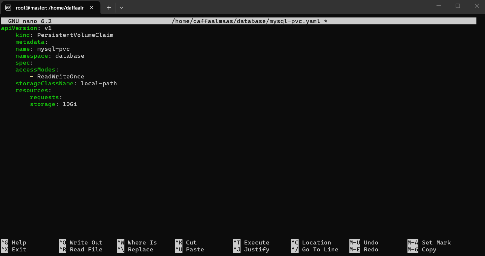

    5. Jalankan perintah ' k3s kubectl apply -f /home/daffaalmaas/database/mysql-pvc.yaml ' untuk menerapkan konfigurasi PersistentVolumeClaim (PVC) ke dalam cluster Kubernetes. Setelah itu, jalankan perintah ' k3s kubectl get pvc -n database ' untuk memeriksa status PVC yang telah dibuat dan memastikan konfigurasi penyimpanan database berhasil diterapkan.

        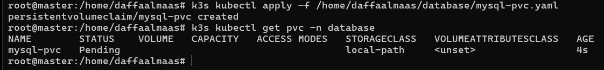

    6. Jalankan perintah ' nano /home/daffaalmaas/database/mysql-secret.yaml ' untuk membuat file konfigurasi Secret yang digunakan untuk menyimpan informasi sensitif database MySQL, seperti password root, nama database, username, dan password pengguna. Secret ini akan digunakan oleh StatefulSet MySQL agar informasi kredensial database tidak dituliskan secara langsung pada konfigurasi StatefulSet. Isi file seperti di bawah :

            apiVersion: v1
            kind: Secret
            metadata:
            name: mysql-secret
            namespace: database
            type: Opaque
            stringData:
            MYSQL_ROOT_PASSWORD: "password_root"
            MYSQL_DATABASE: "nama_database"
            MYSQL_USER: "nama_user"
            MYSQL_PASSWORD: "password_user"
        
        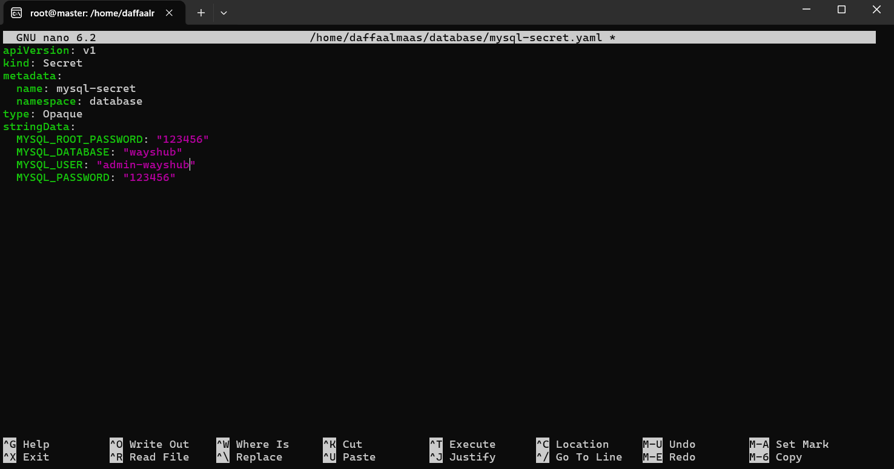

    7. Jalankan perintah ' k3s kubectl apply -f /home/daffaalmaas/database/mysql-secret.yaml ' untuk menerapkan konfigurasi Secret MySQL ke namespace database. Setelah itu, jalankan perintah ' k3s kubectl get secret -n database ' untuk memastikan Secret mysql-secret telah berhasil dibuat tanpa menampilkan isi kredensial yang tersimpan di dalamnya.

        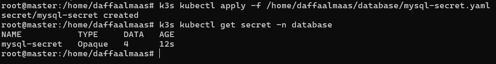

    8. Jalankan perintah ' nano /home/daffaalmaas/database/mysql-statefulset.yaml ' untuk membuat file konfigurasi StatefulSet yang digunakan untuk menjalankan database MySQL pada cluster Kubernetes. StatefulSet ini menggunakan satu replika MySQL, mengambil kredensial dari Secret mysql-secret, serta menghubungkan MySQL dengan mysql-pvc sebagai penyimpanan persisten untuk data database. Isi file seperti di bawah:

        apiVersion: apps/v1
        kind: StatefulSet
        metadata:
        name: mysql
        namespace: database
        spec:
        serviceName: mysql
        replicas: 1
        selector:
            matchLabels:
            app: mysql
        template:
            metadata:
            labels:
                app: mysql
            spec:
            containers:
                - name: mysql
                image: mysql:8.0
                ports:
                    - containerPort: 3306
                    name: mysql
                envFrom:
                    - secretRef:
                        name: mysql-secret
                volumeMounts:
                    - name: mysql-storage
                    mountPath: /var/lib/mysql
                resources:
                    requests:
                    cpu: "250m"
                    memory: "512Mi"
                    limits:
                    cpu: "500m"
                    memory: "1Gi"
            volumes:
                - name: mysql-storage
                persistentVolumeClaim:
                    claimName: mysql-pvc
        
        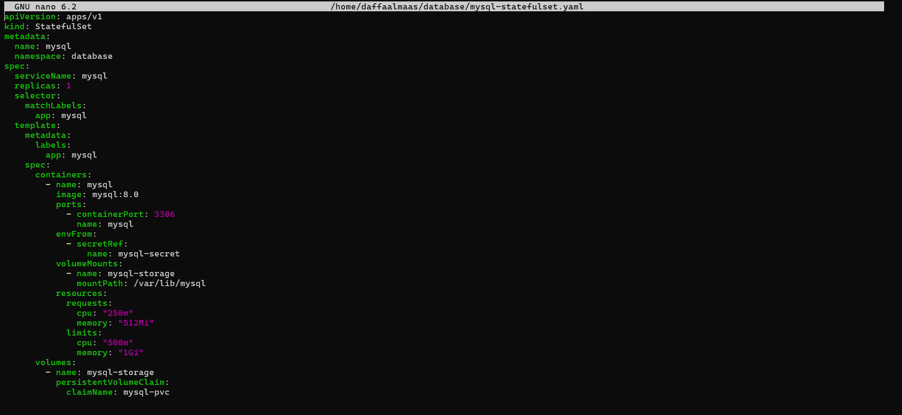

    9. Jalankan perintah ' k3s kubectl apply -f /home/daffaalmaas/database/mysql-statefulset.yaml ' untuk menerapkan konfigurasi StatefulSet MySQL ke namespace database.

        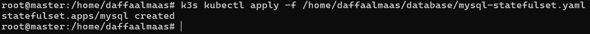

    10. Jalankan perintah ' k3s kubectl get statefulset -n database ' dan ' k3s kubectl get pods -n database ' untuk memastikan StatefulSet dan Pod MySQL telah berhasil dibuat serta memeriksa status Pod dan penggunaan PVC mysql-pvc.

        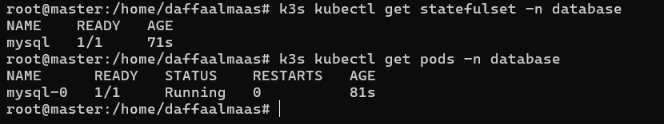

    11. Jalankan perintah ' k3s kubectl get pvc -n database ' untuk memeriksa status PersistentVolumeClaim (PVC) mysql-pvc dan memastikan volume penyimpanan untuk database MySQL telah berhasil dibuat serta terhubung dengan Pod MySQL.

        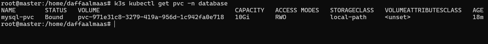

    12. Jalankan perintah ' nano /home/daffaalmaas/database/mysql-service.yaml ' untuk membuat file konfigurasi Service MySQL. Service menggunakan tipe ClusterIP agar database MySQL hanya dapat diakses oleh Pod lain di dalam cluster Kubernetes dan tidak diekspos secara langsung ke jaringan eksternal. Isi file seperti di bawah:

        apiVersion: v1
        kind: Service
        metadata:
        name: mysql
        namespace: database
        spec:
        type: ClusterIP
        selector:
            app: mysql
        ports:
            - port: 3306
            targetPort: 3306
            protocol: TCP
            name: mysql

        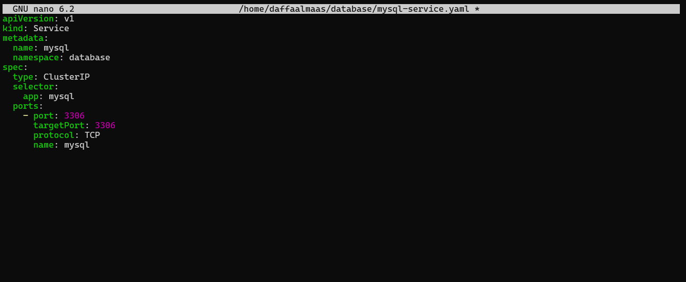

    13. Jalankan perintah ' k3s kubectl apply -f /home/daffaalmaas/database/mysql-service.yaml ' untuk menerapkan konfigurasi Service MySQL ke namespace database.

        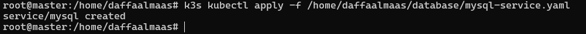

    14. Jalankan perintah ' k3s kubectl get svc -n database ' dan ' k3s kubectl get endpointslice -n database ' untuk memeriksa Service MySQL, memastikan Service menggunakan tipe ClusterIP pada port 3306, serta memastikan Service telah terhubung dengan Pod mysql-0 sebagai endpoint yang dapat menerima koneksi database.

        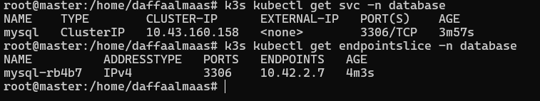

    15. Jalankan perintah ' k3s kubectl exec -it mysql-0 -n database -- mysql -u admin-wayshub -p ' untuk melakukan pengujian koneksi ke database MySQL yang berjalan pada Pod mysql-0. Masukkan password yang telah dikonfigurasi pada Secret mysql-secret, kemudian jalankan perintah ' SHOW DATABASES; ' untuk memastikan database wayshub telah berhasil dibuat dan dapat diakses.

        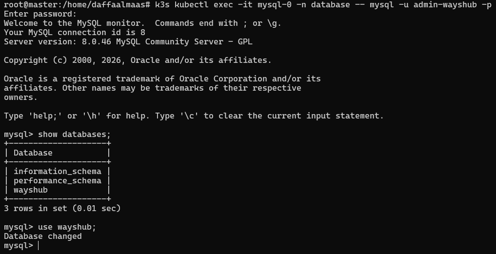

    16. Konfigurasi database MySQL pada Kubernetes telah berhasil diterapkan menggunakan StatefulSet, PersistentVolumeClaim (PVC) 10 GiB, dan Secret untuk menyimpan kredensial. MySQL berjalan dengan status Running, PVC telah berstatus Bound, dan Service ClusterIP pada port 3306 berhasil terhubung ke Pod MySQL.

## Deploy Aplikasi Wayshub - Backend

    1. Jalankan perintah ' git clone https://github.com/dumbwaysdev/wayshub-backend.git ' pada WSL untuk mengunduh repository backend WaysHub dari GitHub ke komputer lokal. Setelah proses clone selesai, masuk ke direktori project menggunakan  perintah ' cd wayshub-backend '.

        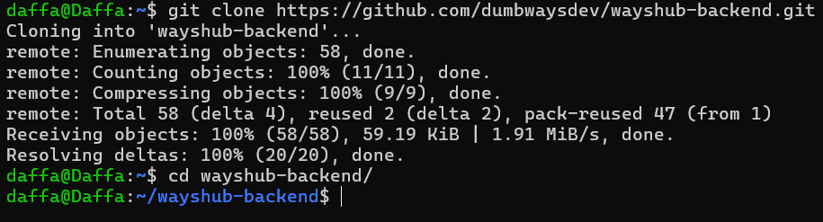

    2. Jalankan perintah ' nano config/config.json ' untuk membuka file konfigurasi database backend. Pada environment development, ubah username, password, nama database, dan host sesuai dengan Secret mysql-secret dan Service MySQL. Host mysql.database.svc.cluster.local digunakan sebagai DNS internal Kubernetes untuk mengakses Service MySQL pada namespace database.

        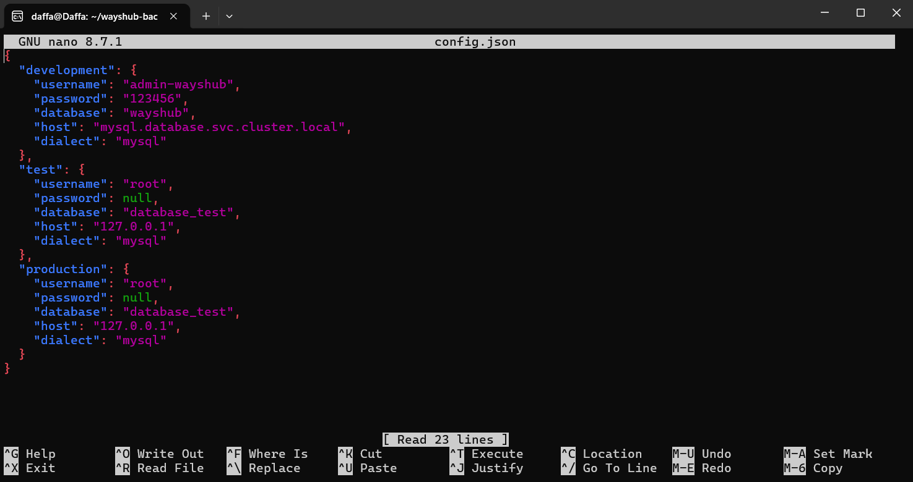

    3. Jalankan perintah ' nano Dockerfile ' untuk membuat Dockerfile yang digunakan sebagai konfigurasi pembuatan image backend. Dockerfile menggunakan Node.js versi 12, menyalin file konfigurasi package terlebih dahulu, menjalankan npm install untuk menginstal seluruh dependency, kemudian menyalin source code aplikasi. Backend menggunakan port 5000 dan dijalankan dengan node index.js. Isi Dockerfile seperti pada di bawah:

        FROM node:12

        WORKDIR /app

        COPY package*.json ./

        RUN npm install

        COPY . .

        EXPOSE 5000

        CMD ["node", "index.js"]

        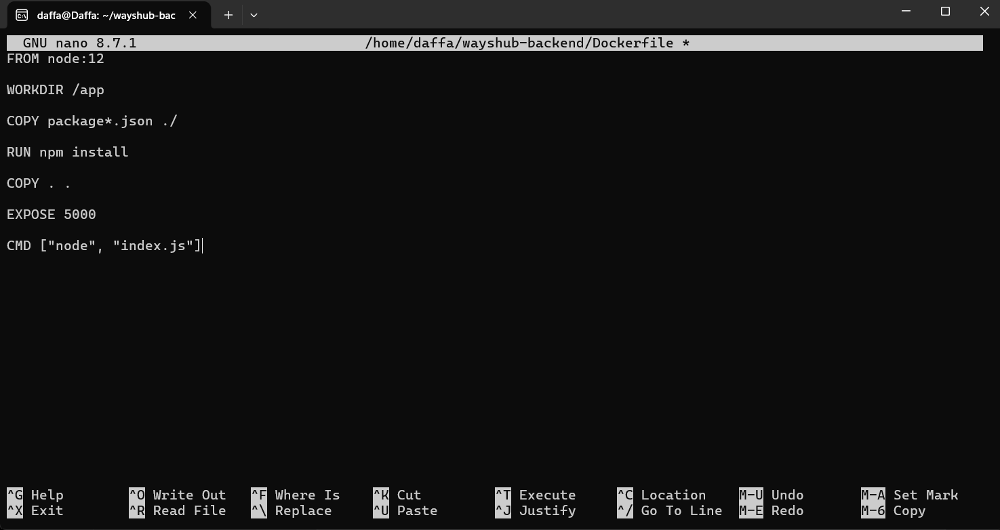

    4. Jalankan perintah ' docker build -t daffaalmaas74/wayshub-backend:kubernetes . ' untuk membuat Docker image backend dengan nama daffaalmaas74/wayshub-backend:kubernetes.

        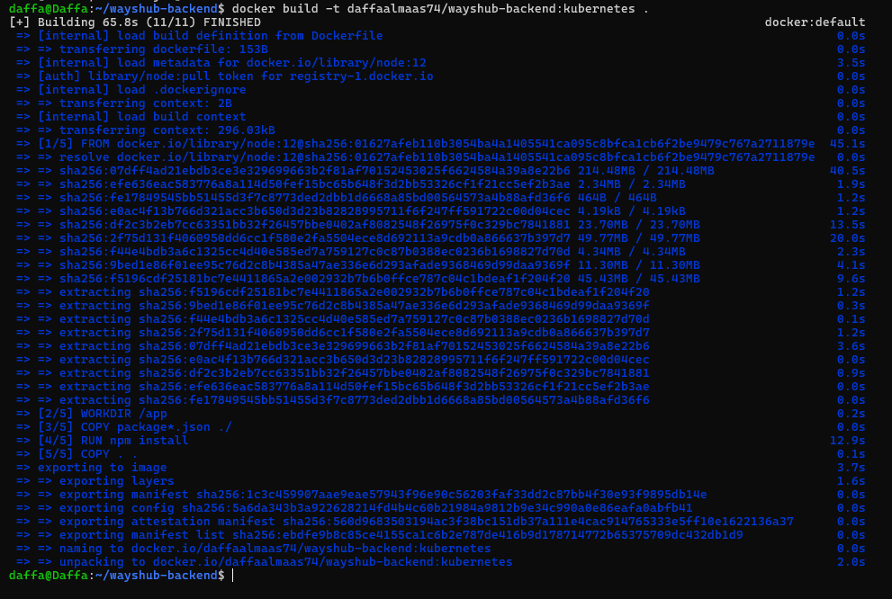

    5. Jalankan perintah ' docker push daffaalmaas74/wayshub-backend:kubernetes ' untuk mengunggah Docker image backend ke Docker Hub.

        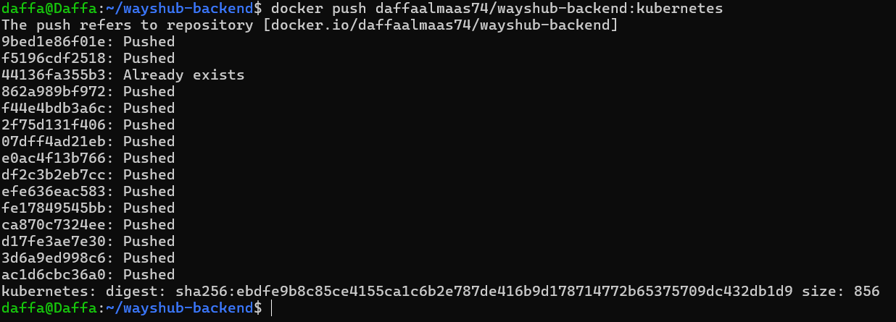

    6. Pada server master, masuk sebagai user root, kemudian jalankan perintah ' k3s kubectl create namespace apps-wayshub ' untuk membuat namespace apps-wayshub yang digunakan sebagai tempat deployment aplikasi frontend dan backend WaysHub.

        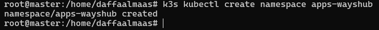

    7. Jalankan perintah ' mkdir /home/daffaalmaas/backend ' untuk membuat direktori backend, kemudian jalankan perintah ' nano /home/daffaalmaas/backend/backend-deployment.yaml ' untuk membuat file konfigurasi Deployment backend. Isi file backend-deployment.yaml seperti pada dibawah :

        apiVersion: apps/v1
        kind: Deployment
        metadata:
        name: backend
        namespace: apps-wayshub
        spec:
        replicas: 1
        selector:
            matchLabels:
            app: backend
        template:
            metadata:
            labels:
                app: backend
            spec:
            containers:
                - name: backend
                image: daffaalmaas74/wayshub-backend:kubernetes
                ports:
                    - containerPort: 5000
        
        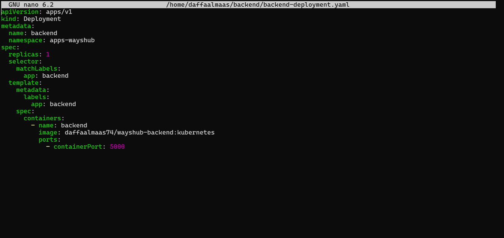 

    8. Jalankan perintah ' k3s kubectl apply -f /home/daffaalmaas/backend/backend-deployment.yaml ' untuk menerapkan konfigurasi Deployment backend ke dalam cluster kubernetes.

        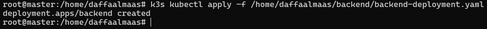 

    9. Jalankan perintah ' k3s kubectl get deployment -n apps-wayshub ' dan ' k3s kubectl get pods -n apps-wayshub ' untuk memastikan Deployment dan Pod backend berhasil dibuat dan berjalan.

        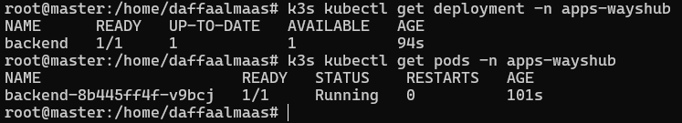 

    10. Jalankan perintah ' nano /home/daffaalmaas/backend/backend-service.yaml ' untuk membuat file konfigurasi Service backend. Service ini menggunakan tipe ClusterIP agar Pod backend dapat diakses oleh aplikasi lain di dalam cluster melalui port 5000, sedangkan akses dari luar cluster akan diteruskan melalui NGINX Ingress.Isi backend-service.yaml seperti di bawah :

        apiVersion: v1
        kind: Service
        metadata:
        name: backend
        namespace: apps-wayshub
        spec:
        type: ClusterIP
        selector:
            app: backend
        ports:
            - port: 5000
            targetPort: 5000
            protocol: TCP
            name: backend

        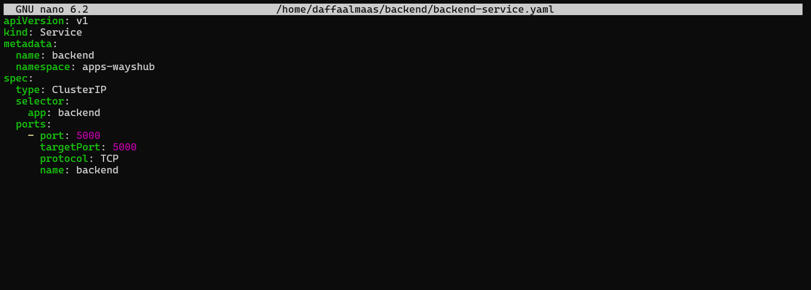 

    11. Jalankan perintah ' k3s kubectl apply -f /home/daffaalmaas/backend/backend-service.yaml ' untuk mener
    apkan konfigurasi Service backend ke namespace apps-wayshub.

        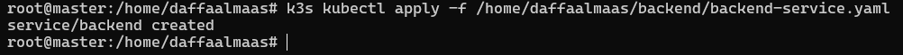

    12. Jalankan perintah ' k3s kubectl get svc -n apps-wayshub ' untuk memastikan Service backend berhasil dibuat dengan tipe ClusterIP dan menggunakan port 5000.

        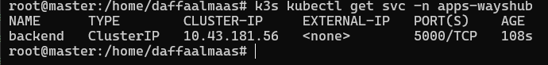

    13. Jalankan perintah ' k3s kubectl get pods -n apps-wayshub -o wide ' untuk memastikan Pod backend berstatus Running, kemudian jalankan perintah ' k3s kubectl get endpointslice -n apps-wayshub ' untuk memastikan Service backend memiliki endpoint yang mengarah ke Pod backend.

        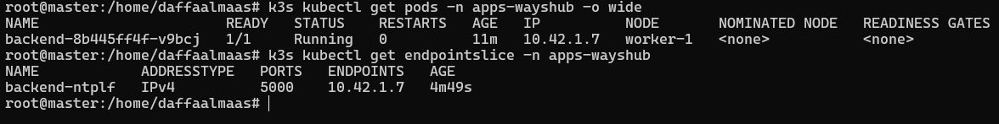

    14. Jalankan perintah ' k3s kubectl exec -it backend-8b445ff4f-v9bcj -n apps-wayshub -- bash ' untuk masuk ke dalam Pod backend. Nama ' backend-8b445ff4f-v9bcj ' diperoleh dari hasil pengecekan menggunakan perintah ' k3s kubectl get pods -n apps-wayshub ', yang menampilkan nama Pod backend yang sedang berjalan. Setelah masuk ke dalam Pod, jalankan perintah ' npx sequelize-cli db:migrate ' untuk menjalankan database migration menggunakan Sequelize.

        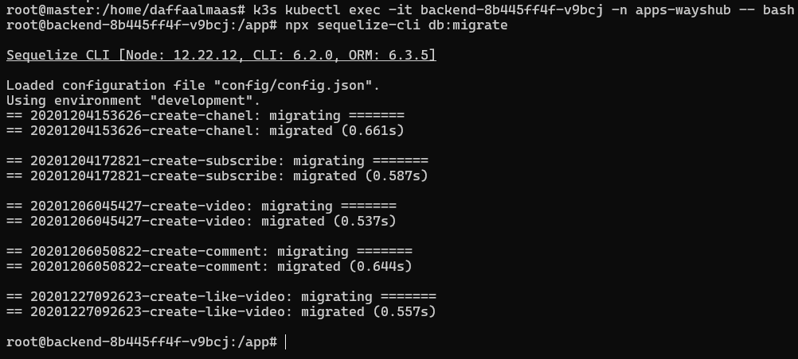

    15. Jalankan perintah ' k3s kubectl run curl-test -n apps-wayshub --rm -it --image=curlimages/curl --restart=Never -- curl http://backend:5000 ' untuk menguji aplikasi backend dapat diakses melalui Service backend pada port 5000 dari dalam cluster Kubernetes.

        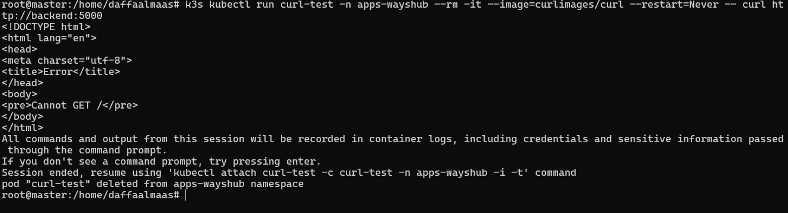

    16. Deployment backend telah berhasil dilakukan pada Kubernetes. Backend berjalan pada Pod dengan status Running, Service ClusterIP berhasil menghubungkan request ke Pod, database migration berhasil dijalankan, dan pengujian dari dalam cluster menghasilkan respons Cannot GET /, yang menunjukkan bahwa request berhasil mencapai aplikasi backend.

## Deploy Aplikasi Wayshub - Frontend

    1. Jalankan perintah ' git clone https://github.com/dumbwaysdev/wayshub-frontend.git ' pada WSL untuk mengunduh repository frontend WaysHub dari GitHub ke komputer lokal. Setelah proses clone selesai, masuk ke direktori project menggunakan  perintah ' cd wayshub-frontend '.

        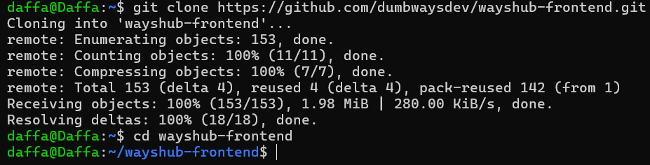

    2. Jalankan perintah ' nano src/config/api.js ' untuk membuka konfigurasi API frontend, kemudian ubah nilai baseURL dari http://localhost:5000/api/v1 menjadi https://api-daffaalmaas.kubernetes.studentdumbways.my.id/api/v1 agar frontend menggunakan domain API yang akan dikonfigurasi melalui NGINX Ingress dan SSL.

        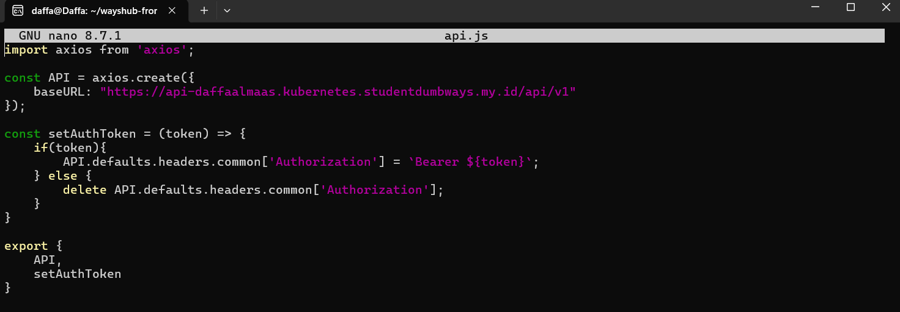

    3. Jalankan perintah ' nano Dockerfile ' untuk membuat file Dockerfile yang digunakan sebagai konfigurasi pembuatan image frontend. Dockerfile menggunakan Node.js versi 12, menyalin file package.json dan package-lock.json, menjalankan npm install untuk menginstal seluruh dependency, kemudian menyalin source code aplikasi. Frontend menggunakan port 3000 dan dijalankan dengan perintah npm start. Isi Dockerfile seperti pada dibawah :

        FROM node:12

        WORKDIR /app

        COPY package*.json ./

        RUN npm install

        COPY . .

        EXPOSE 3000

        CMD ["npm", "start"]

        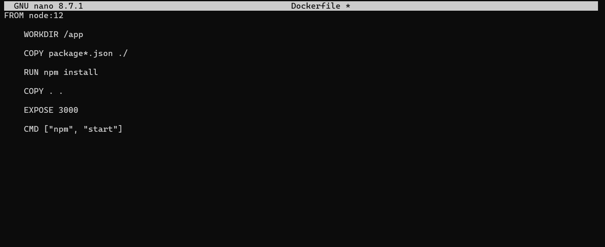

    4. Jalankan perintah ' docker build -t daffaalmaas74/wayshub-frontend:kubernetes . ' untuk membuat Docker image frontend dengan nama daffaalmaas74/wayshub-frontend:kubernetes.

        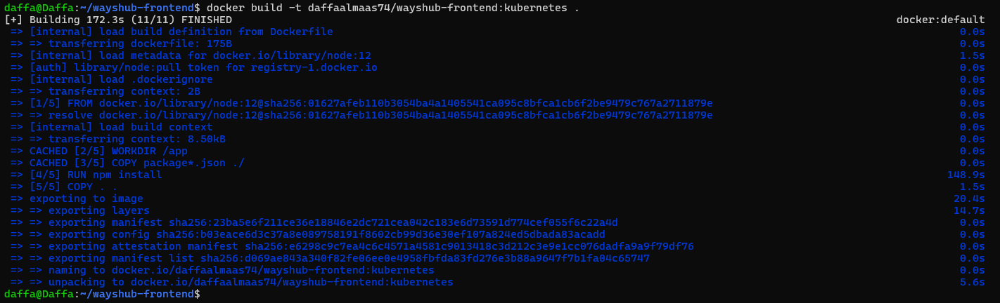

    5. Jalankan perintah ' docker push daffaalmaas74/wayshub-frontend:kubernetes ' untuk mengunggah Docker image frontend ke Docker Hub.

        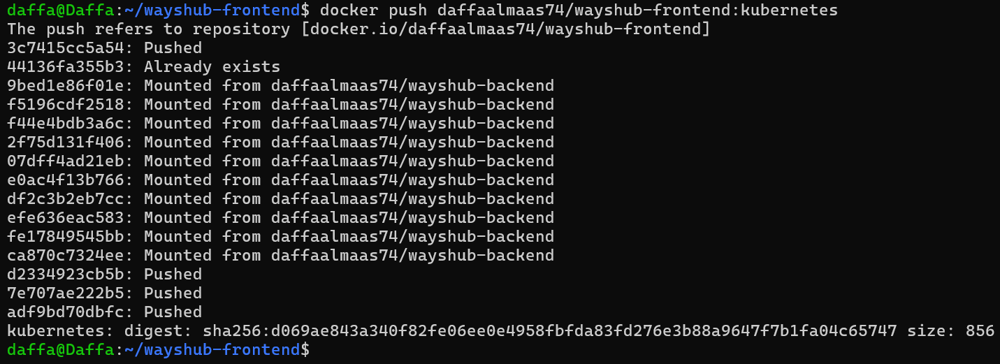

    6. Pada server master, masuk sebagai user root kemudian jalankan perintah ' mkdir /home/daffaalmaas/frontend ' untuk membuat direktori frontend. Jalankan perintah ' nano /home/daffaalmaas/frontend/frontend-deployment.yaml ' untuk membuat file konfigurasi Deployment frontend. Isi file backend-frontend.yaml seperti pada dibawah :

        apiVersion: apps/v1
        kind: Deployment
        metadata:
        name: frontend
        namespace: apps-wayshub
        spec:
        replicas: 1
        selector:
            matchLabels:
            app: frontend
        template:
            metadata:
            labels:
                app: frontend
            spec:
            containers:
                - name: frontend
                image: daffaalmaas74/wayshub-frontend:kubernetes
                ports:
                    - containerPort: 3000

        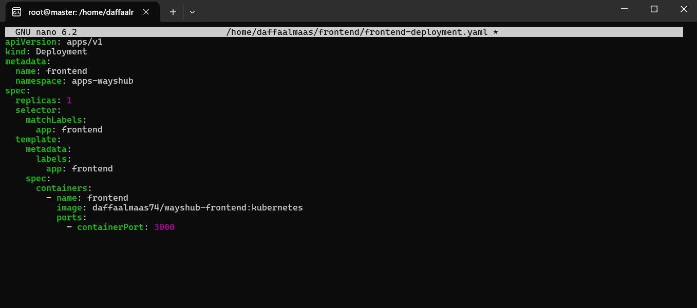

    7. Jalankan perintah ' k3s kubectl apply -f /home/daffaalmaas/frontend/frontend-deployment.yaml ' untuk menerapkan konfigurasi Deployment frontend ke dalam cluster Kubernetes.

        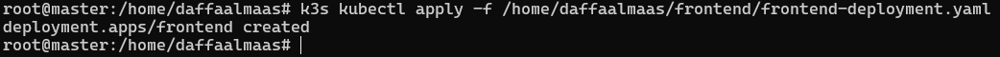

    8. Jalankan perintah ' k3s kubectl get deployment -n apps-wayshub ' dan ' k3s kubectl get pods -n apps-wayshub ' untuk memastikan Deployment dan Pod frontend berhasil dibuat dan berjalan.

        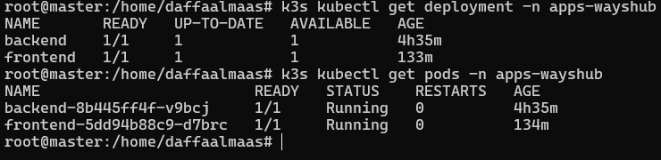

    9. Jalankan perintah ' nano /home/daffaalmaas/frontend/frontend-service.yaml ' untuk membuat file konfigurasi Service frontend. Service ini menggunakan tipe ClusterIP agar Pod frontend dapat diakses melalui Service pada port 3000 di dalam cluster, sedangkan akses dari luar cluster akan diteruskan oleh NGINX Ingress Controller ke Service frontend. Isi frontend-service.yaml seperti di bawah :

        apiVersion: v1
        kind: Service
        metadata:
        name: frontend
        namespace: apps-wayshub
        spec:
        type: ClusterIP
        selector:
            app: frontend
        ports:
            - port: 3000
            targetPort: 3000
            protocol: TCP
            name: frontend
        
        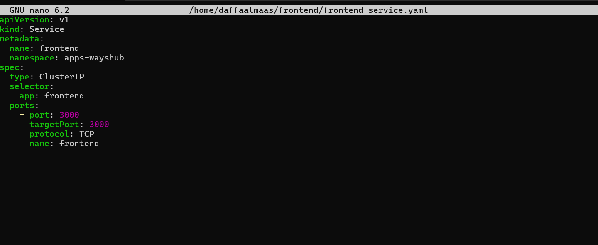

    10. Jalankan perintah ' k3s kubectl apply -f /home/daffaalmaas/frontend/frontend-service.yaml ' untuk menerapkan konfigurasi Service frontend ke dalam cluster Kubernetes.

        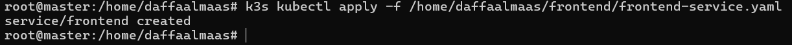

    11. Jalankan perintah ' k3s kubectl get svc -n apps-wayshub ' dan ' k3s kubectl get endpointslice -n apps-wayshub ' untuk memastikan Service frontend telah dibuat dengan tipe ClusterIP dan memiliki endpoint yang mengarah ke Pod frontend.

        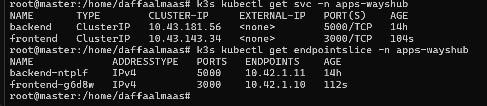

    12. Jalankan perintah ' k3s kubectl run curl-test -n apps-wayshub --rm -it --image=curlimages/curl --restart=Never -- curl http://frontend:3000 ' untuk menguji koneksi ke Service frontend dari dalam cluster dan memastikan aplikasi frontend dapat menerima request melalui Service frontend.

        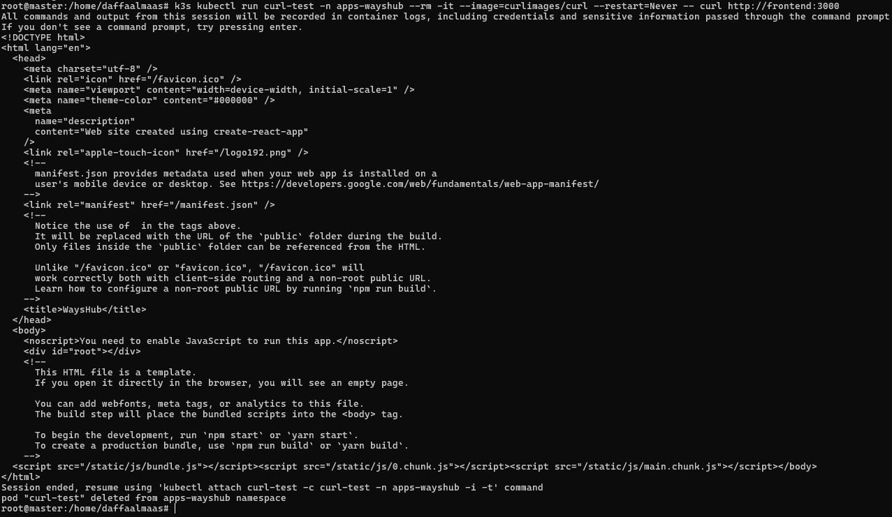

    13. Deployment frontend telah berhasil dilakukan pada Kubernetes. Frontend berjalan pada Pod dengan status Running, Service ClusterIP berhasil menghubungkan request ke Pod, dan pengujian dari dalam cluster menghasilkan respons berupa halaman HTML aplikasi WaysHub, yang menunjukkan bahwa request berhasil mencapai aplikasi frontend.

## Instalasi Cert Manager dan Persiapan Cloudflare DNS-01

    1. Pada server master, masuk sebagai user root, kemudian jalankan perintah ' helm install cert-manager oci://quay.io/jetstack/charts/cert-manager --namespace cert-manager --create-namespace --version v1.21.2 --set crds.enabled=true ' untuk menginstal Cert-Manager pada cluster Kubernetes.

        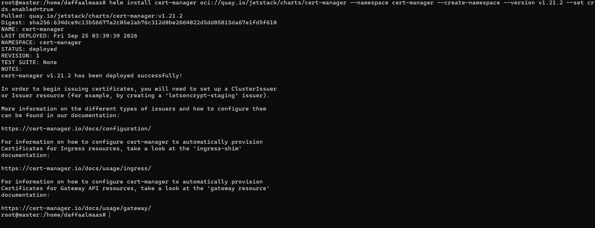

    2. Jalankan perintah ' k3s kubectl get pods -n cert-manager ' untuk memastikan seluruh komponen Cert-Manager telah berjalan dengan status Running.

        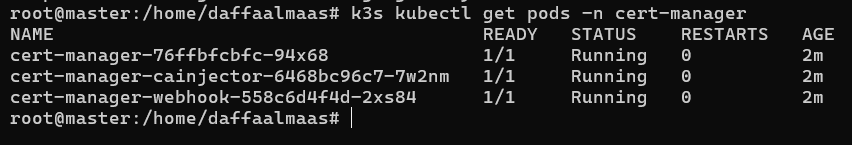

    3. Buat Cloudflare API Token melalui dashboard Cloudflare dengan memberikan permission Zone → DNS → Edit dan Zone → Zone → Read.

        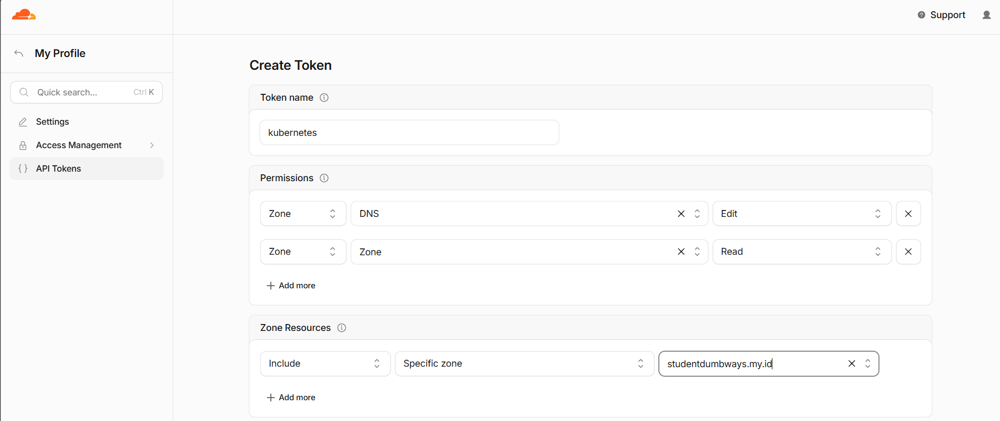

    4. Jalankan perintah ' k3s kubectl create secret generic cloudflare-api-token-secret --namespace cert-manager --from-literal=api-token=isi_token ' untuk menyimpan Cloudflare API Token sebagai Kubernetes Secret pada namespace cert-manager.

        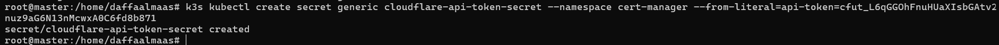

    5. Jalankan perintah ' k3s kubectl get secret -n cert-manager ' untuk memastikan Secret cloudflare-api-token-secret telah berhasil dibuat pada namespace cert-manager.

        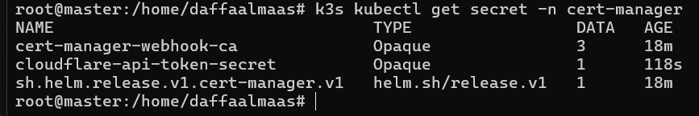

## Konfigurasi Wildcard SSL

    1. Pada server master, masuk sebagai user root, kemudian Jalankan perintah ' mkdir -p /home/daffaalmaas/cert-manager ' untuk membuat direktori cert-manager, kemudian jalankan perintah ' nano /home/daffaalmaas/cert-manager/cluster-issuer.yaml ' untuk membuat file konfigurasi ClusterIssuer Let's Encrypt yang menggunakan Cloudflare DNS-01 challenge dengan Cloudflare API Token yang telah disimpan pada Kubernetes Secret cloudflare-api-token-secret. Isi file cluster-issuer.yaml seperti dibawah :

        apiVersion: cert-manager.io/v1
        kind: ClusterIssuer
        metadata:
        name: letsencrypt-prod
        spec:
        acme:
            email: daffaalmaas74@gmail.com
            server: https://acme-v02.api.letsencrypt.org/directory
            privateKeySecretRef:
            name: letsencrypt-prod
            solvers:
            - dns01:
                cloudflare:
                    apiTokenSecretRef:
                    name: cloudflare-api-token-secret
                    key: api-token

        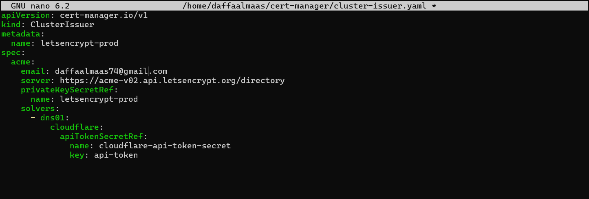

    2. Jalankan perintah ' k3s kubectl apply -f /home/daffaalmaas/cert-manager/cluster-issuer.yaml ' untuk menerapkan konfigurasi ClusterIssuer Let's Encrypt yang digunakan oleh Cert-Manager untuk menerbitkan certificate.

        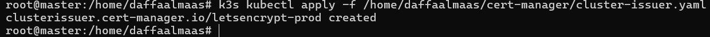

    3. Jalankan perintah ' k3s kubectl get clusterissuer ' untuk memastikan ClusterIssuer letsencrypt-prod telah berhasil dibuat dan memiliki status Ready.

        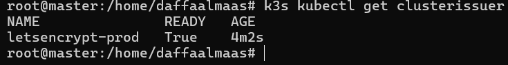

    4. Jalankan perintah ' nano /home/daffaalmaas/cert-manager/certificate.yaml ' untuk membuat konfigurasi wildcard SSL *.kubernetes.studentdumbways.my.id. Isi file certificate.yaml seperti dibawah :

        apiVersion: cert-manager.io/v1
        kind: Certificate
        metadata:
        name: daffaalmaas-wildcard-tls
        namespace: apps-wayshub
        spec:
        secretName: daffaalmaas-wildcard-tls
        issuerRef:
            name: letsencrypt-prod
            kind: ClusterIssuer
        dnsNames:
            - "*.kubernetes.studentdumbways.my.id"

        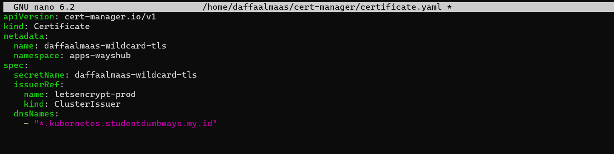

    5. Jalankan perintah ' k3s kubectl apply -f /home/daffaalmaas/cert-manager/certificate.yaml ' untuk menerapkan konfigurasi Certificate wildcard SSL pada namespace apps-wayshub.

        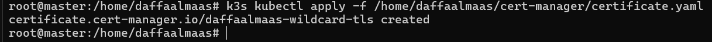

    6. Jalankan perintah ' k3s kubectl get certificate -n apps-wayshub ' dan ' k3s kubectl get secret daffaalmaas-wildcard-tls -n apps-wayshub ' untuk memeriksa status penerbitan wildcard SSL serta memastikan Certificate berstatus Ready dan Secret yang berisi sertifikat serta private key telah berhasil dibuat pada namespace apps-wayshub.

        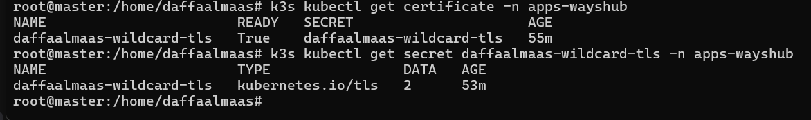

## Konfigurasi NGINX Ingress sebagai Reverse Proxy

    1. Pada server master, masuk sebagai user root,kemudian Jalankan perintah ' mkdir -p /home/daffaalmaas/ingress '
    untuk membuat direktori ingress. Jalankan perintah ' nano /home/daffaalmaas/ingress/wayshub-ingress.yaml ' untuk membuat file konfigurasi Ingress. Konfigurasi ini digunakan untuk mengarahkan domain frontend dan backend melalui NGINX Ingress serta menggunakan wildcard SSL yang telah dibuat sebelumnya. Isi file wayshub-ingress.yaml seperti di bawah : 

        apiVersion: networking.k8s.io/v1
        kind: Ingress
        metadata:
        name: wayshub-ingress
        namespace: apps-wayshub
        spec:
        ingressClassName: nginx
        tls:
            - hosts:
                - daffaalmaas.kubernetes.studentdumbways.my.id
                - api-daffaalmaas.kubernetes.studentdumbways.my.id
            secretName: daffaalmaas-wildcard-tls
        rules:
            - host: daffaalmaas.kubernetes.studentdumbways.my.id
            http:
                paths:
                - path: /
                    pathType: Prefix
                    backend:
                    service:
                        name: frontend
                        port:
                        number: 3000

            - host: api-daffaalmaas.kubernetes.studentdumbways.my.id
            http:
                paths:
                - path: /
                    pathType: Prefix
                    backend:
                    service:
                        name: backend
                        port:
                        number: 5000

        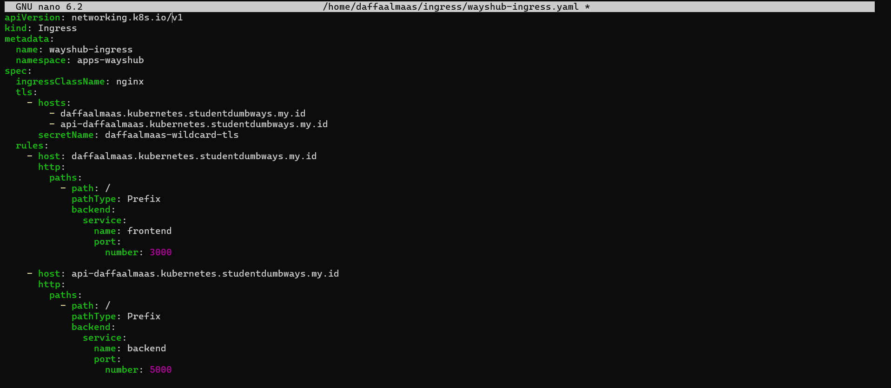

    2. Jalankan perintah ' k3s kubectl apply -f /home/daffaalmaas/ingress/wayshub-ingress.yaml ' untuk menerapkan konfigurasi Ingress pada cluster Kubernetes.

        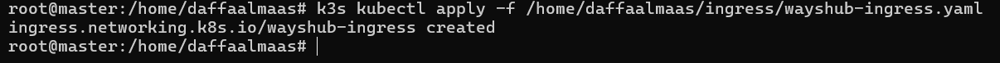

    3. Jalankan perintah ' k3s kubectl get ingress -n apps-wayshub ' untuk memastikan konfigurasi Ingress telah terdaftar serta memeriksa host dan alamat yang digunakan.

        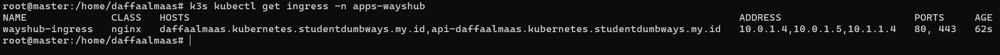

    4. Pada Cloudflare, tambahkan dua record A untuk mengarahkan domain frontend dan backend ke IP publik server master (20.58.164.146) dengan status DNS Only.

        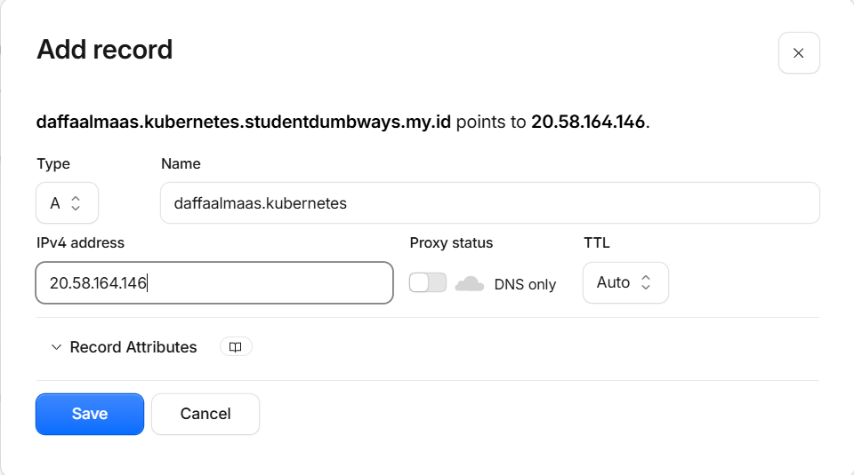

        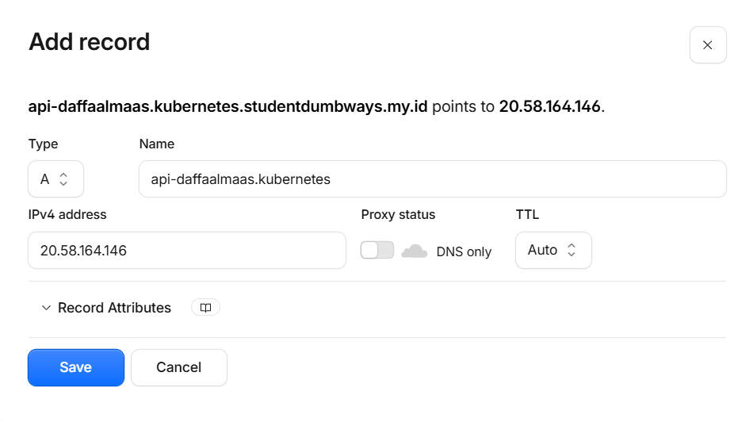

